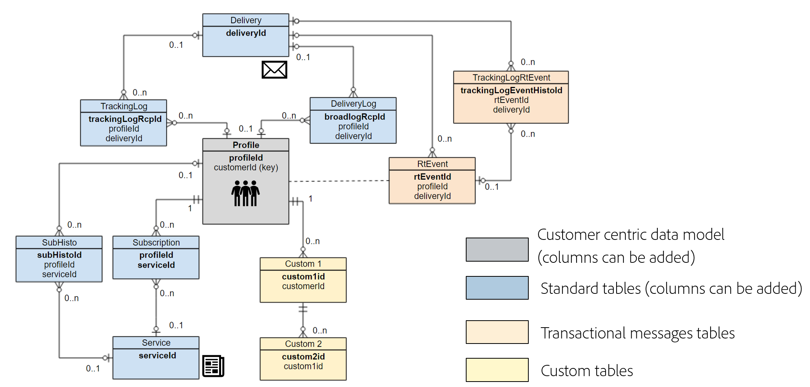

# 데이터 모델 모범 사례{#data-model-best-practices}

이 문서에서는 Adobe Campaign 데이터 모델을 디자인하는 동안 주요 권장 사항에 대해 간략하게 설명합니다.

>[!NOTE]
>
>Adobe Campaign 사전 정의된 데이터 모델을 확장하기 위해 리소스를 생성하고 수정하려면 [이 섹션을 참조하십시오](../../developing/using/key-steps-to-add-a-resource.md).
>
>이 페이지에서 기본 제공 리소스의 데이터 모델 표현을 찾을 수 [있습니다](../../developing/using/datamodel-introduction.md).

## 개요 {#overview}

Adobe Campaign 시스템은 매우 유연하며 초기 구현 범위를 확장할 수 있습니다. 그러나 가능성은 무한하지만 현명한 의사 결정을 내리고 데이터 모델 디자인을 시작할 강력한 기반을 구축하는 것이 중요합니다.

이 문서에서는 Adobe Campaign 툴을 적절하게 설계하는 방법을 배울 수 있는 일반적인 활용 사례와 모범 사례를 제공합니다.

## 데이터 모델 아키텍처 {#data-model-architecture}

Adobe Campaign Standard은 개인화된 고객 경험을 구축하기 위해 온라인 및 오프라인 전략을 연계할 수 있는 강력한 크로스채널 캠페인 관리 시스템입니다.

### 고객 중심의 접근 방식 {#customer-centric-approach}

대부분의 이메일 서비스 제공업체는 목록 중심의 접근 방식을 통해 고객과 커뮤니케이션하고 있지만, Adobe Campaign은 고객 및 해당 속성에 대한 광범위한 뷰를 활용하기 위해 관계형 데이터베이스에 의존합니다.

이 고객 중심의 접근 방법은 아래 차트에 나와 있습니다. 회색 **프로필** 리소스는 모든 것이 빌드되고 있는 주 고객 테이블을 나타냅니다.

이 [섹션에는 Adobe Campaign 기본 데이터 모델이 표시됩니다](../../developing/using/datamodel-introduction.md).

<!--You can find a datamodel representation for the out-of-the-box resources [here](../../developing/using/datamodel-introduction.md).-->

<!--### What is a customer? {#customer-definition}

If you have customer data in more than one system, you need to determine which solution will allow you to identify records as one person. This work might require rules, eventually a match and merge processes to determine the primary record. This primary record should be the one sent to Adobe Campaign.

While some of this data cleansing might be performed in Adobe Campaign, the recommendation is to run these processes outside and only import clean data in Adobe Campaign. You should keep Campaign as a marketing solution more than a data cleansing tool.

Be able to provide a primary customer record which will be sent to Adobe Campaign.-->

### Adobe Campaign 데이터 {#data-for-campaign}

어떤 데이터를 Adobe Campaign으로 보내야 합니까? 마케팅 활동에 필요한 데이터를 결정하는 것은 매우 중요합니다.

>[!NOTE]
>
>Adobe Campaign은 데이터 웨어하우스가 아닙니다. 따라서 모든 가능한 고객과 관련 정보를 Adobe Campaign으로 가져오려고 하지 마십시오.

Adobe Campaign에서 속성이 필요한지 여부를 결정하려면 속성이 다음 카테고리 중 하나에 해당하는지 여부를 결정합니다.
* 세그멘테이션에 사용되는 **속성**
* 데이터 **관리 프로세스에** 사용되는 속성(예: 집계 계산)
* 개인화에 사용되는 **속성**
* 보고에 사용되는 **속성** (사용자 지정 프로필 데이터를 기반으로 보고서를 만들 수 있음)

이러한 속성에 해당되지 않을 경우 Adobe Campaign에서 이 속성이 필요하지 않을 가능성이 높습니다.

### 데이터 유형 {#data-types}

시스템의 우수한 아키텍처와 성능을 유지하려면 아래 모범 사례를 따라 Adobe Campaign에서 데이터를 설정하십시오.
* 문자열 필드의 길이는 항상 열로 정의되어야 합니다. 기본적으로 Adobe Campaign의 최대 길이는 255자입니다. 그러나 크기가 더 짧은 길이를 초과하지 않을 것을 이미 알고 있는 경우 Adobe은 필드를 더 짧게 유지하는 것이 좋습니다.
* 소스 시스템의 크기가 과대평가되어 도달하지 않을 것이 확실하다면, Adobe Campaign에 있는 필드가 소스 시스템보다 작으면 됩니다. 이것은 Adobe Campaign에서 더 짧은 문자열 또는 더 작은 정수를 의미할 수 있습니다.

## 데이터 구조 구성 {#configuring-data-structure}

이 섹션에서는 리소스의 데이터 구조를 [구성할 때의 우수 사례를 설명합니다](../../developing/using/configuring-the-resource-s-data-structure.md).

### 식별자 {#identifiers}

Adobe Campaign 리소스에는 세 개의 식별자가 있으며 추가 식별자를 추가할 수 있습니다.

다음 표에서는 이러한 식별자 및 해당 용도를 설명합니다.

>[!NOTE]
>
>표시 이름은 Adobe Campaign 사용자 인터페이스를 통해 사용자에게 표시되는 필드의 이름입니다. 기술 이름은 리소스 정의(및 테이블 열 이름)의 실제 필드 이름입니다.

| 표시 이름 | 기술명 | 설명 | 모범 사례 |
|--- |--- |--- |--- |
|  | PKey | <ul><li>PKey는 Adobe Campaign 테이블의 물리적 기본 키입니다.</li><li>이 식별자는 일반적으로 특정 Adobe Campaign 인스턴스에 고유합니다.</li><li>Adobe Campaign Standard에서 이 값은 최종 사용자가 볼 수 없습니다(URL에서는 제외).</li></ul> | <ul><li>API 시스템 을 통해 PKey 값(실제 키가 아닌 생성/해시된 값)을 검색할 수 있습니다.</li><li>API를 통해 레코드를 검색, 업데이트 또는 삭제하는 것 외에는 사용하지 않는 것이 좋습니다.</li></ul> |
| ID | name 또는 internalName | <ul><li>이 정보는 테이블에 있는 레코드의 고유 식별자입니다. 이 값은 수동으로 업데이트할 수 있습니다.</li><li>이 식별자는 다른 Adobe Campaign 인스턴스에 배포할 때 값을 유지합니다. 패키지를 통해 내보낼 수 있는 생성된 값과 이름이 달라야 합니다.</li><li>테이블의 실제 기본 키가 아닙니다.</li></ul> | <ul><li>공백 &quot;&quot;, 세미열 &quot;:&quot; 또는 하이픈 &quot;-&quot;과 같은 특수 문자는 사용하지 마십시오.</li><li>이러한 모든 문자는 밑줄 &quot;_&quot;(허용되는 문자)로 대체됩니다. 예를 들어 &quot;abc-def&quot; 및 &quot;abc:def&quot;는 &quot;abc_def&quot;로 저장되고 서로를 덮어씁니다.</li></ul> |
| 레이블 | label | <ul><li>레이블은 Adobe Campaign에 있는 개체 또는 레코드의 비즈니스 식별자입니다.</li><li>이 개체는 공백과 특수 문자를 허용합니다.</li><li>그렇다고 기록의 고유성을 보장하지는 않는다.</li></ul> | <ul><li>개체 레이블의 구조를 결정하는 것이 좋습니다.</li><li>Adobe Campaign 사용자의 레코드 또는 개체를 식별하기 위한 가장 사용자 친화적인 솔루션입니다.</li></ul> |
| ACS ID | acsId | <ul><li>추가 식별자를 생성할 수 있습니다.ACS [ID](../../developing/using/configuring-the-resource-s-data-structure.md#generating-a-unique-id-for-profiles-and-custom-resources).</li><li>PKey는 Adobe Campaign 사용자 인터페이스에서 사용할 수 없으므로 프로필 레코드를 삽입하는 동안 생성된 고유한 값을 가져오는 솔루션입니다.</li><li>레코드가 Adobe Campaign에 삽입되기 전에 리소스에서 옵션을 활성화한 경우에만 값이 자동으로 생성됩니다.</li></ul> | <ul><li>이 UUID를 조정 키로 사용할 수 있습니다.</li><li>자동 생성된 ACS ID는 워크플로우 또는 패키지 정의에서 참조로 사용할 수 없습니다.</li><li>이 값은 Adobe Campaign 인스턴스에만 적용됩니다.</li></ul> |

### 식별 키 {#keys}

Adobe Campaign에서 만든 각 리소스에는 하나 이상의 고유한 [ID 키가 있어야 합니다](../../developing/using/configuring-the-resource-s-data-structure.md#defining-identification-keys).

<!--Most organizations are importing records from external systems. While the physical key of a resource lies behind the PKey attribute, it is possible to determine a custom key in addition.

This custom key is the actual record primary key in the external system feeding Adobe Campaign.

When an out-of-the-box resource has both an internal auto-generated and an internal custom key, the internal key will be set as a unique index in the physical database table.-->

사용자 지정 리소스를 만들 때 두 가지 옵션이 있습니다.

* 자동 생성된 키와 내부 사용자 지정 키의 조합입니다. 이 옵션은 시스템 키가 정수가 아닌 복합 키일 경우에 유용합니다. 정수는 큰 테이블에서 더 높은 성과를 제공하고 다른 테이블과 결합합니다.
* 기본 키를 외부 시스템 기본 키로 사용합니다. 이 솔루션은 일반적으로 서로 다른 시스템 간의 일관된 키를 사용하여 데이터를 가져오고 내보내는 방법을 단순화하므로 선호하는 솔루션입니다.

식별 키는 워크플로우에서 참조로 사용해서는 안 됩니다.

<!--For more on defining identification keys, see [this section](../../developing/using/configuring-the-resource-s-data-structure.md#defining-identification-keys).-->

### 인덱스 {#indexes}

Adobe Campaign은 리소스에 정의된 모든 기본 및 내부 키에 [인덱스를](../../developing/using/configuring-the-resource-s-data-structure.md#defining-indexes) 자동으로 추가합니다.

* Adobe은 성능을 향상시킬 수 있으므로 추가 색인을 정의하는 것이 좋습니다.
* 하지만 데이터베이스의 공간을 사용하므로 색인을 너무 많이 추가하지 마십시오. 또한 많은 인덱스가 부정적인 성능에 영향을 줄 수 있습니다.
* 정의해야 하는 인덱스를 신중하게 선택합니다.

<!--For more on defining indexes, see [this section](../../developing/using/configuring-the-resource-s-data-structure.md#defining-indexes).

When you are performing an initial import with very high volumes of data insert in Adobe Campaign database, it is recommended to run that import without custom indexes at first. It will allow to accelerate the insertion process. Once you’ve completed this important import, it is possible to enable the index(es).-->

### 링크 {#links}

다른 리소스와 링크를 정의하는 것이 [이 섹션에 나와 있습니다](../../developing/using/configuring-the-resource-s-data-structure.md#defining-links-with-other-resources).

* 워크플로우에서 테이블을 연결할 수 있지만 데이터 구조 정의에서 바로 리소스 간의 공통 링크를 정의하는 것이 좋습니다.
* 링크는 표의 실제 데이터와 일치하도록 정의해야 합니다. 잘못된 정의는 링크를 통해 검색된 데이터에 영향을 줄 수 있습니다(예: 예기치 않은 레코드 복제).
* 링크 이름을 리소스 이름과 일관되게 지정합니다.링크 이름은 먼 테이블이 무엇인지 이해하는 데 도움이 됩니다.
* &quot;id&quot;가 있는 링크의 이름을 접미어로 지정하지 마십시오. 예를 들어 &quot;transactionId&quot;가 아닌 &quot;transaction&quot;이라는 이름을 지정합니다.

<!--For more on defining links with other resources, see [this section](../../developing/using/configuring-the-resource-s-data-structure.md#defining-links-with-other-resources).-->

## 성능 {#performance}

언제든지 더 나은 성능을 위해 아래 모범 사례를 따르십시오.

### 일반 추천 {#general-recommendations}

* 쿼리에 &quot;CONTAINS&quot;와 같은 작업을 사용하지 마십시오. 예상 내용을 알고 있고 필터링하려는 경우 &quot;EQUAL TO&quot; 또는 기타 특정 필터 연산자와 동일한 조건을 적용합니다.
* 워크플로우에서 데이터를 작성하는 동안 인덱싱되지 않은 필드와 결합하지 마십시오.
* 가져오기 및 내보내기와 같은 프로세스가 업무 시간에 종료되는지 확인하십시오.
* 모든 일별 활동 일정이 있는지 확인하고 일정대로 하세요.
* 일일 프로세스 중 하나 또는 일부가 실패하여 같은 날에 실행해야 하는 경우 시스템 성능에 영향을 줄 수 있으므로 수동 프로세스를 시작할 때 실행 중인 프로세스가 충돌하지 않도록 하십시오.
* 가져오기 프로세스 동안 또는 수동 프로세스가 실행될 때 일일 캠페인이 실행되지 않도록 하십시오.
* 모든 행에서 필드를 복제하는 대신 하나 또는 여러 개의 참조 테이블을 사용합니다. 키/값 쌍을 사용할 때는 숫자 키를 선택하는 것이 좋습니다.
* 짧은 문자열을 사용할 수 있습니다. 외부 시스템에서 참조 테이블이 이미 있는 경우 동일한 항목을 다시 사용하면 Adobe Campaign와의 데이터 통합이 수월해집니다.

### 일대다 관계 {#one-to-many-relationships}

* 데이터 디자인은 유용성과 기능에 영향을 줍니다. 일대다 관계로 데이터 모델을 설계하면 애플리케이션에서 의미 있는 논리를 만드는 것이 더 어렵습니다. 일대다 필터 로직은 기술적인 면을 잘 모르는 마케터가 올바르게 구성하거나 이해하기가 어려울 수 있습니다.
* 사용자는 쿼리를 손쉽게 작성할 수 있으므로 하나의 테이블에 모든 필수 필드를 포함하는 것이 좋습니다. 조인을 피할 수 있는 경우 테이블 간에 일부 필드를 복제하는 것도 성능이 좋은 경우가 있습니다.
* 특정 내장 기능은 일대다 관계(예: 오퍼 가중치 공식 및 배달)를 참조할 수 없습니다.

### 큰 표 {#large-tables}

다음은 큰 표와 복잡한 조인을 사용하여 데이터 모델을 디자인할 때 따라야 할 몇 가지 우수 사례입니다.

* 특히 사용하지 않은 열을 확인하여 열 수를 줄입니다.
* 여러 조건 및/또는 여러 열에 연결된 연결과 같은 복잡한 조인을 방지하여 데이터 모델 관계를 최적화합니다.
* 조인 키의 경우 항상 문자 문자열이 아닌 숫자 데이터를 사용하십시오.
* 로그 보존 깊이를 최대한 줄일 수 있습니다. 더 깊은 내역이 필요한 경우 계산 및/또는 사용자 정의 로그 테이블을 처리하여 더 큰 내역을 저장할 수 있습니다.