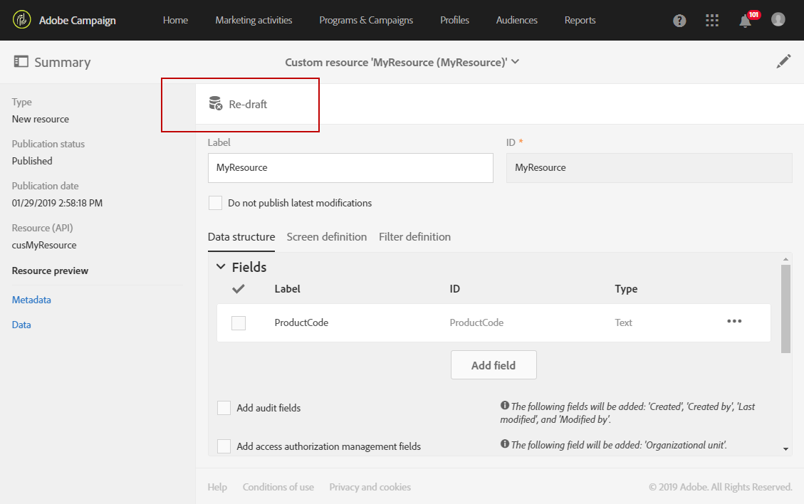

# Deleting a resource{#deleting-a-resource}

To delete a resource, the resource in question must be a **[!UICONTROL Draft]**. The resource is in **[!UICONTROL Draft]** status if:

* 방금 작성되었으며 아직 게시되지 않았습니다.
* 이미 게시된 경우 리소스를 다시 작성해야 합니다.

>[!CAUTION]
>
>사용자 지정 리소스를 다시 작성하고 삭제하는 것은 다른 리소스에 영향을 줄 수 있는 민감한 작업입니다. 이러한 작업은 전문가 사용자만 수행해야 합니다.

게시된 리소스를 다시 작성하고 삭제하려면 다음을 수행하십시오.

1. 다시 작성할 리소스를 선택합니다.
1. Click the **[!UICONTROL Re-draft]** button in the action bar.

   

1. **[!UICONTROL Ok]**&#x200B;을 클릭합니다.

   >[!CAUTION]
   >
   >이 작업은 다음과 같습니다. 리소스가 변경되면 리소스의 데이터베이스 테이블이나 게시물과 해당 데이터가 영구적으로 삭제되므로 다른 사용자 지정 리소스의 링크가 끊어질 수 있습니다. 리소스 정의만 사용할 수 있습니다.

   

   >[!NOTE]
   >
   >If you re-draft an extension of the out-of-the-box **Profiles (profile)** resource, you must also re-draft any **Test profile (seedMember)** extension you may have defined. For more on extending the profile resource, see [this section](../../developing/using/extending-the-profile-resource-with-a-new-field.md).

1. 리소스를 게시합니다. For more detailed steps, refer to [Publishing a custom resource](../../developing/using/updating-the-database-structure.md#publishing-a-custom-resource).

   The resource then goes into **Draft** mode and its activation status is **[!UICONTROL Inactive]**.

1. In **[!UICONTROL List]** mode, check the resource to delete then click the  **[!UICONTROL Delete element]** icon.

   

데이터가 데이터 모델에서 삭제됩니다.

>[!NOTE]
>
>이벤트에 사용된 사용자 정의 리소스의 필드를 수정하거나 삭제하면 해당 이벤트가 자동으로 게시 취소됩니다. See [Configuring transactional messaging](../../administration/using/configuring-transactional-messaging.md).

