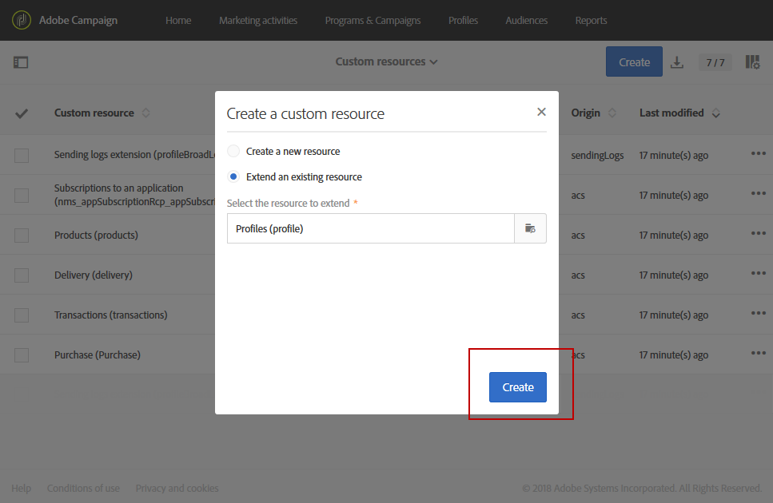

# Extending the profile resource with a new field{#extending-the-profile-resource-with-a-new-field}

## About extending profiles {#about-extending-profiles}

이 사용 사례는 전용 필드로 프로필 및 테스트 프로필을 확장하는 방법을 자세히 설명합니다.

여기서는 랜딩 페이지를 사용하여 새 필드로 프로파일을 업데이트한 다음 관심사에 맞는 뉴스레터와 함께 프로필을 타깃팅하려고 합니다.

이렇게 하려면 아래 단계를 따르십시오.

* [1 단계: 프로필 리소스 확장](../../developing/using/extending-the-profile-resource-with-a-new-field.md#step-1--extend-the-profile-resource)
* [2 단계: 테스트 프로필 확장](../../developing/using/extending-the-profile-resource-with-a-new-field.md#step-2--extend-the-test-profile)
* [3 단계: 사용자 정의 리소스 게시](../../developing/using/extending-the-profile-resource-with-a-new-field.md#step-3--publish-your-custom-resource)
* [4 단계: 워크플로우로 프로필 업데이트 및 타겟 설정](../../developing/using/extending-the-profile-resource-with-a-new-field.md#step-4--update-and-target-profiles-with-a-workflow)

다음 필드가 프로필에 추가되고 게시에 타깃팅될 수 있습니다.

관련 항목:

* [사용자 정의 리소스 정보](../../developing/using/data-model-concepts.md)
* [프로필 관리](../../audiences/using/about-profiles.md)
* [테스트 프로필 관리](../../sending/using/managing-test-profiles-and-sending-proofs.md#managing-test-profiles)

## Step 1: Extend the profile resource {#step-1--extend-the-profile-resource}

To create the new **Interest** field for our profiles, you first need to extend the out-of-the-box **[!UICONTROL Profiles (profile)]** resource.

1. From the advanced menu, via the Adobe Campaign logo, select **[!UICONTROL Administration]** &gt; **[!UICONTROL Development]**, then **[!UICONTROL Custom resources]**.
1. If you have not extended the **[!UICONTROL Profiles]** resource yet, click **[!UICONTROL Create]**.
1. **[!UICONTROL Extend an existing resource]** 옵션을 선택합니다.
1. **[!UICONTROL Profile (profile)]** 리소스를 선택합니다.
1. **[!UICONTROL Create]**&#x200B;을 클릭합니다.

   

1. In the **[!UICONTROL Fields]** category of the **[!UICONTROL Data structure]** tab, click **[!UICONTROL Create element]**.

   >[!NOTE]
   >
   >Note that if you already extended the **[!UICONTROL Profile]** resource for previous purposes, you can start at this step by clicking **[!UICONTROL Add field]**.

   

1. Add a **[!UICONTROL Label]** and an **[!UICONTROL ID]**. **[!UICONTROL Text]** 유형을 선택하고 **[!UICONTROL Add]**&#x200B;를 클릭합니다.

   

1. To configure your field, in the **[!UICONTROL Data structure]** tab under the **[!UICONTROL Fields]** drop-down, click  then  from your previously created field.
1. In this example we want to add specific values, to do so click **[!UICONTROL Specify a list of authorized values]**.

   

1. Click **[!UICONTROL Add an element]** then add as many value as needed by adding a **[!UICONTROL Label]** and an **[!UICONTROL ID]** and clicking **[!UICONTROL Add]**.

   여기에서는 이러한 옵션 중에서 선택할 수 있도록 도서, 전시회, 동영상과 프로필 N/A 값을 만듭니다.

   

1. **[!UICONTROL Profile]** 화면에 이 필드를 추가하려면 **[!UICONTROL Screen definition]** 탭을 클릭합니다.
1. **[!UICONTROL Detail screen configuration]****[!UICONTROL Add a personalized fields section]****[!UICONTROL Create element]**&#x200B;드롭다운에서를 클릭하고 클릭합니다.

   

1. Select a **[!UICONTROL Type]**. 입력 필드를 추가합니다. Then, select your previously created field and click **[!UICONTROL Add]**.

   

1. To add a separator to better organize your profile window, click **[!UICONTROL Create an element]** and select **[!UICONTROL Separator]** from the **[!UICONTROL Type]** drop-down.

   

이제 필드가 구성됩니다. 이제 테스트 프로필로 확장해야 합니다.

>[!NOTE]
>
>테스트 프로필 리소스를 확장할 필요가 없으면 게시 단계로 이동할 수 있습니다.

## Step 2: Extend the test profile {#step-2--extend-the-test-profile}

새로 만들어진 필드가 올바르게 구성되어 있는지 테스트할 경우 테스트 프로필로 배달을 보내 테스트할 수 있습니다. 먼저 새 필드를 테스트 프로필로도 수행해야 합니다.

1. From the advanced menu, via the Adobe Campaign logo, select **[!UICONTROL Administration]** &gt; **[!UICONTROL Development]**, then **[!UICONTROL Custom resources]**.
1. If you have not extended the **[!UICONTROL Profiles]** resource yet, click **[!UICONTROL Create]**.
1. **[!UICONTROL Extend an existing resource]** 옵션을 선택합니다.
1. **[!UICONTROL Test profile (seedMember)]** 리소스를 선택합니다.
1. **[!UICONTROL Create]**&#x200B;을 클릭합니다.

   

1. **[!UICONTROL Data structure]** 탭에서 **[!UICONTROL Create element]**&#x200B;를 클릭합니다.

   

1. Select your previously created resource field and click **[!UICONTROL Add]**.

   

1. Carry out the same steps from step 11 to 13 as the extend profile walkthrough above to add this field in the **[!UICONTROL Test profile]** screen.
1. **[!UICONTROL Save]**&#x200B;을 클릭합니다.

프로필 및 테스트 프로필 모두 새 필드를 사용할 수 있게 됩니다. 올바르게 구성하려면 사용자 지정 리소스를 게시해야 합니다.

## Step 3: Publish your custom resource {#step-3--publish-your-custom-resource}

리소스에 대해 수행한 변경 사항을 적용하려면 데이터베이스 업데이트를 수행해야 합니다.

1. From the advanced menu, select **Administration** &gt; **Development**, then **Publishing**.
1. By default, the option **[!UICONTROL Determine modifications since the last publication]** is checked, which means that only the changes carried out since the last update will be applied.

   

1. Click **[!UICONTROL Prepare publication]** to start the analysis which will update your database.
1. Once the publication has been carried out, click the **Publish** button to apply your new configurations.

   

1. Once published, the **Summary** pane of each resource indicates that the status is now **Published** and specifies the date of the last publication.

   

1. **[!UICONTROL Profiles]** 탭을 선택하고를 클릭하여 **[!UICONTROL New]** 변경 사항이 올바르게 구현되었는지 확인합니다.

   

이제 새 리소스 필드를 게시에 사용하고 타깃팅할 준비가 되었습니다.

## Step 4: Update and target profiles with a workflow {#step-4--update-and-target-profiles-with-a-workflow}

To update profiles with data for the new custom field, you can create a landing page using the **[!UICONTROL Profile acquisition]** template. For more information on landing pages, refer to this [page](../../channels/using/about-landing-pages.md).

여기서는 이 필드를 채우지 않은 워크플로우 프로필에서 타깃팅하려고 합니다. 개인화된 뉴스레터와 제안을 받을 수 있도록 프로필을 업데이트하라는 이메일을 수신하게 됩니다. 그러면 각 프로필은 선택한 관심사에 따라 개인화된 뉴스레터를 받게 됩니다.

First, we need to create a landing page that will update the **Interest** fields of the targeted profiles:

1. From the **[!UICONTROL Marketing activities]**, click **[!UICONTROL Create]** then select **[!UICONTROL Landing page]**.
1. 랜딩 페이지 유형을 선택합니다. Here, since we want to update our profiles, select **[!UICONTROL Profile acquisition]**.
1. **[!UICONTROL Create]**&#x200B;을 클릭합니다.
1. **[!UICONTROL Content]** 블록을 클릭하여 랜딩 페이지의 컨텐츠를 편집합니다.

   

1. 필요에 따라 랜딩 페이지를 사용자 지정합니다.
1. 프로필에 대해 구성된 필드를 클릭하여 관심 영역 중에서 선택합니다. In the left pane, select your previously created **Interest** custom resource.

   

1. 랜딩 페이지를 저장하고 테스트하여 필드가 올바르게 구성되어 있는지 확인합니다.
1. Click **[!UICONTROL Publish]** when your landing page is ready.

이제 랜딩 페이지를 사용할 수 있습니다. 프로필을 업데이트하려면 선택한 관심 항목에 따라 특별 오퍼를 전송할 워크플로우를 만들 수 있습니다.

1. **[!UICONTROL Marketing activities]** 탭에서 **[!UICONTROL Create]****[!UICONTROL Workflow]**&#x200B;아이콘을 클릭한 다음 선택합니다.
1. **[!UICONTROL Query]** 활동을 드래그 앤 드롭하여 필요한 프로파일과 대상을 타겟팅할 수 있습니다.
1. Drag and drop an **[!UICONTROL Email delivery]** activity to start configuring your email which will contain a link to the landing page. **[!UICONTROL Add an outbound transition with the population]**&#x200B;을 선택합니다.

   

1. 필요에 따라 이메일을 만들고 디자인합니다. For more information on email personalization, refer to this [page](../../designing/using/designing-content-in-adobe-campaign.md).
1. 랜딩 페이지로 리디렉션할 이메일을 이메일에 추가합니다.
1. Select the added button and click  in the **[!UICONTROL Link]** section in the left pane.

   

1. **[!UICONTROL Insert link]** 창에서 드롭다운 **[!UICONTROL Landing page]** 목록에서 **[!UICONTROL Link type]** 선택한 다음 이전에 만든 랜딩 페이지를 선택합니다.

   

1. **[!UICONTROL Save]**&#x200B;을 클릭합니다. 이제 이메일이 준비되어 워크플로우로 돌아갈 수 있습니다.
1. **[!UICONTROL Wait]** 랜딩 페이지를 채우는 데 필요한 프로필의 시간을 추가합니다.
1. Add a **[!UICONTROL Segmentation]** activity to split the outbound transition depending on their **Interests**.
1. Create an outbound segment for each **Interest**.

   

1. Add an **[!UICONTROL Email delivery]** activity after each transition and create a personalized email depending on the chosen **Interest**.
1. 구성이 완료되면 워크플로우를 시작합니다.

   

이제 프로필에 선택한 값에 따라 이 관심 분야를 채우도록 요구하는 이메일을 받게 됩니다.
