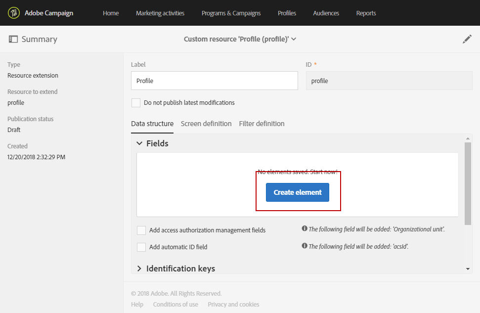

# 새 필드로 프로필 리소스 확장{#extending-the-profile-resource-with-a-new-field}

## 프로필 확장 기본 정보 {#about-extending-profiles}

이 사용 사례에서는 전용 필드를 사용하여 프로필 및 테스트 프로필을 확장하는 방법을 자세히 설명합니다.

여기에서는 랜딩 페이지를 사용하여 프로필에 새 필드를 업데이트한 다음, 프로필을 타겟팅하여 관심사에 따른 뉴스레터를 보내려고 합니다.

이렇게 하려면 아래 절차를 따르십시오.

* [1단계: 프로필 리소스 확장](#step-1--extend-the-profile-resource)
* [2단계: 테스트 프로필 확장](#step-2--extend-the-test-profile)
* [3단계: 사용자 정의 리소스 게시](#step-3--publish-your-custom-resource)
* [4단계: 워크플로우를 통해 프로필 업데이트 및 타겟팅](#step-4--update-and-target-profiles-with-a-workflow)

그러면 프로필에 다음 필드가 추가되어 게재 시 타겟팅할 수 있습니다.

관련 항목:

* [사용자 지정 리소스 기본 정보](../../developing/using/data-model-concepts.md)
* [프로필 관리](../../audiences/using/about-profiles.md)
* [테스트 프로필 관리](../../audiences/using/managing-test-profiles.md)

## 1단계: 프로필 리소스 확장 {#step-1--extend-the-profile-resource}

프로필에 새 **관심사** 필드를 만들려면 먼저 기본 제공 **[!UICONTROL Profiles (profile)]** 리소스를 확장해야 합니다.

1. 고급 메뉴에서 Adobe Campaign 로고를 통해 **[!UICONTROL Administration]** > **[!UICONTROL Development]** > **[!UICONTROL Custom resources]**&#x200B;을(를) 선택합니다.
1. 아직 **[!UICONTROL Profiles]** 리소스를 확장하지 않은 경우 **[!UICONTROL Create]**&#x200B;을(를) 클릭합니다 .
1. **[!UICONTROL Extend an existing resource]** 옵션을 선택합니다.
1. **[!UICONTROL Profile (profile)]** 리소스를 선택합니다.
1. **[!UICONTROL Create]**&#x200B;을(를) 클릭합니다.

   

1. **[!UICONTROL Data structure]** 탭의 **[!UICONTROL Fields]** 카테고리에서 **[!UICONTROL Create element]**&#x200B;을(를) 클릭합니다.

   >[!NOTE]
   >
   >이전에 다른 용도로 이미 **[!UICONTROL Profile]** 리소스를 확장한 경우, **[!UICONTROL Add field]**&#x200B;을(를) 클릭하여 이 단계에서 시작할 수 있습니다.

   

1. **[!UICONTROL Label]** 및 **[!UICONTROL ID]**&#x200B;을(를) 추가합니다. **[!UICONTROL Text]** 유형을 선택하고 **[!UICONTROL Add]**&#x200B;을(를) 클릭합니다.

   

1. 필드를 구성하려면 **[!UICONTROL Fields]** 드롭다운 아래의 **[!UICONTROL Data structure]** 탭에서 을(를) 클릭한 다음 앞에 만든 필드에서 을(를) 클릭합니다.
1. 이 예제에서는 특정 값을 추가하려 하므로 **[!UICONTROL Specify a list of authorized values]**&#x200B;을(를) 클릭합니다.

   

1. **[!UICONTROL Add an element]**&#x200B;을(를) 클릭한 뒤 **[!UICONTROL Label]** 및 **[!UICONTROL ID]**&#x200B;을(를) 추가하고 **[!UICONTROL Add]**&#x200B;을(를) 클릭하여 값을 필요한 만큼 추가합니다.

   여기에서는 프로필에 대해 선택할 수 있는 책, 전시회, 영화, 해당 없음의 값을 만들겠습니다.

   

1. **[!UICONTROL Profile]** 화면에 이 필드를 추가하기 위해 **[!UICONTROL Screen definition]** 탭을 클릭합니다.
1. **[!UICONTROL Detail screen configuration]** 드롭다운에서 **[!UICONTROL Add a personalized fields section]**&#x200B;을(를) 클릭한 뒤 **[!UICONTROL Create element]**&#x200B;을(를) 클릭합니다.

   

1. **[!UICONTROL Type]**&#x200B;을(를) 선택합니다. 여기에서는 입력 필드를 추가하려고 합니다. 그 다음 앞에서 만든 필드를 선택하고 **[!UICONTROL Add]**&#x200B;을(를) 클릭합니다.

   

1. 프로필 창을 더 잘 정리하기 위해 구분자를 추가하려면 **[!UICONTROL Create an element]**&#x200B;을(를) 클릭하고 **[!UICONTROL Type]** 드롭다운에서 **[!UICONTROL Separator]**&#x200B;을(를) 선택합니다.

   

이제 필드가 구성되었습니다. 이제 테스트 프로필을 확장해야 합니다.

>[!NOTE]
>
>테스트 프로필 리소스를 확장할 필요가 없는 경우 게시 단계로 이동할 수 있습니다.

## 2단계: 테스트 프로필 확장 {#step-2--extend-the-test-profile}

새로 만든 필드가 올바르게 구성되었는지 테스트하려면 테스트 프로필로 게재를 보내볼 수 있습니다. 먼저 테스트 프로필에도 새 필드를 적용해야 합니다.

1. 고급 메뉴에서 Adobe Campaign 로고를 통해 **[!UICONTROL Administration]** > **[!UICONTROL Development]** > **[!UICONTROL Custom resources]**&#x200B;을(를) 선택합니다.
1. 아직 **[!UICONTROL Profiles]** 리소스를 확장하지 않은 경우 **[!UICONTROL Create]**&#x200B;을(를) 클릭합니다 .
1. **[!UICONTROL Extend an existing resource]** 옵션을 선택합니다.
1. **[!UICONTROL Test profile (seedMember)]** 리소스를 선택합니다.
1. **[!UICONTROL Create]**&#x200B;을(를) 클릭합니다.

   

1. **[!UICONTROL Data structure]** 탭에서 **[!UICONTROL Create element]**&#x200B;을(를) 클릭합니다 .

   

1. 앞에서 만든 리소스 필드를 선택하고 **[!UICONTROL Add]**&#x200B;을(를) 클릭합니다.

   

1. 위의 프로필 확장 연습에서 11~13단계를 동일하게 수행하여 이 필드를 **[!UICONTROL Test profile]** 화면에 추가합니다.
1. **[!UICONTROL Save]**&#x200B;을(를) 클릭합니다.

이제 프로필과 테스트 프로필 모두에서 새 필드를 사용할 수 있습니다. 올바르게 구성될 수 있도록 사용자 정의 리소스를 게시해야 합니다.

## 3단계: 사용자 정의 리소스 게시 {#step-3--publish-your-custom-resource}

리소스 변경 사항을 적용하고 리소스를 사용하려면 데이터베이스 업데이트를 수행해야 합니다.

1. 고급 메뉴에서 **관리** > **개발** > **게시**&#x200B;를 선택합니다.
1. 기본적으로 **[!UICONTROL Determine modifications since the last publication]** 옵션이 선택되어 있으므로 마지막 업데이트 이후 수행한 변경 사항만 적용합니다.

   

1. 분석을 시작하여 데이터베이스를 업데이트하려면 **[!UICONTROL Prepare publication]**&#x200B;을(를) 클릭합니다.
1. 게시가 수행되면 **게시** 버튼을 클릭하여 새 구성을 적용합니다.

   

1. 게시되면 각 리소스의 **요약** 창에 이제 **게시됨** 상태와 마지막으로 게시한 날짜가 표시됩니다.

   

1. **[!UICONTROL Profiles]** 탭을 선택하고 **[!UICONTROL New]**&#x200B;을(를) 클릭하여 변경 사항이 올바르게 구현되었는지 확인합니다.

   

이제 새 리소스 필드를 사용할 준비가 되었습니다. 게재 시 타겟팅하는 등의 작업을 수행할 수 있습니다.

## 4단계: 워크플로우를 통해 프로필 업데이트 및 타겟팅 {#step-4--update-and-target-profiles-with-a-workflow}

프로필에 새로운 사용자 정의 필드의 데이터를 업데이트하려면 **[!UICONTROL Profile acquisition]** 템플릿을 사용하여 랜딩 페이지를 만들 수 있습니다. 랜딩 페이지에 대한 자세한 내용은 이 [페이지](../../channels/using/getting-started-with-landing-pages.md)를 참조하십시오.

여기에서는 이 필드를 입력하지 않은 워크플로우 프로필을 타겟팅하려고 합니다. 이들은 개인화된 뉴스레터 및 오퍼를 수신할 수 있도록 프로필을 업데이트하라는 이메일을 받게 됩니다. 그러고 나면 각 프로필은 선택한 관심사에 따라 개인화된 뉴스레터를 수신하게 됩니다.

먼저 타겟팅한 프로필의 **관심사** 필드를 업데이트할 랜딩 페이지를 만들어야 합니다.

1. **[!UICONTROL Marketing activities]**&#x200B;에서 **[!UICONTROL Create]**&#x200B;을(를) 클릭한 다음 **[!UICONTROL Landing page]**&#x200B;을(를) 선택합니다.
1. 랜딩 페이지 유형을 선택합니다. 여기에서는 프로필을 업데이트하려고 하므로 **[!UICONTROL Profile acquisition]**&#x200B;을(를) 선택합니다.
1. **[!UICONTROL Create]**&#x200B;을(를) 클릭합니다.
1. **[!UICONTROL Content]** 블록을 클릭하여 랜딩 페이지의 콘텐츠 편집을 시작합니다.

   

1. 필요에 따라 랜딩 페이지를 사용자 정의합니다.
1. 프로필에 대해 구성한 필드를 클릭하여 관심사 선택 사항을 고릅니다. 왼쪽 창에서 앞에서 만든 **관심사** 사용자 정의 리소스를 선택합니다.

   

1. 랜딩 페이지를 저장하고 테스트하여 필드가 올바르게 구성되었는지 확인합니다.
1. 랜딩 페이지를 완성하면 **[!UICONTROL Publish]**&#x200B;을(를) 클릭합니다.

이제 랜딩 페이지를 사용할 수 있습니다. 선택한 관심사에 따라 특별 오퍼를 보내는 워크플로우를 만들어 프로필을 업데이트할 수 있습니다.

1. **[!UICONTROL Marketing activities]** 탭에서 **[!UICONTROL Create]**&#x200B;을(를) 클릭한 다음 **[!UICONTROL Workflow]**&#x200B;을(를) 선택합니다.
1. **[!UICONTROL Query]** 활동을 끌어다 놓아 필요한 프로필 또는 대상자를 타겟팅합니다.
1. **[!UICONTROL Email delivery]** 활동을 끌어다 놓아 랜딩 페이지 링크가 포함될 이메일을 구성합니다.  **[!UICONTROL Add an outbound transition with the population]**&#x200B;을(를) 선택합니다.

   

1. 필요에 따라 이메일을 만들고 디자인합니다. 이메일 개인화에 대한 자세한 내용은 이 [페이지](../../designing/using/quick-start.md)를 참조하십시오.
1. 프로필을 랜딩 페이지로 리디렉션하기 위한 버튼을 이메일에 추가합니다.
1. 추가한 버튼을 선택하고 왼쪽 창의 **[!UICONTROL Link]** 섹션에서 을(를) 클릭합니다.

   

1. **[!UICONTROL Insert link]** 창의 **[!UICONTROL Link type]** 드롭다운에서 **[!UICONTROL Landing page]**&#x200B;을(를) 선택한 다음 앞에서 만든 랜딩 페이지를 선택합니다.

   

1. **[!UICONTROL Save]**&#x200B;을(를) 클릭합니다. 이제 이메일이 준비되었습니다. 워크플로우로 돌아올 수 있습니다.
1. **[!UICONTROL Wait]** 활동을 추가하여 프로필이 랜딩 페이지를 채울 수 있도록 합니다.
1. **[!UICONTROL Segmentation]** 활동을 추가하여 **관심사**&#x200B;에 따라 아웃바운드 전환을 분할합니다.
1. 각 **관심사**&#x200B;마다 아웃바운드 세그먼트를 만듭니다.

   

1. 각 전환 뒤에 **[!UICONTROL Email delivery]** 활동을 추가하고 선택한 **관심사**&#x200B;에 따라 개인화된 이메일을 만듭니다.
1. 구성이 완료되면 워크플로우를 시작합니다.

   

이제 프로필에 이 관심사 필드를 입력하라는 메일을 보낸 뒤, 선택한 값에 따라 개인화된 이메일을 보내게 됩니다.
