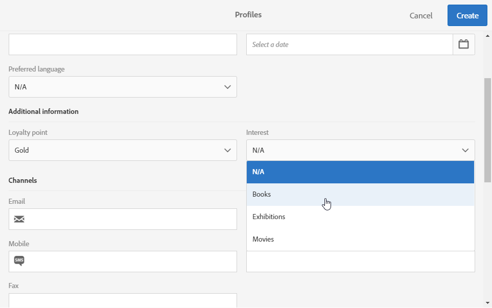

# 새 필드로 프로필 리소스 확장{#extending-the-profile-resource-with-a-new-field}

## 프로파일 확장 정보 {#about-extending-profiles}

이 사용 사례에서는 전용 필드를 사용하여 프로필 및 테스트 프로필을 확장하는 방법에 대해 자세히 설명합니다.

여기서는 랜딩 페이지를 사용하여 프로파일을 새 필드로 업데이트한 다음 관심사와 관련된 뉴스레터를 사용하여 프로파일을 타깃팅합니다.

이렇게 하려면 아래 절차를 따르십시오.

* [1단계:프로필 리소스 확장](#step-1--extend-the-profile-resource)
* [2단계:테스트 프로필 확장](#step-2--extend-the-test-profile)
* [3단계:사용자 지정 리소스 게시](#step-3--publish-your-custom-resource)
* [4단계:워크플로우를 통해 프로파일 업데이트 및 타깃팅](#step-4--update-and-target-profiles-with-a-workflow)

그러면 다음 필드가 프로필에 추가되고 전달에서 타깃팅될 수 있습니다.

관련 항목:

* [사용자 지정 리소스 기본 정보](../../developing/using/data-model-concepts.md)
* [프로필 관리](../../audiences/using/about-profiles.md)
* [테스트 프로필 관리](../../sending/using/managing-test-profiles-and-sending-proofs.md#managing-test-profiles)

## 1단계:프로필 리소스 확장 {#step-1--extend-the-profile-resource}

프로파일에 대한 새 **관심** 필드를 만들려면 먼저 기본 **[!UICONTROL Profiles (profile)]** 리소스를 확장해야 합니다.

1. 고급 메뉴에서 Adobe Campaign 로고를 통해 **[!UICONTROL Administration]** &gt; **[!UICONTROL Development]**&#x200B;을 선택한 다음 **[!UICONTROL Custom resources]**&#x200B;선택합니다.
1. 아직 **[!UICONTROL Profiles]** 리소스를 연장하지 않은 경우 을 클릭합니다 **[!UICONTROL Create]**.
1. 옵션을 **[!UICONTROL Extend an existing resource]** 선택합니다.
1. 리소스를 **[!UICONTROL Profile (profile)]** 선택합니다.
1. Click **[!UICONTROL Create]**.

   

1. 탭의 **[!UICONTROL Fields]** 범주에서 을 **[!UICONTROL Data structure]** 클릭합니다 **[!UICONTROL Create element]**.

   >[!NOTE]
   >
   >이전 용도로 **[!UICONTROL Profile]** 리소스를 이미 확장한 경우 을 클릭하여 이 단계에서 시작할 수 있습니다 **[!UICONTROL Add field]**.

   

1. a 및 **[!UICONTROL Label]** an을 **[!UICONTROL ID]**&#x200B;추가합니다. 유형을 **[!UICONTROL Text]** 선택하고 을 클릭합니다 **[!UICONTROL Add]**.

   

1. To configure your field, in the **[!UICONTROL Data structure]** tab under the **[!UICONTROL Fields]** drop-down, click  then  from your previously created field.
1. 이 예에서는 특정 값을 추가하고 클릭하여 **[!UICONTROL Specify a list of authorized values]**&#x200B;추가합니다.

   

1. 을 **[!UICONTROL Add an element]** 클릭한 다음 을 클릭하고 을 클릭하여 필요한 만큼 **[!UICONTROL Label]** 값을 **[!UICONTROL ID]** 추가합니다 **[!UICONTROL Add]**.

   여기에서 이러한 옵션 중에서 선택할 프로파일에 대한 책, 전시회, 영화 및 N/A 값을 만듭니다.

   

1. 화면에 이 필드를 추가하려면 **[!UICONTROL Profile]** 탭을 클릭합니다 **[!UICONTROL Screen definition]** .
1. 드롭다운에서 을 클릭하고 **[!UICONTROL Detail screen configuration]** 을 **[!UICONTROL Add a personalized fields section]** **[!UICONTROL Create element]**&#x200B;클릭합니다.

   

1. 을 **[!UICONTROL Type]**&#x200B;선택합니다. 입력 필드를 추가하려고 합니다. 그런 다음 이전에 만든 필드를 선택하고 을 **[!UICONTROL Add]**&#x200B;클릭합니다.

   

1. 프로필 창을 보다 효율적으로 구성하기 위해 구분 기호를 추가하려면 을 클릭하고 **[!UICONTROL Create an element]** 드롭다운에서 **[!UICONTROL Separator]** **[!UICONTROL Type]** 선택합니다.

   

이제 필드가 구성됩니다. 이제 테스트 프로필로 확장해야 합니다.

>[!NOTE]
>
>테스트 프로필 리소스를 확장할 필요가 없는 경우 게시 단계로 이동할 수 있습니다.

## 2단계:테스트 프로필 확장 {#step-2--extend-the-test-profile}

새로 만든 필드가 올바르게 구성되어 있는지 테스트하려면 테스트 프로필로 배달을 보내 테스트할 수 있습니다. 먼저 새 필드를 테스트 프로필로 전달해야 합니다.

1. 고급 메뉴에서 Adobe Campaign 로고를 통해 **[!UICONTROL Administration]** &gt; **[!UICONTROL Development]**&#x200B;을 선택한 다음 **[!UICONTROL Custom resources]**&#x200B;선택합니다.
1. 아직 **[!UICONTROL Profiles]** 리소스를 연장하지 않은 경우 을 클릭합니다 **[!UICONTROL Create]**.
1. 옵션을 **[!UICONTROL Extend an existing resource]** 선택합니다.
1. 리소스를 **[!UICONTROL Test profile (seedMember)]** 선택합니다.
1. Click **[!UICONTROL Create]**.

   

1. 탭에서 을 **[!UICONTROL Data structure]** 클릭합니다 **[!UICONTROL Create element]**.

   

1. 이전에 만든 리소스 필드를 선택하고 을 **[!UICONTROL Add]**&#x200B;클릭합니다.

   

1. 이 필드를 **[!UICONTROL Test profile]** 화면에 추가하려면 위의 확장 프로필 연습과 같은 단계를 11단계부터 13단계까지 수행합니다.
1. Click **[!UICONTROL Save]**.

이제 프로파일과 테스트 프로필 모두 새 필드를 사용할 수 있습니다. 올바르게 구성되려면 사용자 지정 리소스를 게시해야 합니다.

## 3단계:사용자 지정 리소스 게시 {#step-3--publish-your-custom-resource}

리소스에 대해 수행된 변경 사항을 적용하고 사용할 수 있으려면 데이터베이스 업데이트를 수행해야 합니다.

1. 고급 메뉴에서 관리 &gt; **개발** , **게시**&#x200B;순으로 **선택합니다**.
1. 기본적으로 이 옵션이 선택되어 **[!UICONTROL Determine modifications since the last publication]** 있으므로 마지막 업데이트 이후 수행된 변경 사항만 적용됩니다.

   

1. 을 **[!UICONTROL Prepare publication]** 클릭하여 데이터베이스를 업데이트할 분석을 시작합니다.
1. 게시가 수행되면 [게시] **단추를 클릭하여** 새 구성을 적용합니다.

   

1. 게시되면 각 **리소스의** 요약 창에 상태가 이제 게시되었음을 **나타내며 마지막** 게시 날짜를 지정합니다.

   

1. 탭을 선택하고 을 **[!UICONTROL Profiles]** **[!UICONTROL New]** 클릭하여 변경 사항이 올바르게 구현되었는지 확인합니다.

   

이제 새 리소스 필드를 사용할 준비가 되어 배달을 타깃팅할 수 있습니다.

## 4단계:워크플로우를 통해 프로파일 업데이트 및 타깃팅 {#step-4--update-and-target-profiles-with-a-workflow}

새 사용자 정의 필드의 데이터로 프로파일을 업데이트하려면 **[!UICONTROL Profile acquisition]** 템플릿을 사용하여 랜딩 페이지를 만들 수 있습니다. 랜딩 페이지에 대한 자세한 내용은 이 [페이지를](../../channels/using/getting-started-with-landing-pages.md)참조하십시오.

이 필드를 채우지 않은 워크플로우 프로필에서 타깃팅하려고 합니다. 개인화된 뉴스레터와 제안을 받기 위해 프로필을 업데이트하라는 이메일을 받게 됩니다. 각 프로필은 선택한 관심사에 따라 개인화된 뉴스레터를 수신하게 됩니다.

먼저 타깃팅된 프로필의 관심 **필드를 업데이트하는** 랜딩 페이지를 만들어야 합니다.

1. 에서 **[!UICONTROL Marketing activities]**&#x200B;을 **[!UICONTROL Create]** 클릭한 다음 **[!UICONTROL Landing page]**&#x200B;선택합니다.
1. 랜딩 페이지 유형을 선택합니다. 여기에서 프로필을 업데이트하려는 경우 선택하십시오 **[!UICONTROL Profile acquisition]**.
1. Click **[!UICONTROL Create]**.
1. 랜딩 페이지의 컨텐츠 편집을 시작하려면 **[!UICONTROL Content]** 블록을 클릭합니다.

   

1. 필요에 따라 랜딩 페이지를 사용자 정의합니다.
1. 관심사를 선택할 수 있도록 프로파일에 대해 구성된 필드를 클릭합니다. 왼쪽 창에서 이전에 만든 Interest **사용자 지정** 리소스를 선택합니다.

   

1. 랜딩 페이지를 저장하고 테스트하여 필드가 올바르게 구성되었는지 확인합니다.
1. 랜딩 페이지가 준비되면 **[!UICONTROL Publish]** 클릭합니다.

이제 랜딩 페이지가 준비되었습니다. 프로필을 업데이트하려면 선택한 관심사에 따라 특별 오퍼를 전송하는 워크플로우를 만들 수 있습니다.

1. 탭에서 을 **[!UICONTROL Marketing activities]** 클릭한 다음 **[!UICONTROL Create]** **[!UICONTROL Workflow]**&#x200B;선택합니다.
1. 필요한 프로필 또는 대상을 타깃팅하려면 **[!UICONTROL Query]** 활동을 드래그하여 놓습니다.
1. 활동을 드래그하여 놓아 랜딩 페이지에 대한 링크가 포함될 이메일 구성을 시작합니다. **[!UICONTROL Email delivery]** 를 **[!UICONTROL Add an outbound transition with the population]**&#x200B;선택합니다.

   

1. 필요에 따라 이메일을 만들고 디자인합니다. 이메일 개인화에 대한 자세한 내용은 이 [페이지를](../../designing/using/quick-start.md)참조하십시오.
1. 프로필을 랜딩 페이지로 리디렉션하는 단추를 이메일에 추가합니다.
1. 추가된 단추를 선택하고 왼쪽  창의 **[!UICONTROL Link]** 섹션에서 을 클릭합니다.

   

1. 창의 **[!UICONTROL Insert link]** 드롭다운에서 **[!UICONTROL Landing page]** **[!UICONTROL Link type]** 선택한 다음 이전에 만든 랜딩 페이지를 선택합니다.

   

1. Click **[!UICONTROL Save]**. 이제 이메일이 준비되었으며 워크플로우로 돌아갈 수 있습니다.
1. 프로필을 랜딩 페이지를 채울 수 있도록 **[!UICONTROL Wait]** 활동을 추가합니다.
1. 관심사에 따라 아웃바운드 전환을 분할할 **[!UICONTROL Segmentation]** 활동을 **추가합니다**.
1. 각 관심 영역에 대한 아웃바운드 세그먼트를 **만듭니다**.

   

1. 각 전환 후 **[!UICONTROL Email delivery]** 활동을 추가하고 선택한 관심 사항에 따라 개인화된 이메일을 **만듭니다**.
1. 구성이 완료되면 워크플로우를 시작합니다.

   

이제 프로필은 이 관심 필드를 채우도록 요청하는 이메일을 수신하게 되며, 그 다음에 선택한 값에 따라 개인화된 이메일이 표시됩니다.
