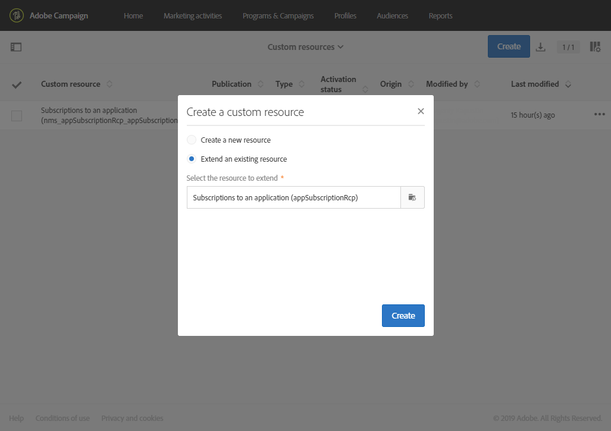
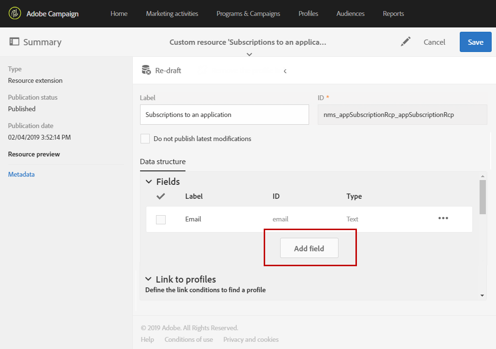
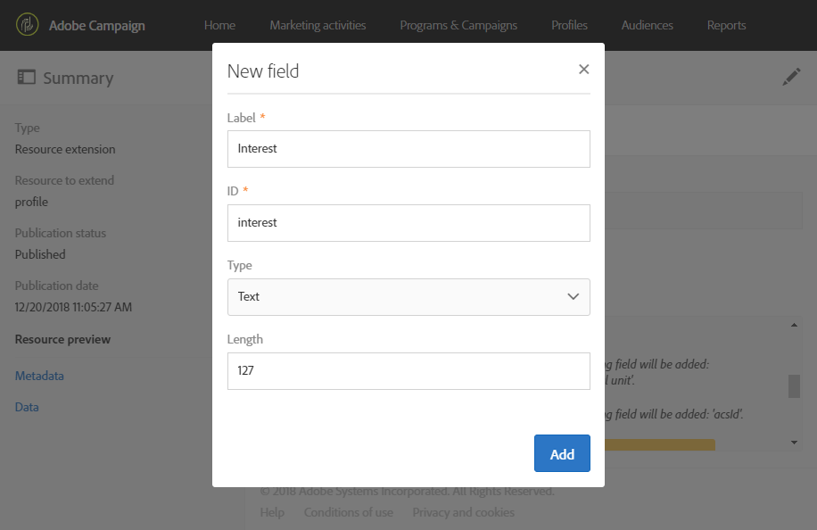
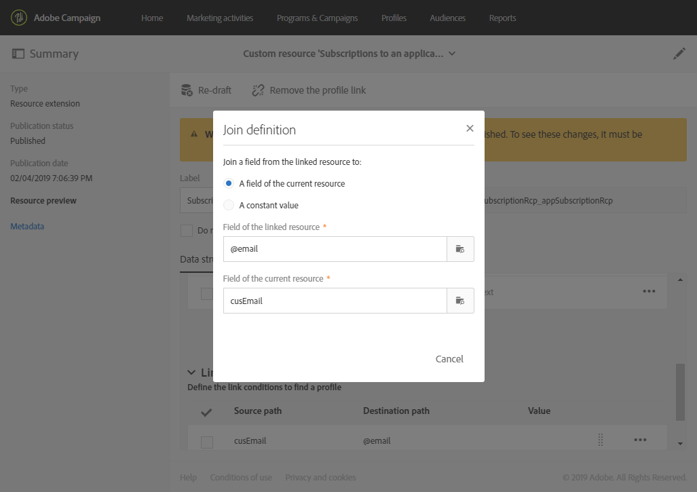

# 구독을 확장해 애플리케이션 리소스로 만들기{#extending-the-subscriptions-to-an-application-resource}

모바일 디바이스에서 전송한 모바일 프로필 속성 데이터는 Adobe Campaign의 **[!UICONTROL Subscriptions to an application (appSubscriptionRcp)]** 리소스에 저장됩니다. 이를 통해 애플리케이션 구독자로부터 수집하려는 데이터를 정의할 수 있습니다. 사용자 지정 리소스에 대한 자세한 내용은 [이 페이지](../../developing/using/key-steps-to-add-a-resource.md)를 참조하세요.

이 리소스를 확장하여 모바일 장치에서 Adobe Campaign으로 전송할 데이터를 수집할 수 있습니다.

1. 고급 메뉴에서 Adobe Campaign 로고를 통해 **[!UICONTROL Administration]** > **[!UICONTROL Development]** 다음 **[!UICONTROL Custom resources]**&#x200B;을 선택합니다.
1. **[!UICONTROL Create]**&#x200B;을(를) 클릭하고 **[!UICONTROL Extend an existing resource]** 옵션을 선택합니다.
1. **[!UICONTROL Subscriptions to an application (appSubscriptionRcp)]** 리소스를 선택하고 **[!UICONTROL Create]**&#x200B;을(를) 클릭합니다.

   

1. **[!UICONTROL Data structure]** 탭의 **[!UICONTROL Fields]** 카테고리에서 **[!UICONTROL Add field]** 단추를 클릭하여 모바일 응용 프로그램에서 검색할 고객 데이터를 정의합니다.

   >[!NOTE]
   >
   >여러 모바일 애플리케이션을 관리하는 경우 모든 애플리케이션에서 사용하는 모든 필드가 나열되어야 합니다. iOS 또는 Android collect PII 호출은 각 애플리케이션에서 캡처하는 필드를 정의합니다.

   

1. 새 필드에 **[!UICONTROL Label]** 및 **[!UICONTROL ID]**&#x200B;을(를) 추가합니다. 필드의 **[!UICONTROL Type]**&#x200B;을(를) 선택합니다.

   

1. **[!UICONTROL Link to profiles]** 범주에서 Adobe Campaign 데이터베이스의 프로필을 응용 프로그램 구독자(예: 이메일)와 연결하는 데 사용되는 조정 키를 구성합니다.

   인앱 메시지의 경우 모든 모바일 애플리케이션에 대해 하나의 조정 키만 정의할 수 있습니다.

   

1. **[!UICONTROL Save]**&#x200B;을(를) 만들고 사용자 지정 리소스를 게시합니다. 사용자 지정 리소스 게시에 대한 자세한 내용은 이 [페이지](../../developing/using/updating-the-database-structure.md#publishing-a-custom-resource)를 참조하세요.
