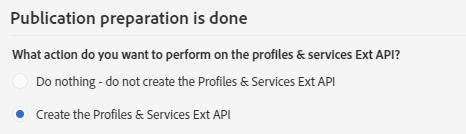

# 2단계: 확장 게시{#step-publish-the-extension}

1. 고급 메뉴에서 Adobe Campaign 로고를 통해 **[!UICONTROL Administration]** > **[!UICONTROL Development]** 다음 **[!UICONTROL Publication]**&#x200B;을 선택합니다.
1. **[!UICONTROL Prepare Publication]** 버튼을 클릭합니다.
1. **[!UICONTROL Create the Profiles & Services Ext API]** 옵션을 선택합니다.

   

   >[!NOTE]
   >
   >API가 이미 게시되어 있는 경우(이 리소스 또는 다른 리소스에 대해 이 옵션을 이미 한 번 선택한 경우) API 업데이트가 강제로 수행됩니다.

1. **[!UICONTROL Profiles & Services API Preview]** 탭을 클릭합니다.

   API 게시가 profilesAndServicesExt API의 현재 버전에 적용되는 변경 사항을 보여 줍니다.

   여기에서는 프로모션 코드 필드(ID: cusBrand)가 API에 삽입됩니다.

   

1. **[!UICONTROL Publish]** 버튼을 클릭합니다.
