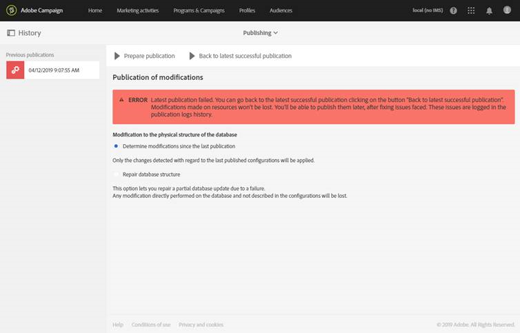

# 데이터베이스 구조 업데이트{#updating-the-database-structure}

데이터 모델을 효과적으로 수정하여 사용할 수 있도록 하려면 데이터베이스 구조를 업데이트해야 합니다.

>[!NOTE]
>
>사용자 지정 리소스는 Adobe에서 수행하는 자동 업데이트 중에 자동으로 새로 고쳐집니다.

## 사용자 지정 리소스 게시 {#publishing-a-custom-resource}

리소스에 대해 수행된 변경 사항을 적용하려면 데이터베이스 업데이트를 수행해야 합니다.

>[!NOTE]
>
>이벤트에 사용된 사용자 지정 리소스의 필드를 수정하거나 삭제하면 해당 이벤트의 게시는 자동으로 취소됩니다. [트랜잭션 메시지 구성](../../administration/using/configuring-transactional-messaging.md)을 참조하십시오.

1. 고급 메뉴에서 Adobe Campaign 로고를 통해 **[!UICONTROL Administration]** > **[!UICONTROL Development]** 다음 **[!UICONTROL Publishing]**&#x200B;을 선택합니다.
1. 기본적으로 **[!UICONTROL Determine modifications since the last publication]** 옵션이 선택되어 있으므로 마지막 업데이트 이후 수행된 변경 사항만 적용됩니다.

   >[!NOTE]
   >
   >**[!UICONTROL Repair database structure]**&#x200B;은(는) 게시가 완료되기 전에 실패한 경우 올바른 구성을 재설정합니다. 데이터베이스에서 직접 수행되고 사용자 지정 리소스를 사용하지 않은 수정 사항은 삭제됩니다.

   

1. 분석을 시작하려면 **[!UICONTROL Prepare publication]** 버튼을 클릭합니다. 워크플로우가 인스턴스를 집중적으로 사용하지 않는 경우 빅 테이블 업데이트를 수행해야 합니다.

   프로필 및 서비스 API에서 수행하는 작업에 대한 자세한 내용은 [API 확장으로 리소스 게시](#publishing-a-resource-with-api-extension)를 참조하십시오.

   

1. 게시가 실행되면 **[!UICONTROL Publish]** 버튼을 클릭하여 새 구성을 적용합니다.
1. 게시되면 각 리소스의 **[!UICONTROL Summary]** 창이 현재 상태가 **[!UICONTROL Published]**&#x200B;임을 나타내고 마지막 게시물의 날짜를 지정합니다.

   >[!NOTE]
   >
   >리소스를 새로 변경하는 경우 변경 사항을 적용하려면 이 작업을 반복해야 합니다.

   게시하기 전 리소스가 **[!UICONTROL Pending re-draft]** 상태일 때 게시하면 확정적인 변경(열, 표 삭제 등)이 발생하므로 작업을 확인할 수 있는 추가 메시지가 나타납니다. 마지막 변경 사항을 수행하는 데 도움이 되는 **[!UICONTROL SQL Script]**&#x200B;탭을 사용할 수 있습니다. 게시 중에 실행될 SQL 명령을 제공합니다.

   

   >[!NOTE]
   >
   >**[!UICONTROL Cancel re-draft]** 버튼을 클릭하여 초안으로 되돌리기 프로세스를 중단할 수 있습니다. 이 작업은 리소스의 상태를 원래 상태로 되돌립니다.

1. 게시에 실패한 경우 언제든지 **[!UICONTROL Back to latest successful publication]**&#x200B;을(를) 클릭하여 이전 게시물로 돌아갈 수 있습니다 .

   게시 실패 상태로 두면 인스턴스에 로그인하는 즉시 팝업 창이 열리고 이 게시물을 수정하라는 메시지가 표시됩니다. 게시물이 수정되기 전에는 인스턴스가 새 제품 버전으로 업그레이드되지 않습니다.

   

## API 확장을 사용하여 리소스 게시 {#publishing-a-resource-with-api-extension}

다음과 같은 경우 프로필 및 서비스 API를 만들 수 있습니다.

* **[!UICONTROL Profiles]**(이)나 **[!UICONTROL Services]**&#x200B;의 사용자 지정 리소스를 확장할 때 사용자 지정 리소스 확장에서 선언된 필드를 통합하기 위해 프로필 및 서비스 API의 업데이트를 수행할 수 있습니다.
* 사용자 지정 리소스를 정의하고 **[!UICONTROL Profiles]**(이)나 **[!UICONTROL Services]** 리소스 또는 사용자 지정 리소스 간에 링크를 만들면 API에 새 리소스를 포함하도록 업데이트를 수행할 수 있습니다.

게시물 화면에서 이 옵션을 선택할 수 있습니다.

* API가 아직 게시되지 않은 경우(리소스를 확장한 적이 없거나 이 리소스 또는 다른 리소스에 대해 이 옵션을 아직 선택하지 않은 경우) API를 만들지 여부를 선택할 수 있습니다.

   

* API가 이미 게시되어 있는 경우(리소스를 이미 확장했고 이 옵션을 선택한 경우) API 업데이트가 강제로 수행됩니다.

   실제로 링크가 만들어지면 다시 게시할 때마다 API가 자동으로 업데이트됩니다. 해당 API의 프로필 또는 서비스 리소스를 끊지 않고 인스턴스를 훼손하지 않기 위한 것입니다.

기본적으로 사용자 지정 리소스는 통합되지만, 특정 동작의 경우 이 리소스를 게시하지 않으려면 **[!UICONTROL Resource Properties]**&#x200B;에서 사용할 수 있는 **[!UICONTROL Hide this resource from APIs]** 옵션을 선택할 수 있습니다 .

**[!UICONTROL Prepare Publication]** 단계 후에 Adobe Campaign은 **[!UICONTROL Profiles & Services API Preview]** 탭에서 게시한 후 현재 버전의 API와 향후 버전 간의 델타를 표시합니다. API를 처음 확장하는 경우 델타는 기본 사용자 지정 리소스 정의를 확장과 비교합니다.

탭에 표시되는 정보는 추가, 삭제 및 수정된 요소의 세 섹션으로 나누어져 있습니다.

게시 단계는 API 동작을 수정할 것이며 주변 개발에 도미노 효과로 영향을 미칠 수 있으므로 델타의 분석은 필수 단계입니다.

>[!NOTE]
>
>이 게시는 **[!UICONTROL profilesAndServicesExt]** API를 업데이트합니다. **[!UICONTROL profilesAndServices]** API는 업데이트되지 않습니다.

Adobe Campaign API에 대한 자세한 내용은 [Adobe IO](https://docs.campaign.adobe.com/doc/standard/en/adobeio.html)에 대한 전용 Adobe Campaign 설명서를 참조하십시오.
