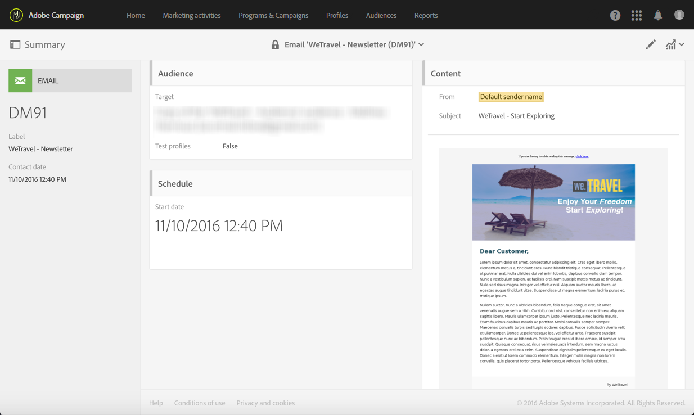

# 포기 트리거 사용 사례{#abandonment-triggers-use-cases}

이 섹션에서는 Adobe Campaign과 Experience Cloud 트리거 간의 통합으로 구현할 수 있는 다양한 사용 사례를 제공합니다. 다음 두 가지 사용 사례를 확인할 수 있습니다.

* [찾아보기 포기 트리거](#browse-abandonment-trigger): 웹사이트 방문을 포기한 고객에게 메시지를 보냅니다.
* [검색 포기 트리거](#search-abandonment-trigger): 웹사이트에서 검색을 했지만 구매하지 않은 방문자에게 메시지를 보냅니다.

>[!NOTE]
>
>이 섹션에서 설명하는 사용 사례는 Experience Cloud 방문자 ID를 기반으로 합니다. Experience Cloud 선언 ID로 구현할 수도 있습니다. 해시 및 암호화한 선언 ID도 지원됩니다. 암호화된 이메일 주소/모바일 번호를 직접 해독하여 Campaign에 존재하지 않는 프로필에 이메일/SMS를 보낼 수 있습니다. 하지만 이 경우 프로필 데이터를 통한 개인화는 사용할 수 없습니다.

## 사전 요구 사항 {#pre-requisites}

이 사용 사례를 구현하려면 다음 솔루션/핵심 서비스에 액세스할 수 있어야 합니다.

* Adobe Campaign
* Adobe Analytics Ultimate, Premium, Foundation, OD, Select, Prime, Mobile Apps, Select 또는 Standard.
* Experience Cloud 트리거 핵심 서비스
* Experience Cloud DTM 핵심 서비스
* Experience Cloud 방문자 ID 및 Experience Cloud People 핵심 서비스

또한 작동하는 웹사이트가 필요합니다.

자세한 내용은 [솔루션 및 서비스 구성](../../integrating/using/configuring-triggers-in-experience-cloud.md#configuring-solutions-and-services)을 참조하십시오.

## 찾아보기 포기 트리거 {#browse-abandonment-trigger}

이 사용 사례에서는 고객이 웹사이트 방문을 중단할 때마다 실행되는 간단한 트리거를 만듭니다. 이 예제에서는 이미 DTM을 통해 데이터를 수집하여 Adobe Analytics로 푸시하고 모든 이벤트를 만든 경우를 가정합니다.

### Experience Cloud 트리거 만들기 {#creating-an-experience-cloud-trigger}

1. Experience Cloud 활성화 핵심 서비스 메뉴에서 **[!UICONTROL Manage Triggers]**&#x200B;을(를) 선택합니다.

   

1. 트리거 유형을 선택합니다(이 사용 사례의 경우 **[!UICONTROL Abandonment]**).

   

1. 이 사용 사례의 경우 간단한 포기 트리거가 필요합니다. 비즈니스 목적은 여행 예약 웹사이트를 찾아보고 “딜” 페이지를 열람했지만 여행을 예약하지 않는 방문자를 파악하는 것입니다. 이 대상자를 파악하면 짧은 시간 내에 다시 연락하는 편이 좋을 것입니다. 이 예제에서는 10분 후에 트리거를 보내도록 선택합니다.

   

### Adobe Campaign에서 트리거 사용 {#using-the-trigger-in-adobe-campaign}

지금 만든 Experience Cloud 트리거를 Adobe Campaign에서 사용해 보겠습니다.

Adobe Campaign에서는 Experience Cloud에서 만든 트리거에 연결된 [트리거]를 만들어야 합니다.

1. Adobe Campaign에서 [트리거]를 만들려면 왼쪽 상단 모서리에서 **[!UICONTROL Adobe Campaign]** 로고를 클릭한 다음 **[!UICONTROL Marketing plans]** > **[!UICONTROL Transactional messages]** > **[!UICONTROL Experience Cloud triggers]**&#x200B;을(를) 선택합니다.

   

1. **[!UICONTROL Create]**&#x200B;을(를) 클릭합니다.
1. 앞에서 만든 [트리거]를 선택하고 **[!UICONTROL Next]**&#x200B;을(를) 클릭합니다.

   

1. **[!UICONTROL Email]** 채널과 **[!UICONTROL Real-time event]** 타겟팅 차원을 선택하고 **[!UICONTROL Create]**&#x200B;을(를) 클릭합니다.

   

1. Adobe Campaign에서 [트리거]를 게시합니다. 이 프로세스는 자동으로 트랜잭션 메시지 템플릿을 만듭니다.

   

1. 메시지 템플릿을 표시하려면 오른쪽 상단에서 **[!UICONTROL More]** 버튼을 클릭한 다음 **[!UICONTROL Trigger Transactional Template]**&#x200B;을(를) 클릭합니다.

1. 콘텐츠 및 발신자 세부 정보를 개인화합니다.

   

1. 메시지 템플릿을 게시합니다. 이제 트리거가 작동합니다.

   

### 시나리오 실행 {#running-the-scenario}

1. 이 사용 사례는 Adobe Campaign을 통해 대상자에게 보낸 초기 이메일에서 시작됩니다.

   

1. 수신자가 이메일을 엽니다.

   

1. 웹사이트로 연결되는 링크를 클릭합니다. 이 예제의 배너는 수신자를 여행 예약 웹사이트의 홈페이지로 데려옵니다.

   

1. 수신자가 &quot;딜&quot; 페이지로 이동하지만 갑자기 방문을 중단합니다. 10분의 시간이 지나면 Adobe Campaign에서 트랜잭션 메시지 보내기를 트리거합니다.

   

1. 언제든지 Experience Cloud 로그를 확인하여 트리거가 몇 번 실행되었는지 확인할 수 있습니다.

   

1. Adobe Campaign 트리거 보고서를 표시할 수도 있습니다.

   

## 검색 포기 트리거 {#search-abandonment-trigger}

이 사용 사례에서는 여행 예약 웹사이트를 방문하여 여행지를 검색했지만 성공적인 결과를 찾지 못해 그 이후에 예약하지 않은 방문자에게 다시 연락할 수 있는 트리거를 만들어 보겠습니다. 전반적인 프로세스는 앞의 사용 사례와 동일합니다([찾아보기 포기 트리거](#browse-abandonment-trigger) 참조). 여기에서는 리마케팅 이메일 메시지를 개인화하는 방법을 중점적으로 살펴봅니다.

### Experience Cloud 트리거 만들기 {#creating-an-experience-cloud-trigger-1}

앞의 사용 사례에서 설명한 단계에 따라 Experience Cloud 트리거를 만듭니다. [Experience Cloud 트리거 만들기](#creating-an-experience-cloud-trigger)를 참조하십시오. 가장 큰 차이는 트리거의 정의입니다.

**[!UICONTROL Include Meta Data]** 섹션에서는 Analytics에서 수집한 모든 데이터를 [트리거] 페이로드로 전달할 수 있습니다. 이 예제에서는 사용자 정의 eVar(예: eVar 3)를 만들어 방문자가 입력하는 검색어를 수집합니다. 이 검색어는 같은 방문자에게 보낼 트랜잭션 이메일 메시지에 사용됩니다.

### Adobe Campaign에서 트리거 사용 {#using-the-trigger-in-adobe-campaign-1}

1. 앞의 사용 사례에서 설명한 단계에 따라 Adobe Campaign에서 트리거를 만듭니다. [Adobe Campaign에서 트리거 사용](#using-the-trigger-in-adobe-campaign)을 참조하십시오. 가장 큰 차이는 Adobe Campaign에서 [트리거] 페이로드에서 푸시한 메타데이터에 액세스 및 사용하는 방법입니다.
1. Adobe Campaign에서 만든 [검색 포기] 트리거에서 **[!UICONTROL Event content and enrichment]** 아이콘을 클릭하여 Adobe Campaign으로 푸시된 페이로드를 확인합니다. 

   

1. 사용자 정의 eVar가 [트리거] 페이로드에서 전달되어 **이벤트 컨텍스트** 표(ctx)에 매핑됩니다. 이를 사용해 트랜잭션 메시지를 개인화할 수 있습니다.

   

1. 이 예제에서는 여행지 검색어를 제목란과 이메일 본문에 포함하겠습니다.

   

1. 개인화된 필드를 선택할 때 페이로드 메타데이터를 **트랜잭션 이벤트**(rtEvent) 표에서 찾은 뒤 **이벤트 컨텍스트**(ctx) 하위 표에서 찾습니다.

   

### 시나리오 실행 {#running-the-scenario-1}

1. 방문자가 여행 예약 웹사이트로 이동하여 목적지를 검색합니다. 이 예제에서 방문자는 일본 여행을 찾고 있지만 결과를 찾지 못합니다. 이 방문자에게 다시 연락하여 대체 여행 계획을 추천할 수 있는 기회입니다.

   

   >[!NOTE]
   >
   >이 경우 방문자/수신자가 이미 동일한 웹사이트에서 보낸 이메일을 열고 링크를 클릭했다고 가정합니다. 이를 통해 방문자 ID를 사용하고 수집하여 수신자에게 매핑할 수 있습니다. 이 작업은 한 번만 하면 됩니다.

1. 잠시 후 같은 방문자/수신자가 리마케팅 메시지를 수신합니다. 메시지에 최근에 검색한 여행지가 포함됩니다.

   

