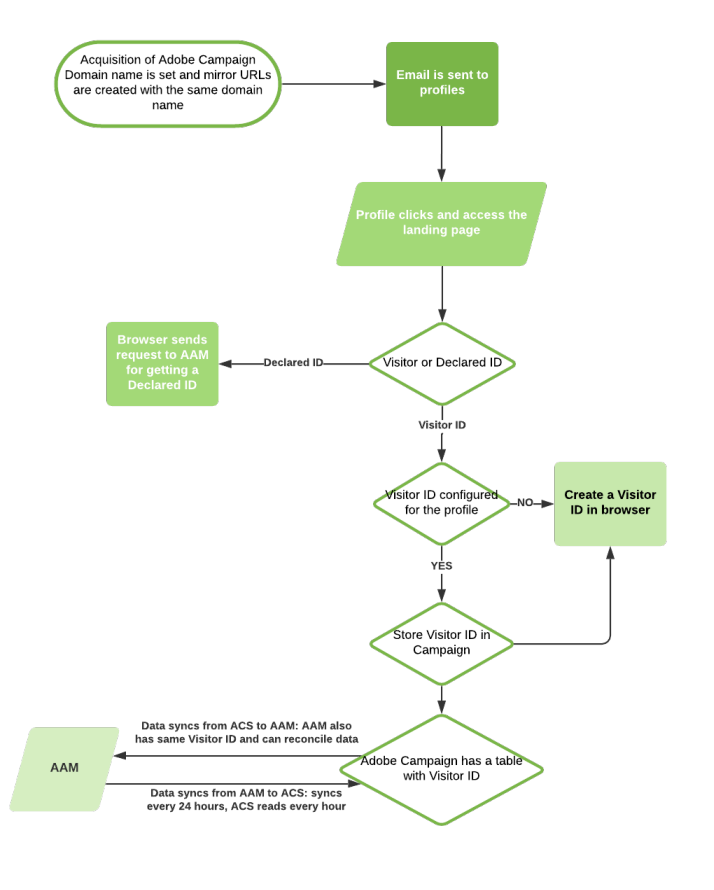

# Campaign-Audience Manager 또는 People 핵심 서비스 통합 기본 정보{#about-campaign-audience-manager-or-people-core-service-integration}

>[!CAUTION]
>
>교환된 데이터에 따라 Adobe Campaign에서 대상을 가져오는 것은 법적 제한이 적용될 수 있습니다.

Adobe Campaign을 사용하면 대상/세그먼트를 다른 Adobe Experience Cloud 애플리케이션과 교환하고 공유할 수 있습니다. **Adobe Campaign**&#x200B;과 **사용자 핵심 서비스**(또한 **프로필 및 대상 핵심 서비스**&#x200B;라고도 함) 통합 또는 Adobe Audience Manager을 사용하면 다음을 수행할 수 있습니다.

* 다양한 Adobe Experience Cloud 솔루션의 대상/세그먼트를 Adobe Campaign으로 가져올 수 있습니다. 대상은 Adobe Campaign의 **[!UICONTROL Audiences]** 메뉴에서 가져올 수 있습니다.
* 대상을 공유 대상/세그먼트로 내보냅니다. 이러한 대상은 사용하는 다른 Adobe Experience Cloud 솔루션에서 사용할 수 있습니다. **[!UICONTROL Save audience]** 활동을 사용하여 워크플로의 타깃팅 활동 후에 대상을 내보낼 수 있습니다.

통합은 다음 두 가지 유형의 Adobe Experience Cloud ID를 지원합니다.

* **방문자 ID**:이 유형의 ID를 사용하면 Adobe Experience Cloud 방문자를 Adobe Campaign 프로필과 조정할 수 있습니다. Adobe IMS를 통해 연결이 활성화되면 Adobe Campaign에서 사용하는 영구 쿠키를 대체하는 Marketing Cloud 방문자 ID 서비스가 활성화됩니다. 방문자를 식별한 다음 프로필에 연결할 수 있습니다.
    방문자 ID는 프로필이 Adobe Campaign을 통해 보낸 이메일을 클릭하는 즉시 프로필에 연결됩니다.
   * 프로필에 이미 방문자 ID가 있는 경우 프로필의 브라우저 데이터를 통해 Adobe Campaign에서 프로필을 복구하여 방문자 ID에 자동으로 연결할 수 있습니다.
   * 방문자 ID가 없으면 새 ID가 만들어집니다. 이 방문자 ID는 프로필 추적 로그에 저장됩니다.

   그러면 ID는 동일한 CNAME의 다른 Adobe Marketing Cloud 애플리케이션에서 인식됩니다.

* **선언된 ID**:이 유형의 ID를 사용하면 모든 유형의 데이터를 Adobe Campaign 데이터베이스의 요소와 대사할 수 있습니다. Adobe Campaign에 사전 정의된 조정 키로 표시됩니다. 데이터를 교환할 때 Adobe Campaign 데이터베이스 식별자가 해시 처리됩니다. 이렇게 해시된 ID는 가져오기 또는 내보내기에 관련된 Adobe Marketing Cloud 대상의 해시 ID와 비교됩니다.
    이 통합은 선언된 일반 ID, 해시된 선언된 ID 및 암호화된 선언된 ID를 지원합니다.

   >[!CAUTION]
   >
   >선언된 ID는 Adobe Audience Manager에서만 작동합니다. 선언된 ID는 ID가 없으면 작동하지 않습니다.

   암호화를 사용하면 암호화 알고리즘을 지정하여 선언된 ID를 사용하여 데이터 소스(예: PII)에서 암호화된 데이터를 공유할 수 있습니다.

   예를 들어 암호화된 이메일 주소 또는 SMS 번호를 해독할 수 있으므로 Adobe Campaign 데이터베이스에 프로필이 없더라도 사용자에게 트리거된 메시지를 보낼 수 있습니다.

다음 다이어그램은 이 통합이 작동하는 방식을 자세히 설명합니다. 여기서 AAM은 Adobe Campaign Standard용 Adobe Audience Manager et ACS를 의미합니다.

