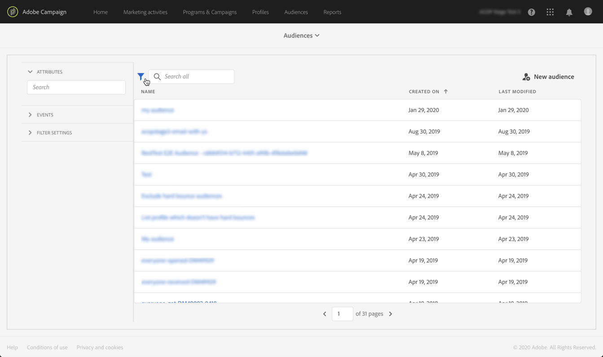

# Adobe Experience Platform 대상자 관리 {#about-audiences}

>[!IMPORTANT]
>
>Audience Destinations Service는 현재 베타 버전으로, 사전 통지 없이 수시로 업데이트될 수 있습니다. 고객은 이러한 기능에 액세스하려면 Azure에서 호스팅(현재 북미 전용 베타 버전)해야 합니다. 액세스하려면 고객 지원 센터에 문의하십시오.

## Adobe Experience Platform 대상자 액세스

Adobe Experience Platform 세그먼트 빌더에 액세스하려면 다음 위치로 이동합니다. **[!UICONTROL Audiences]** Campaign Standard 홈페이지의 카드(또는 **[!UICONTROL Audiences]** (헤더)에 연결된 다음, **[!UICONTROL Adobe Experience Platform]** 환경.

먼저 Adobe Experience Platform 세그먼트 목록 페이지로 이동합니다. 기존 Adobe Experience Platform 세그먼트를 더 편집하기 위해 액세스할 수 있습니다.

원하는 Adobe Experience Platform 세그먼트를 찾는 데 도움이 되는 검색 막대 및 필터를 사용할 수 있습니다.

## Adobe Experience Platform 대상자 만들기

Campaign Standard에서 직접 Adobe Experience Platform 대상을 만들려면 다음 단계를 수행하십시오.

1. Adobe Experience Platform 세그먼트 목록 페이지에서 **[!UICONTROL New audience]** 오른쪽 모서리에 있는 단추.

   

1. 이제 작업 공간에 세그먼트 빌더가 표시됩니다. 이를 통해 최종적으로 대상자를 만드는 데 사용할 Adobe Experience Platform의 데이터를 사용하여 세그먼트를 만들 수 있습니다.

1. 오른쪽 창에서 세그먼트 이름을 지정하고 설명을 입력합니다(선택 사항).

   

1. 세그먼트를 성공적으로 만들려면 **병합 정책** 이 세그먼트의 마케팅 목적과 일치합니다.

   설정 창에서 플랫폼 기본 병합 정책이 선택됩니다. 병합 정책에 대한 자세한 내용은 [세그먼트 빌더 사용 안내서](https://experienceleague.adobe.com/docs/experience-platform/segmentation/ui/overview.html).

   

1. 대상에서 검색할 프로필을 식별할 규칙을 정의합니다.

   이렇게 하려면 왼쪽 창에서 작업 공간으로 원하는 속성 및/또는 이벤트를 드래그하고 해당 규칙을 정의한 다음 **[!UICONTROL Create segment]** 세그먼트를 저장하는 버튼( 참조) [세그먼트 빌더 사용](../../integrating/using/aep-using-segment-builder.md)).

   

이제 대상이 활성화될 준비가 되었습니다. 이를 캠페인의 타겟으로 사용할 수 있습니다( 참조). [Adobe Experience Platform 대상자 타겟팅](../../integrating/using/aep-targeting-audiences.md)).

## 대상자 편집

대상을 편집하려면 대상자를 열고 세그먼트 빌더 인터페이스 내에서 필요에 따라 규칙을 수정합니다(참조 [세그먼트 빌더 사용](../../integrating/using/aep-using-segment-builder.md)).

변경이 완료되면 **[!UICONTROL Save segment]** 버튼을 클릭하여 대상자를 업데이트합니다.

