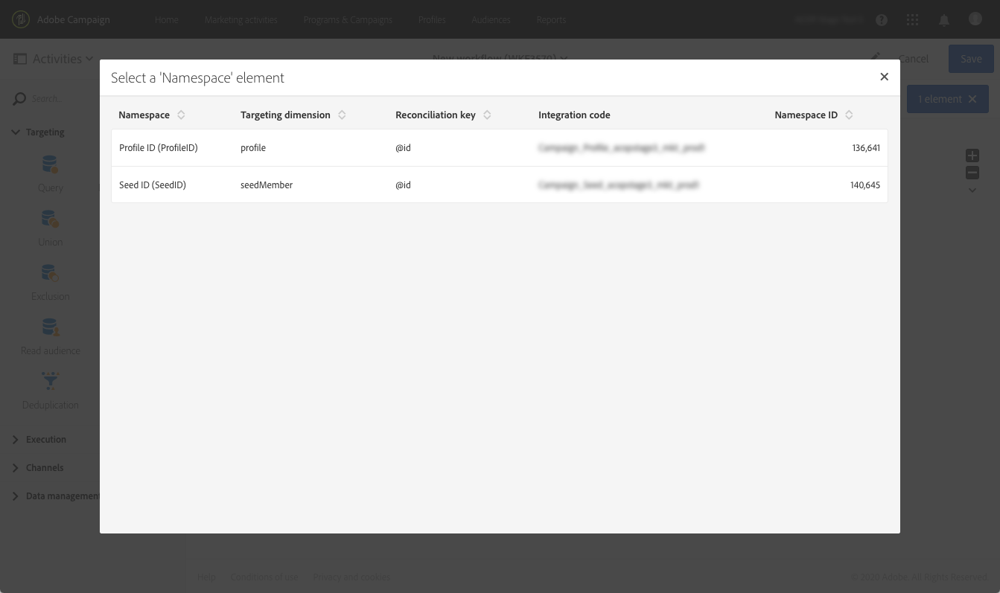

# Adobe Experience Platform 대상자 타기팅 {#targeting-aep-audiences}

>[!IMPORTANT]
>
>Audience Destinations 서비스는 현재 베타에 있으며, 예고 없이 자주 업데이트될 수 있습니다. 고객은 이러한 기능에 액세스하려면 Azure에서 호스팅(현재 북미 전용 베타 버전)해야 합니다. 액세스하려면 고객 지원 센터에 문의하십시오.

만든 후에 [Adobe Experience Platform 대상](../../integrating/using/aep-about-audience-destinations-service.md) 세그먼트 빌더를 사용하면 워크플로우 내의 캠페인 대상자가 메시지를 개인화하고 전송하는 것과 동일한 방식으로 메시지를 사용할 수 있습니다.

워크플로우로 Adobe Experience Platform 대상자를 활성화하려면 다음 단계를 수행하십시오.

1. 추가 **[!UICONTROL Read audience]** 활동을 워크플로우에 끌어와 다음 엽니다.

1. 을(를) 선택합니다 **[!UICONTROL Adobe Experience Platform]** 옵션 아래의 **[!UICONTROL Type of audience]**&#x200B;를 입력한 다음 원하는 대상자를 추가합니다.

   

1. (선택 사항) 대상자를 선택하면 눈 버튼을 클릭하여 세그먼트 정의를 검토 및/또는 편집할 수 있습니다(변경 사항을 다시 저장했는지 확인).

   눈 모양 단추를 클릭하면 Campaign 내에서 선택한 대상과 연결된 세그먼트 빌더(다른 탭)로 이동합니다.

1. 선택 **[!UICONTROL Platform data mapping]** 요소를 사용하여 선택한 Adobe Experience Platform 대상에 대해 원하는 타겟팅 차원을 지정합니다.

   기본적으로 조정에 사용되는 기본 키(예: 프로필 테이블의 iRecipientID, AppSubscription 테이블의 iAppSubscriptionID)는 드롭다운 목록에서 자동으로 사용할 수 있습니다. 기본 키의 외부에서 타깃팅하려면 사용자 지정 키를 만들어야 합니다 **네임스페이스**.

   >[!NOTE]
   >
   >기본 키 외부의 대상의 경우 사용자 지정 네임스페이스에 해당하는 사용자 지정 대상 매핑도 만들어야 합니다. 대상 매핑에 대한 자세한 내용은 [이 섹션](../../administration/using/target-mappings-in-campaign.md).

   

   이 목록에는 인스턴스에 구성된 모든 XDM(Experience Data Model) 매핑이 포함되어 있습니다. Adobe Experience Platform 데이터 커넥터에 대한 자세한 내용은 [이 전용 문서](../../integrating/using/aep-about-data-connector.md).

   

1. 대상 및 타겟팅 차원이 제대로 구성되면 **[!UICONTROL Confirm]** 단추를 클릭하여 변경 사항을 저장합니다.

이제 다른 활동으로 워크플로우를 구성할 수 있습니다. 예를 들어 **[!UICONTROL Email delivery]** 활동을 통해 선택한 대상자에게 이메일을 보냅니다.

>[!NOTE]
>
>Campaign Standard을 사용하면 모든 전달 채널 내에서 Adobe Experience Platform 대상을 타깃팅할 수 있습니다. 이메일, SMS 메시지, DM 메시지, 푸시 알림 및 인앱 메시지.
>
>*참고: 모든 푸시 및 인앱 메시지의 경우, Campaign Standard은 알려진 프로필에 대해서만 게재를 지원합니다.

워크플로우 및 게재 사용 방법에 대한 자세한 내용은 다음 섹션을 참조하십시오.

* [워크플로우 살펴보기](../../automating/using/get-started-workflows.md)
* [워크플로우 작성](../../automating/using/building-a-workflow.md)
* [통신 채널 살펴보기](../../channels/using/get-started-communication-channels.md)
* [채널 활동 기본 정보](../../automating/using/about-channel-activities.md)
