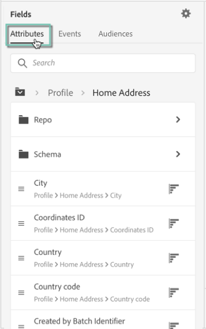
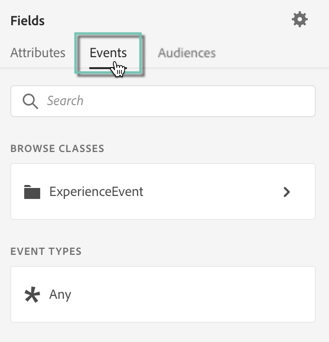

# 세그먼트 빌더 사용 {#using-the-segment-builder}

>[!IMPORTANT]
>
>Audience Destinations 서비스는 현재 베타에 있으며, 예고 없이 자주 업데이트될 수 있습니다. 고객은 이러한 기능에 액세스하려면 Azure에서 호스팅(현재 북미 전용 베타 버전)해야 합니다. 액세스하려면 고객 지원 센터에 문의하십시오.

세그먼트 빌더를 사용하면 [실시간 고객 프로필](https://experienceleague.adobe.com/docs/experience-platform/profile/home.html).

이 섹션에서는 세그먼트를 작성할 때의 글로벌 개념을 설명합니다. 세그먼트 빌더 자체에 대한 자세한 내용은 [세그먼트 빌더 사용 안내서](https://experienceleague.adobe.com/docs/experience-platform/segmentation/ui/overview.html).

세그먼트 빌더 인터페이스는 다음과 같이 구성됩니다.

* 왼쪽 창에는 원하는 필드를 세그먼트 빌더 작업 영역으로 끌어다 놓아 세그먼트를 작성할 수 있는 모든 속성, 이벤트 및 대상이 있습니다.
* 중앙 영역에서는 사용 가능한 필드에서 규칙을 정의하고 결합하여 세그먼트를 만드는 작업 공간을 제공합니다.
* 헤더 및 오른쪽 창에는 세그먼트의 속성(예: 세그먼트의 이름, 설명 및 예상 자격 프로필)이 표시됩니다.

## 세그먼트 작성

세그먼트를 만들려면 다음 단계를 수행하십시오.

이제 작업 공간에 세그먼트 빌더가 표시됩니다. 이를 통해 최종적으로 대상자를 만드는 데 사용할 Adobe Experience Platform의 데이터를 사용하여 세그먼트를 만들 수 있습니다.

1. 세그먼트 이름을 지정한 다음 설명을 입력합니다(선택 사항).

   

1. 설정 창에서 원하는 병합 정책을 선택했는지 확인합니다.

   병합 정책에 대한 자세한 내용은 [세그먼트 빌더 사용 안내서](https://experienceleague.adobe.com/docs/experience-platform/segmentation/ui/overview.html).

   

1. 왼쪽 창에서 원하는 필드를 찾아 가운데 작업 영역으로 끌어서 놓습니다.

   

1. 드래그한 필드에 해당하는 규칙을 구성합니다.

   

1. **[!UICONTROL Create segment]** 버튼을 클릭합니다.

## 세그먼트에 적합한 필드 찾기

왼쪽 창에는 규칙을 구성하는 데 사용할 수 있는 모든 속성, 이벤트 및 대상이 표시됩니다.

나열된 필드는 회사에서 캡처한 특성이며 [XDM(경험 데이터 모델) 시스템](https://experienceleague.adobe.com/docs/experience-platform/xdm/home.html).

필드는 탭으로 구성됩니다.

* **[!UICONTROL Attributes]**: Adobe Campaign 데이터베이스 및/또는 Adobe Experience Platform에서 생성할 수 있는 기존 프로필 속성입니다. 프로필에 첨부된 정적 정보(예: 이메일 주소, 거주 국가, 충성도 프로그램 상태 등)를 참조합니다.

   

* **[!UICONTROL Events]**: &quot;2주 동안 두 번 주문한 사람&quot;과 같이 회사의 고객 접점과 상호 작용한 고객을 식별하는 활동. Adobe Analytics에서 스트리밍하거나 타사 ETL 도구를 사용하여 Adobe Experience Platform으로 직접 수집할 수 있습니다.

   

>[!NOTE]
>
>**다중 엔티티 세그먼테이션** 제품, 저장소 또는 기타 비프로필 클래스를 기반으로 하여 프로필 데이터를 추가 데이터로 확장할 수 있습니다. 연결되면 추가 클래스의 데이터를 프로필 스키마에 대한 기본 데이터 처럼 사용할 수 있게 됩니다.
>
>자세한 내용은 [전용 설명서](https://experienceleague.adobe.com/docs/experience-platform/segmentation/multi-entity-segmentation.html)를 참조하십시오.

기본적으로 세그먼트 빌더에는 데이터가 이미 있는 필드가 표시됩니다. 데이터가 없는 필드를 포함하여 전체 스키마를 표시하려면 **[!UICONTROL Show full XDM schema]** 옵션을 선택합니다.

각 필드 끝에 있는 기호는 속성 및 속성 사용 방법에 대한 추가 정보를 제공합니다.

## 세그먼트에 대한 규칙 정의

>[!NOTE]
>
>아래 섹션에서는 규칙 정의에 대한 전역 정보를 제공합니다. 자세한 내용은 [세그먼트 빌더 사용 안내서](https://experienceleague.adobe.com/docs/experience-platform/segmentation/ui/overview.html).

규칙을 만들려면 다음 단계를 수행합니다.

1. 왼쪽 창에서 규칙을 기준으로 할 속성이나 이벤트를 반영하는 필드를 찾습니다.

1. 필드를 중앙 작업 영역으로 드래그한 다음 원하는 세그먼트 정의에 따라 구성합니다. 이를 위해 몇 가지 문자열 및 날짜/시간 함수를 사용할 수 있습니다.

   아래 예에서는 규칙은 &quot;남성&quot;과 같은 성별을 가진 모든 프로필을 타겟팅합니다.

   

   세그먼트에 해당하는 예상 모집단은 **[!UICONTROL Segment Properties]** 섹션을 참조하십시오.

1. 다음 **[!UICONTROL View Profiles]** 버튼은 규칙에 해당하는 처음 20개 레코드의 미리 보기를 제공하여 세그먼트의 유효성을 빠르게 검사할 수 있도록 합니다.

   

   올바른 프로필을 타겟팅하기 위해 원하는 만큼 규칙을 추가할 수 있습니다.

   컨테이너에 규칙을 추가하면 AND 논리 연산자가 있는 기존 규칙에 추가됩니다. 필요한 경우 논리 연산자를 클릭하여 수정합니다.

   

두 규칙이 함께 연결되면 컨테이너가 형성됩니다.

## 필드 비교

세그먼트 빌더에서 두 필드를 비교하여 규칙을 정의할 수 있습니다. 예를 들어, 집 주소가 직장 주소와 다른 우편 번호를 가진 여성은 남성입니다.

이렇게 하려면 다음 단계를 수행합니다.

1. 비교할 첫 번째 필드(예: 집 주소 우편 번호)를 중앙 작업 영역으로 드래그합니다.

   

1. 첫 번째 필드와 비교할 두 번째 필드(예: 회사 주소 우편 번호)를 선택합니다.

   중앙 작업 영역으로 끌어서 놓습니다. 그러면 첫 번째 필드와 같은 컨테이너에 있는 **[!UICONTROL Drop here to compare operands]** 상자.

   

1. 원하는 대로 두 필드 사이에 연산자를 구성합니다. 이 예에서는 세그먼트가 작업 주소와 다른 홈 주소를 사용하는 프로필을 타겟팅하려고 합니다.

   

이제 규칙이 구성되었으며 대상으로 활성화할 준비가 되었습니다.
