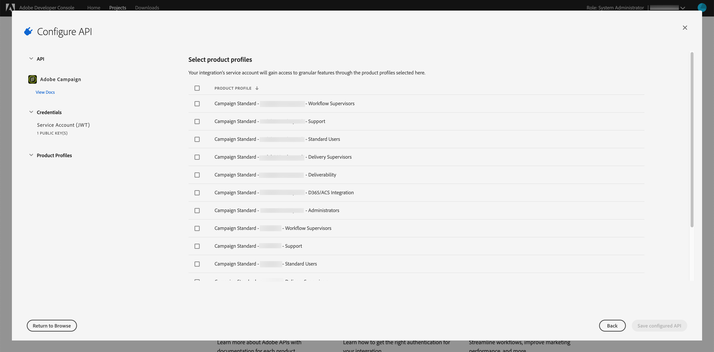

# Microsoft Dynamics 365 통합을 위해 Adobe IO 구성

크로스채널 통신 시 CRM 데이터 활성화:새 Adobe IO 프로젝트를 만들고 Microsoft Dynamics 365 통합을 위해 구성하는 사전 통합 설정 중에 필요한 단계를 살펴보십시오.

## 개요

Adobe Campaign Standard - Microsoft Dynamics 365 통합에 대해서는 [이 페이지에서 설명합니다](../../integrating/using/working-with-campaign-standard-and-microsoft-dynamics-365.md).

이 아티클에서 사전 통합 설정을 수행하기 전에 이미 프로비저닝되었으며 조직의 Campaign Standard 인스턴스에 대한 관리자 액세스 권한이 있는 것으로 가정합니다.  이러한 문제가 발생하지 않은 경우 Adobe 고객 지원 센터에 문의하여 캠페인 제공을 완료해야 합니다.

>[!CAUTION]
>
>관리자가 아래 설명된 단계를 수행해야 합니다.

## 구성

새 Adobe IO 프로젝트를 만들고 통합용으로 구성해야 합니다.

### 새 프로젝트 만들기

이를 수행하려면 아래 절차를 따르십시오.

1. Adobe [IO 콘솔로](https://console.adobe.io/home#) 이동하고 화면 오른쪽 상단의 드롭다운 메뉴에서 Adobe IMS 조직 ID를 선택합니다.

1. 그런 다음 아래 **[!UICONTROL Create new project]** 에서 을 클릭합니다 **[!UICONTROL Quick Start]**.

1. 아래에서 **[!UICONTROL Get started with your new project]**&#x200B;을 클릭합니다 **[!UICONTROL Add API]**.

1. Adobe Campaign API를 선택하고(아래로 스크롤해야 할 수 있음) &quot;다음&quot;을 클릭합니다.

1. 다음 화면에서 자신의 공개 키를 업로드하거나 Adobe IO에서 키 쌍을 생성하도록 선택할 수 있습니다. 이러한 지침은 후자의 옵션을 따릅니다. Adobe IO에서 키 쌍을 생성하도록 하려면 옵션 1을 클릭합니다.그런 다음 &quot;키에어 생성&quot; 버튼을 클릭합니다.

1. 다음 화면에서 키 페어 zip 파일의 다운로드 위치를 지정하고 선택하라는 메시지가 표시됩니다.

다운로드한 후에는 파일의 압축을 해제하여 공개 및 개인 키를 표시할 수 있습니다. Adobe IO가 Adobe IO 프로젝트에 공개 키를 이미 적용했습니다. 개인 키는 나중에 보관해야 합니다.통합 도구의 사전 통합 설정 중에 개인 키가 사용됩니다.

1. 계속하려면 &quot;다음&quot;을 클릭하십시오

1. 다음 화면에서 이 프로젝트와 연결할 제품 프로필을 선택합니다.

1. 제목에 포함된 제품 프로필을 선택합니다.캠페인 인스턴스의 테넌트 ID - [!UICONTROL Administrators] - 예:Campaign Standard - 내 캠페인 테넌트 ID - 관리자

1. 을 클릭합니다 [!UICONTROL Save configured API].

1. 다음 화면에는 새 Adobe IO 프로젝트의 세부 사항이 표시됩니다.

1. 화면 왼쪽 상단에 있는 &quot;프로젝트에 추가&quot;를 클릭하고 드롭다운에서 &quot;API&quot;를 선택합니다.

1. 다음 화면에서 I/O 이벤트 API를 선택한 다음 &quot;다음&quot;을 클릭해야 합니다.

1. 다음 화면에서 &quot;구성된 API 저장&quot;을 클릭합니다.  프로젝트 세부 사항 화면으로 돌아갑니다.

1. 이제 화면 왼쪽 상단에 있는 &quot;프로젝트에 추가&quot;를 클릭하고 드롭다운에서 &quot;API&quot;를 선택하십시오.

1. 다음 화면에서 I/O 관리 API를 선택하고 &quot;다음&quot;을 클릭해야 합니다.

1. 다음 화면에서 &quot;구성된 API 저장&quot;을 클릭합니다.

이제 Campaign의 사전 통합 설정이 완료되었습니다.  Microsoft Dynamics 365에 대한 [사전 통합 설정을 완료하십시오](../../integrating/using/configure-microsoft-dynamics-365-for-campaign-integration.md).

**관련 항목**

* [Adobe IO - 서비스 계정 통합](https://www.adobe.io/authentication/auth-methods.html#!AdobeDocs/adobeio-auth/master/AuthenticationOverview/ServiceAccountIntegration.md)
* [Campaign Standard - API 액세스 설정](https://docs.campaign.adobe.com/doc/standard/en/api/ACS_API.html#setting-up-api-access)
* [Campaign Standard - Dynamics 365 통합](../../integrating/using/configure-microsoft-dynamics-365-for-campaign-integration.md)