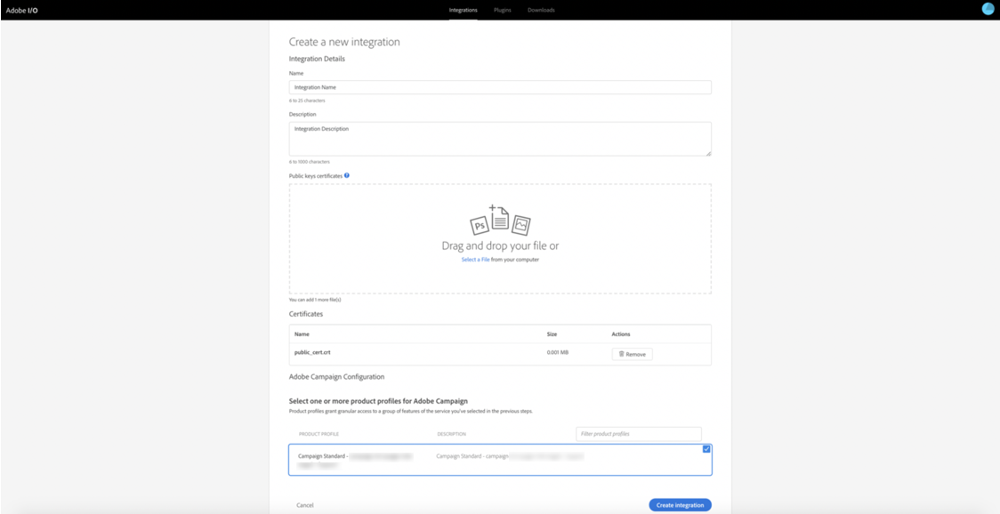
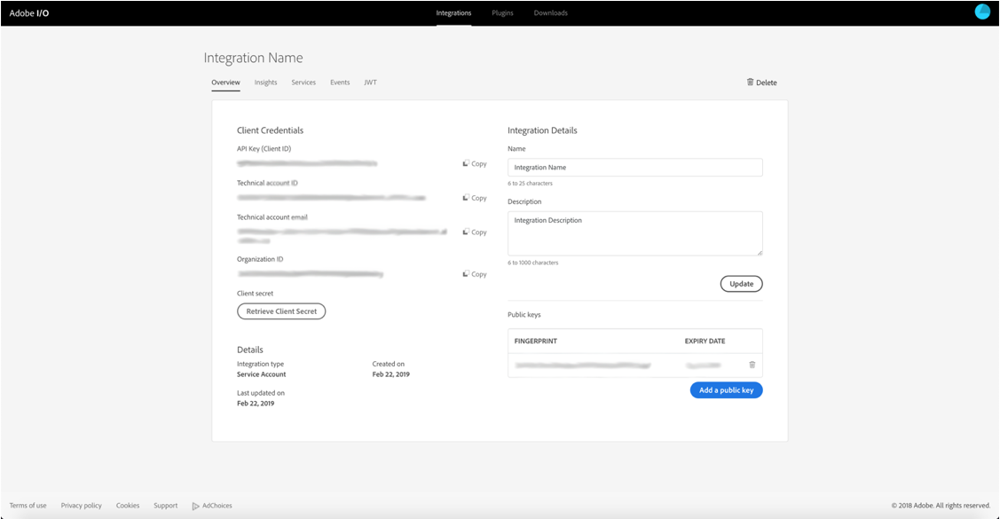

# Microsoft Dynamics 365용 Adobe IO 통합 구성

크로스 채널 커뮤니케이션에서 CRM 데이터 활성화:microsoft Dynamics 365용 새 통합을 만들기 위해 사후 프로비저닝 과정에서 필요한 단계를 살펴보십시오.

## 개요

Adobe Campaign Standard - Microsoft Dynamics 365 통합에 대해서는 [이 페이지에서](../../integrating/using/working-with-campaign-standard-and-microsoft-dynamics-365.md)설명합니다.

이 아티클에서 프로비저닝 후 단계를 수행하기 전에 이미 프로비저닝되어 조직의 Campaign Standard 인스턴스에 대한 관리자 액세스 권한이 있는 것으로 가정합니다.  이러한 문제가 발생하지 않은 경우 Adobe 고객 지원 센터에 문의하여 Campaign 프로비전을 완료해야 합니다.

>[!CAUTION]
>
>아래 설명된 단계는 관리자가 수행해야 합니다.

## 구성

API 액세스를 설정하고 Unifi에 대한 새 통합을 구성해야 합니다.

구성은 Adobe IO에서 수행됩니다.이 비디오에 나와 있는 대로 Unifi에 대한 새 통합을 만들어야 합니다.

>[!VIDEO](https://video.tv.adobe.com/v/27308)

### 새 통합 만들기

이를 수행하려면 아래 절차를 따르십시오.

1. Adobe IO [콘솔로](https://console.adobe.io/home#) 이동하고 왼쪽 상단의 드롭다운 메뉴에서 Adobe IMS 조직 ID를 선택합니다(아래 참조).

오른쪽 **[!UICONTROL New Integration]** 상단에 있는 을 클릭합니다.

>[!NOTE]
>
>이것이 조직의 첫 번째 통합인 경우, 단추는 페이지 가운데에 **[!UICONTROL New Integration]** 있을 수 있습니다.

1. 을 선택하고 **[!UICONTROL Access an API]** 클릭합니다 **[!UICONTROL Continue]**.

1. 섹션에서 _Adobe_ Campaign을 **[!UICONTROL Experience Cloud]** 선택하고 **[!UICONTROL Continue]**&#x200B;클릭합니다.

1. 인증서 및 키를 생성합니다.

**MacOs 및 Linux 플랫폼용**

터미널 애플리케이션을 열고 아래 명령을 실행합니다.

```
openssl req -x509 -sha256 -nodes -days 365 -newkey rsa:2048 -keyout private.key -out certificate_pub.crt
```

**Windows 플랫폼용**

* 공개 클라이언트를 다운로드하여 공개 인증서(예: Open [windows 클라이언트](https://bintray.com/vszakats/generic/download_file?file_path=openssl-1.1.1-win64-mingw.zip)) 생성

* zip 파일에서 폴더 추출

* 명령줄 프롬프트를 열고 아래 명령을 실행합니다.

압축을 푼 폴더의 경로로 `<containing folder path>` 아래를 바꿉니다(예: C:\Users\labuser\Downloads\openssl-1.1.1-win64-mingw\openssl-1.1-win64-mingw).

```
set OPENSSL_CONF=<containing folder path>/openssl.cnf
 
cd <containing folder path>/
 
openssl req -x509 -sha256 -nodes -days 365 -newkey rsa:2048 -keyout private.key -out certificate_pub.crt
```

**모든 플랫폼**

프롬프트에 따라 인증서 요청을 완료합니다.

```
Generating a 2048 bit RSA private key
 
.................+++
 
.......................................+++
 
writing new private key to 'private.key'
 
-----
 
You are about to be asked to enter information that will be incorporated
 
into your certificate request.
 
What you are about to enter is what is called a Distinguished Name or a DN.
 
There are quite a few fields but you can leave some blank
 
For some fields there will be a default value,
 
If you enter '.', the field will be left blank.
 
-----
```

정보를 입력하면 두 개의 파일이 생성됩니다. **[!UICONTROL certificate_pub.crt]** 및 **[!UICONTROL private.key]** Adobe

* **[!UICONTROL certificate_pub.crt]** 365일 후에 만료됩니다. 위의 openssl 명령에서 일 값을 변경하여 만료 기간을 수정할 수 있지만 자격 증명을 주기적으로 회전하는 것은 좋은 보안 방법입니다.

* **[!UICONTROL certificate_pub.crt]** Adobe I/O 콘솔의 통합을 완료하기 위해 다음 화면에서 사용됩니다.

>[!NOTE]
>
> **[!UICONTROL private.key]** 은 Unifi에 대한 사후 프로비저닝 단계 동안 나중에 사용됩니다.

1. Adobe I/O 콘솔로 돌아가서 통합에 대한 이름과 설명을 입력합니다.

1. 업로드 **[!UICONTROL certificate_pub.crt]**

1. 제목에 있는 제품 프로필을 선택합니다.

   * 캠페인 인스턴스의 조직 ID
   * **[!UICONTROL Administrators]**

예: Campaign Standard - your-campaign-organizationID - 관리자

을 **[!UICONTROL Create Integration]**&#x200B;클릭합니다.



### 통합 세부 사항 설정

1. 선택 **[!UICONTROL Continue to Integration Details]**

통합 세부 사항을 검토합니다.  Unifi 사후 프로비저닝 단계를 통해 실행할 때 다시 방문해야 합니다.



1. 탭을 클릭하여 **[!UICONTROL Services]** 추가 **[!UICONTROL I/O Events]** 및 **[!UICONTROL I/O Management API]** 서비스를 추가합니다.  서비스를 추가하려면 라디오 단추를 클릭한 다음 을 클릭합니다 **[!UICONTROL Add service]**.  서비스별로 따로 하시면 됩니다

서비스가 완료되면 아래 그림과 같이 맨 위에 표시됩니다. JWT 및 액세스 토큰 생성에서 A-On 섹션을 완료할 필요가 없습니다.


이제 Campaign의 게시 프로비저닝이 완료되었습니다.  Microsoft Dynamics 365에 대한 [사후 프로비저닝 단계를 완료하십시오](../../integrating/using/configure-microsoft-dynamics-365-for-campaign-integration.md).

**관련 항목**

* [Adobe IO - 서비스 계정 통합](https://www.adobe.io/authentication/auth-methods.html#!AdobeDocs/adobeio-auth/master/AuthenticationOverview/ServiceAccountIntegration.md)
* [Campaign Standard - API 액세스 설정](https://docs.campaign.adobe.com/doc/standard/en/api/ACS_API.html#setting-up-api-access)
* [Campaign Standard - Dynamics 365 통합](../../integrating/using/configure-microsoft-dynamics-365-for-campaign-integration.md)
