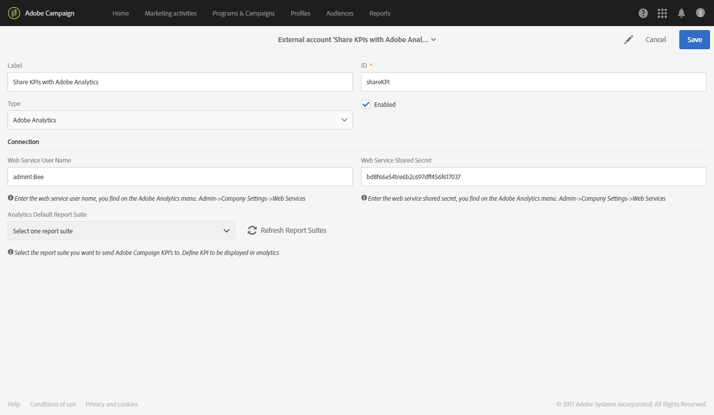

# Campaign-Analytics 통합 구성{#configure-campaign-analytics-integration}

이 통합을 통해 주요 성능 지표 데이터를 Adobe Campaign에서 Adobe Analytics Standard 또는 Premium으로 직접 공유할 수 있습니다.

Adobe Campaign Standard과 Adobe Analytics 간의 통합을 시작하려면 먼저 Adobe Analytics에 연결된 외부 계정을 구성해야 합니다.

외부 계정 및 기술 워크플로우는 플랫폼의 기능 관리자만 관리할 수 있습니다.

1. 고급 메뉴에서 Adobe Campaign 로고를 통해 **[!UICONTROL Administration > Application settings > External accounts]**&#x200B;을(를) 선택합니다.
1. **[!UICONTROL Share KPIs with Adobe Analytics]** 외부 계정을 선택하십시오.

   

1. **[!UICONTROL Connection]** 필드에 **[!UICONTROL Web services user name]** 및 **[!UICONTROL Web services share secret]**&#x200B;을(를) 지정합니다.

   이러한 매개 변수는 **[!UICONTROL Admin > Company settings > Web services]**&#x200B;을(를) 선택하여 Analytics에서 찾을 수 있습니다.

   

1. **[!UICONTROL Refresh report suites]** 버튼을 클릭합니다.
1. **[!UICONTROL Analytics default report suite]** 드롭다운에서 Adobe Campaign 데이터로 보강할 Adobe Analytics 보고서 세트를 선택합니다.

   이제 외부 계정이 준비되었으며 Adobe Analytics에 연결됩니다. 언제든지 **[!UICONTROL Enabled]** 상자를 선택하여 비활성화할 수 있습니다.

   

이제 **[!UICONTROL Share KPIs with Adobe Analytics]** 기술 워크플로우가 자동으로 시작되며 **[!UICONTROL Administration > Application settings > Workflow]**&#x200B;을(를) 선택하여 고급 메뉴에서 볼 수 있습니다. 이 기술 워크플로우는 최대 6개월 된 브로드로그를 유지할 수 있습니다. 이 워크플로우는 증분 워크플로우이며 전날의 데이터를 푸시합니다.

이제 Adobe Analytics에서 데이터를 사용할 수 있습니다.

**관련 항목:**

* [외부 계정](../../administration/using/external-accounts.md)
* [기술 워크플로](../../administration/using/technical-workflows.md)
* [통합 Campaign 보고를 위한 KPI 공유](https://helpx.adobe.com/marketing-cloud/how-to/email-marketing.html) 비디오
