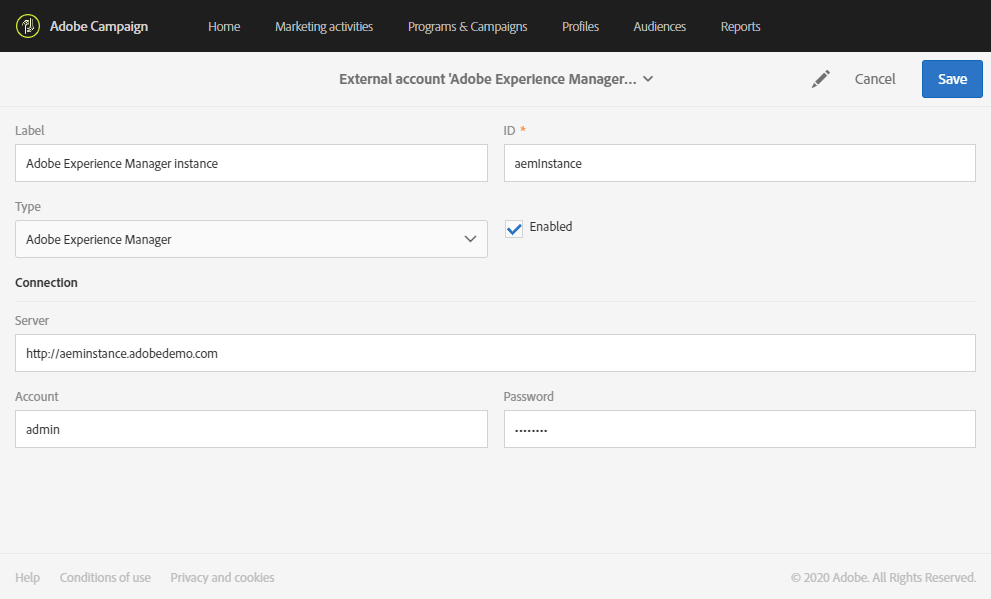

# Campaign-Experience Manager 통합 구성 {#configuration-aem}

Adobe Campaign Standard과 Adobe Experience Manager 간의 이러한 통합을 통해 Adobe Campaign 이메일에서 Adobe Experience Manager에서 만든 컨텐츠를 사용할 수 있습니다.

이 사용 사례를 통해 Adobe Experience Manager에서 이메일 컨텐츠를 만들고 관리하는 방법을 알아보고, 마케팅 캠페인에 사용할 수 있도록 이메일을 Adobe Campaign Standard으로 가져옵니다.

## 사전 요구 사항 {#prerequisites}

다음 요소가 미리 있는지 확인해야 합니다.

* Adobe Experience Manager **작성** 인스턴스
* Adobe Experience Manager **게시** 인스턴스
* Adobe Campaign 인스턴스

## Adobe Campaign Standard의 구성 {#config-acs}

이 두 솔루션을 함께 사용하려면 서로 연결하도록 구성해야 합니다.
Adobe Campaign을 구성하려면:

1. 먼저 **[!UICONTROL Adobe Experience Manager instance]** > **[!UICONTROL Administration]** > **[!UICONTROL Application settings]** 아래에 **[!UICONTROL External accounts menu]**&#x200B;외부 계정을 구성해야 합니다.

1. URL을 사용하여 Adobe Experience Manager 유형 외부 계정 **[!UICONTROL Server]** 을 구성하고 **[!UICONTROL Account]** **[!UICONTROL Password]**,

   

1. 옵션이 올바르게 구성되었는지 **[!UICONTROL AEMResourceTypeFilter]** 확인하십시오. > **[!UICONTROL Options]** > **[!UICONTROL Administration]** 메뉴 아래의 **[!UICONTROL Application settings]** 메뉴에 **[!UICONTROL Options]** 액세스합니다.

1. 필드에서 **[!UICONTROL Value (text)]** 다음 구문이 올바른지 확인하십시오.

   ```
   mcm/campaign/components/newsletter,mcm/campaign/components/campaign_newsletterpage,mcm/neolane/components/newsletter
   ```

   

1. 그런 다음 > **[!UICONTROL Resources]****[!UICONTROL Templates]** > **[!UICONTROL Delivery templates]**&#x200B;아래의 고급 메뉴에서 기존 템플릿 중 하나를 복제하여 Adobe Experience Manager 전용 이메일 템플릿을 만듭니다.

   

1. 아이콘을 **[!UICONTROL Edit properties]** 클릭합니다.

   

1. 드롭다운 아래의 필드 **[!UICONTROL Content]** 에서 **[!UICONTROL Adobe Experience Manager]** 를 선택한 다음 의 **[!UICONTROL Content source]** 이전에 만든 외부 계정을 선택합니다 **[!UICONTROL Adobe Experience Manager account]**.

이제 Adobe Experience Manager에서 통합을 구성해야 합니다.

## Adobe Experience Manager의 구성 {#config-aem}

Adobe Campaign Standard과 Adobe Experience Manager을 구성하려면 다음 단계를 따라야 합니다.

1. 먼저 Adobe Experience Manager 작성 및 게시 인스턴스 간 복제를 구성해야 합니다. Refer to this [section](https://docs.adobe.com/content/help/en/experience-manager-65/administering/integration/campaignstandard.html#configuring-adobe-experience-manager).

1. 그런 다음 전용 서버를 구성하여 Adobe Experience Manager을 Adobe Campaign에 연결합니다 **[!UICONTROL Cloud Service]**. Refer to this [section](https://docs.adobe.com/content/help/en/experience-manager-65/administering/integration/campaignstandard.html#connecting-aem-to-adobe-campaign).

1. 이제 작성 인스턴스에서 Adobe Experience Manager의 외부 도우미를 구성해야 합니다. Refer to this [section](https://docs.adobe.com/content/help/en/experience-manager-65/administering/integration/campaignstandard.html#configuring-the-externalizer).

