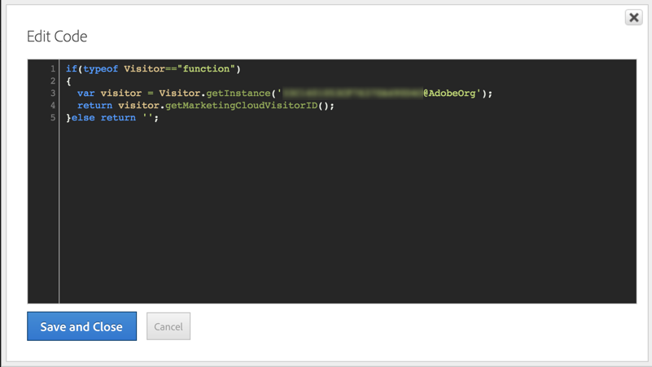

# Configuring Triggers in Experience Cloud{#configuring-triggers-in-experience-cloud}

## Activating the functionality {#activating-the-functionality}

기능은 Adobe Campaign에서 활성화해야 합니다. Adobe 계정 담당자 또는 전문 서비스 파트너에 문의하십시오.

트리거를 활성화하려면 Adobe 팀에 다음 정보가 필요합니다.

* Marketing Cloud 회사 이름
* IMS 조직 ID
* Analytics 로그인 회사 (Marketing Cloud 회사 이름과 같을 수 있음)

## Configuring solutions and services {#configuring-solutions-and-services}

이 기능을 사용하려면 다음 솔루션/핵심 서비스에 액세스해야 합니다.

* Adobe Campaign
* Adobe Analytics Ultimate, Premium, Foundation, OD, Select, Prime, Mobile Apps, Select 또는 Standard.
* Experience Cloud 트리거 코어 서비스

   

* Experience Cloud DTM 핵심 서비스

   

* Experience Cloud 방문자 ID 및 Experience Cloud 사용자 코어 서비스

   

또한 작업 웹 사이트가 필요합니다.

>[!CAUTION]
>
>하위 도메인 위임은 배달 가능성 키 요소입니다. Adobe Campaign 이메일이 웹 사이트에서 사용되는 도메인과 동일한 도메인에서 전송되도록 하십시오.

You need to configure [Experience Cloud DTM Core Service](../../integrating/using/configuring-triggers-in-experience-cloud.md#configuring-experience-cloud-dtm-core-service), [Experience Cloud People Core Service](../../integrating/using/configuring-triggers-in-experience-cloud.md#configuring-experience-cloud-people-core-service) and [Campaign](../../integrating/using/configuring-triggers-in-experience-cloud.md#configuring-triggers-and-aliases-in-campaign) to run these use cases.

### Configuring Experience Cloud DTM Core Service {#configuring-experience-cloud-dtm-core-service}

1. Experience Cloud DTM 핵심 서비스 (다이내믹 태그 관리) 에서 웹 사이트 페이지에 대해 Experience Cloud ID와 Adobe Analytics를 활성화합니다.

   

1. 웹 사이트, Adobe Analytics 및 Adobe Campaign 간의 ID 조정을 사용하려면 별칭을 사용해야 합니다. 예를 들어 «Visitorid» 별칭을 만듭니다.

   

### Configuring Experience Cloud People Core Service {#configuring-experience-cloud-people-core-service}

DTM에서 이전에 참조된 별칭은 고객 속성을 통해 Experience Cloud People 핵심 서비스에서 만들어야 합니다. 새 ID를 만들고 통합 코드에서 동일한 DTM 별칭을 참조하십시오 (예: "visitorid").

>[!NOTE]
>
>Adobe Campaign의 데이터 소스 (다음 단계) 에서 이 고객 속성을 사용할 예정입니다.

### Configuring triggers and aliases in Campaign {#configuring-triggers-and-aliases-in-campaign}

1. Make sure you have **[!UICONTROL Experience Cloud triggers]** visible on your Adobe Campaign Standard instance. 그렇지 않은 경우 Adobe Campaign 관리자에게 문의하십시오.

   

1. 별칭을 사용하면 Analytics에서 연락처를 캠페인의 프로필과 조정할 수 있습니다. Campaign의 공유 데이터 소스와 Experience Cloud ID 서비스에서 정의한 별칭을 일치해야 합니다. You need to configure the aliases resolution in Adobe Campaign via a Data source ( **[!UICONTROL Administration]** &gt; **[!UICONTROL Application Settings]** &gt; **[!UICONTROL Shared Data Sources]** ). Make sure you choose the correct data source in the **[!UICONTROL Data Source/Alias]** drop-down menu, which is mapped with the same Customer Attribute data source created in previous step.

   

   >[!NOTE]
   >
   >익명 사용자와 로그인한 사용자 모두에 대해 트리거를 조정할 수 있습니다. 익명의 사용자의 경우 프로필이 Adobe Campaign에 있어야 하며 사용자에게 이메일이 전송되었습니다. 이를 위해서는 방문자 ID 구성이 충분합니다. 하지만 로그인한 사용자에 대한 트리거를 조정하려면 선언된 ID 데이터 소스를 설정해야 합니다. For more on this, refer to [Data Source configuration](../../integrating/using/provisioning-and-configuring-integration-with-audience-manager-or-people-core-service.md#step-2--configure-the-data-sources).

## Creating a trigger in the Experience Cloud interface {#creating-a-trigger-in-the-experience-cloud-interface}

캠페인에서 사용할 수 있도록 Adobe Experience Cloud 트리거를 만들어야 합니다.

Experience Cloud에서 새 트리거를 만들고 웹 사이트에서 사용되는 보고서 세트를 선택해야 합니다. 트리거가 실행되도록 올바른 차원을 선택해야 합니다.

Refer to the [Adobe Experience Cloud documentation](https://marketing.adobe.com/resources/help/en_US/mcloud/triggers.html) and watch this [video](https://helpx.adobe.com/marketing-cloud/how-to/email-marketing.html#step-two).

## Triggers best practices and limitations {#triggers-best-practices-and-limitations}

다음은 캠페인 사용에 대한 우수 사례 및 제한 사항 목록입니다. 트리거 통합입니다.

* 캠페인 Standard의 인스턴스가 여러 개 있는 경우, 트리거가 동일한 IMS 조직 ID에 있는 한 모든 인스턴스에 의해 수신될 수 있습니다. Analytics는 동일한 IMS 조직 ID에 있어야 합니다.
* 두 개의 서로 다른 보고서 세트의 이벤트를 사용하여 트리거 핵심 서비스에는 트리거를 만들 수 없습니다.
* 트리거는 트랜잭션 메시지를 기반으로 합니다. 트랜잭션 메시지는 메시지를 매우 신속하게 전송해야 할 때마다 사용됩니다. 트랜잭션 메시지를 큐에 넣은 다음 일괄적으로 반복할 수는 없습니다.
* 트리거는 본질적으로 결정적이지 않습니다. 트리거가 생성되면 쿠키와 연관된 모든 별칭을 전송할 수 있으므로 소매 키오스크, 라이브러리, 사이버 카페 또는 홈 (예: 동일한 장치에서 로그인한 남편 및 아내) 의 공유 브라우저 경우 올바른 ID에 매핑할 수 없습니다. 브라우저로 로그인하는 데 사용된 모든 ID는 첫 번째 조정을 기준으로 메시지를 보내는 캠페인으로 전송됩니다. 조정 가능한 "이메일 ID" 가 여러 개 있는 경우 캠페인은 이메일을 보내지 않습니다. Analytics가 캡처하고 보내지 않는 한 캠페인이 올바른 이메일 ID를 알 수 있는 방법은 없습니다.
* 캠페인의 페이로드 컨텐츠는 저장할 수 없습니다. 트리거는 프로필의 데이터를 업데이트하는 데 사용할 수 없습니다.
* 고객 속성은 트리거에서 지원되지 않습니다. 즉, 보고서 세트 데이터만 비즈니스 규칙을 정의하는 데 사용할 수 있습니다.
* 컬렉션의 컬렉션은 캠페인에서 지원되지 않습니다.

>[!CAUTION]
>
>웹 사이트가 Adobe Campaign 서버와 동일한 도메인에서 실행 중이어야 합니다. 그렇지 않은 경우 방문자 ID를 사용하여 익명으로 웹 사이트를 방문하는 사용자에게 조정할 수 없습니다.

