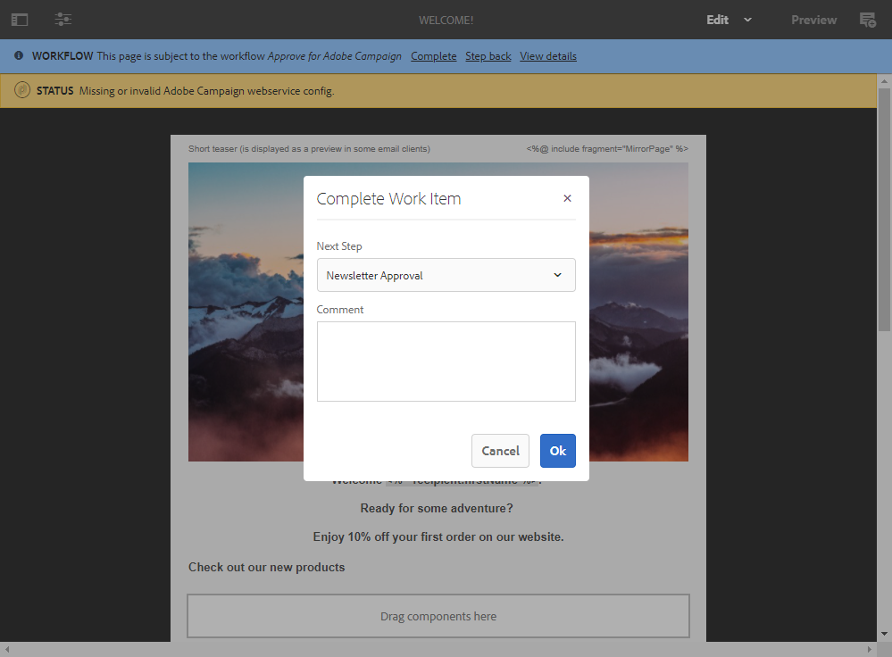
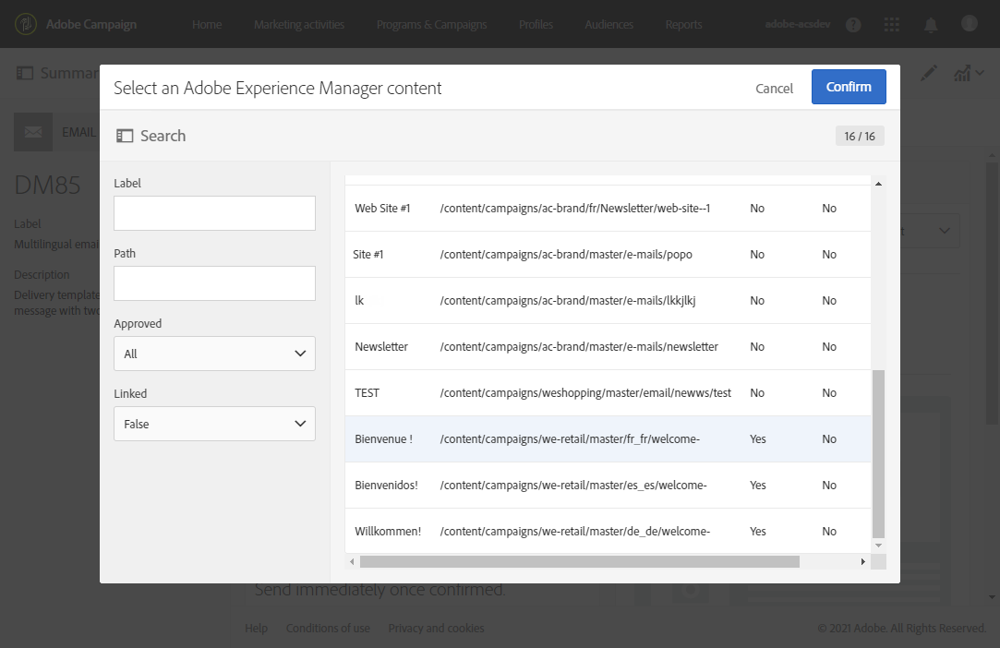

# Adobe Experience Manager 통합 {#creating-multilingual-email-aem}을(를) 사용하여 다국어 이메일 만들기

이 문서에서는 Adobe Experience Manager 컨텐츠과 언어 사본을 사용하여 다국어 이메일을 만드는 방법을 알아봅니다.

전제 조건은 다음과 같습니다.

* 통합을 위해 구성된 AEM 인스턴스에 액세스합니다.
* 통합을 위해 구성된 Adobe Campaign 인스턴스에 액세스합니다.
* AEM 콘텐츠를 수신하도록 구성된 Adobe Campaign 다국어 이메일 템플릿입니다.

## Adobe Experience Manager {#creating-email-content-aem}에서 새 이메일 컨텐츠 만들기

1. Adobe Experience Manager 홈 페이지에서 **[!UICONTROL Site]**&#x200B;을 선택합니다.

   

1. 페이지를 만들 폴더를 선택하고 **[!UICONTROL Create]**, **[!UICONTROL Page]** 순으로 클릭합니다. 여기서는 기본 언어가 될 en_us 폴더에 페이지를 만듭니다.

   

1. **[!UICONTROL Adobe Campaign Email (ACS)]** 템플릿을 선택합니다.

1. 이메일의 속성을 입력하고 **[!UICONTROL Create]**&#x200B;을 클릭합니다.

   

1. 새로운 이메일 컨텐츠를 열어 필요에 따라 개인화할 수 있습니다. 자세한 정보는 이 [페이지](../../integrating/using/creating-email-experience-manager.md#editing-email-aem)를 참조하십시오.

   

1. **[!UICONTROL Workflow]** 탭에서 **[!UICONTROL Approve for Adobe Campaign]** 유효성 검사 워크플로우를 선택합니다. 승인되지 않은 컨텐트를 사용하는 경우에는 Adobe Campaign에서 이메일을 보낼 수 없습니다.

   

1. **[!UICONTROL Complete]**&#x200B;을 클릭한 다음 **[!UICONTROL Complete work item]** 창에서 **[!UICONTROL Newsletter review]**&#x200B;을 클릭합니다.

1. **[!UICONTROL Complete]**&#x200B;을(를) 클릭한 뒤 **[!UICONTROL Newsletter approval]**&#x200B;을(를) 클릭합니다. 컨텐츠 및 전송 매개 변수가 정의되면 Adobe Campaign Standard에서 이메일을 승인, 준비 및 전송할 수 있습니다.

   

## 언어 사본 만들기{#creating-language-copies}

이메일 컨텐츠를 디자인한 후 Adobe Campaign Standard과 변형된 언어 사본을 만들어야 합니다.

1. 이전에 만든 페이지를 선택하고 **[!UICONTROL Create]**&#x200B;을 클릭한 다음 **[!UICONTROL Language Copy]**&#x200B;을 클릭합니다.

   

1. 선택한 언어로 번역될 이전에 만든 이메일 콘텐츠를 선택한 다음 **[!UICONTROL Next]**&#x200B;을 클릭합니다.

   

1. **[!UICONTROL Target language(s)]** 드롭다운에서 컨텐츠가 번역되는 언어를 선택한 다음 **[!UICONTROL Next]** 을 클릭합니다.

   

1. **[!UICONTROL Create]**&#x200B;을(를) 클릭합니다.

이제 언어 복사본이 생성되므로 선택한 언어에 따라 컨텐츠를 편집할 수 있습니다.

>[!CAUTION]
>
>모든 언어 사본은 **[!UICONTROL Approve for Adobe Campaign]** 확인 작업 과정을 통해 승인해야 합니다. 승인되지 않은 컨텐트를 사용하는 경우에는 Adobe Campaign에서 이메일을 보낼 수 없습니다.

## Adobe Campaign Standard {#multilingual-acs}에서 다국어 콘텐츠 만들기

1. Adobe Campaign Standard 홈 페이지에서 **[!UICONTROL Create an email]**&#x200B;을 클릭합니다.

   

1. Adobe Experience Manager 컨텐츠를 수신하도록 구성된 Adobe Campaign 다국어 이메일 템플릿을 선택합니다. Adobe Experience Manager 인스턴스에 연결된 템플릿을 만드는 방법에 대한 자세한 내용은 이 [page](../../integrating/using/configure-experience-manager.md#config-acs)을 참조하십시오.

   >[!NOTE]
   >
   >이 경우 다국어 이메일을 보낼 수 있도록 내장된 템플릿 **[!UICONTROL Multilingual email (mailMultiLang)]**&#x200B;을 복제해야 합니다.

   

1. 이메일의 **[!UICONTROL Properties]** 및 **[!UICONTROL Audience]**&#x200B;을 입력하고 **[!UICONTROL Create]**&#x200B;를 클릭합니다.

1. **[!UICONTROL Edit properties]**&#x200B;에서 Adobe Experience Manager 계정이 **[!UICONTROL Content]** 드롭다운에서 올바르게 설정되어 있는지 확인합니다.

   

1. **[!UICONTROL Language copy creation]**&#x200B;을(를) 클릭합니다.

   

1. 이전에 만든 Adobe Experience Manager 콘텐츠를 선택하고 **[!UICONTROL Confirm]**&#x200B;을 클릭합니다. 여기에 표시된 Adobe Experience Manager 컨텐츠는 유효성이 확인된 컨텐츠만 해당하며 해당 **[!UICONTROL Label]** 및 **[!UICONTROL Path]**&#x200B;에서 필터링할 수 있습니다.

   >[!NOTE]
   >
   >선택한 언어 사본은 기본값으로 설정되며 나중에 **[!UICONTROL Content variant]** 블록에서 변경할 수 있습니다.

   

1. **[!UICONTROL Create variants]**&#x200B;을 클릭하여 다국어 콘텐츠를 연결합니다. 그러면 Adobe Campaign Standard은 다른 언어 사본을 이 컨텐츠에 자동으로 연결합니다. 만들어진 변형은 Adobe Experience Manager에서 선택한 것과 동일한 레이블 및 코드 언어를 갖습니다.

   

1. 필요한 경우 **[!UICONTROL Content variant]** 블록을 클릭하여 기본 변형을 변경하고 **[!UICONTROL Confirm]**&#x200B;을 클릭합니다.

   

1. 컨텐트 또는 변형이 Adobe Experience Manager에서 업데이트되는 경우 Adobe Campaign Standard에서 **[!UICONTROL Refresh AEM contents]** 단추와 직접 동기화할 수 있습니다.

1. 이제 이메일을 보낼 준비가 되었습니다. 이에 대한 자세한 내용은 이 [페이지](../../sending/using/get-started-sending-messages.md)를 참조하십시오.

대상이 **[!UICONTROL Profiles]**&#x200B;에 설정된 **[!UICONTROL Preferred languages]**&#x200B;에 따라 이메일을 수신하게 됩니다. 프로필 및 기본 언어를 편집하는 방법에 대한 자세한 내용은 이 [페이지](../../audiences/using/editing-profiles.md)를 참조하십시오.
