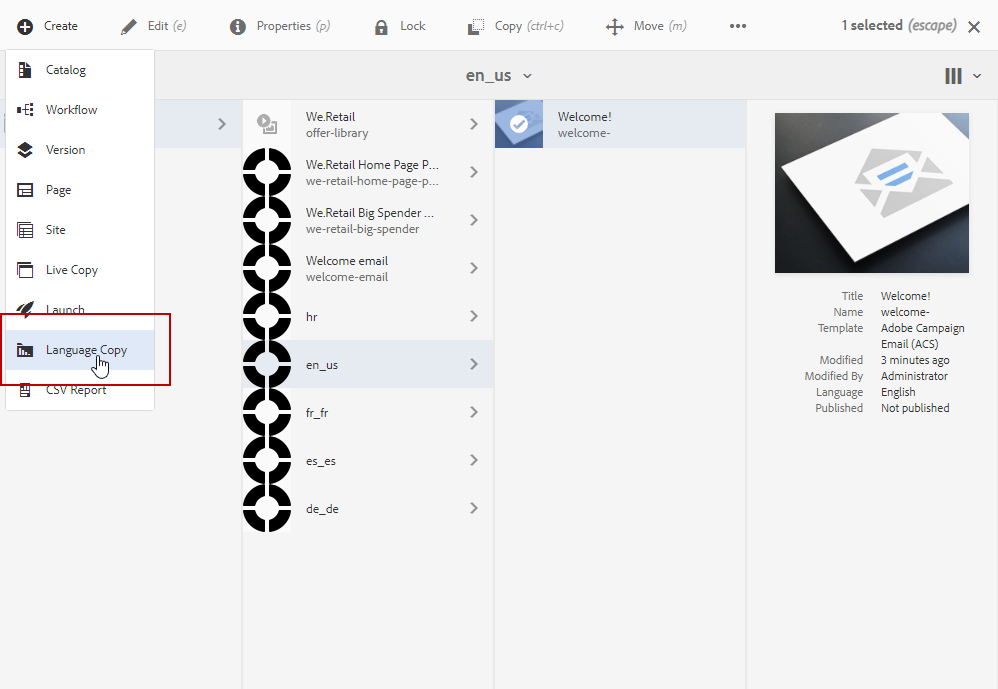

# Adobe Experience Manager 통합으로 다국어 이메일 만들기 {#creating-multilingual-email-aem}

이 문서에서는 Adobe Experience Manager 콘텐츠 및 언어 사본을 사용하여 다국어 이메일을 만드는 방법을 알아봅니다.

전제 조건은 다음과 같습니다.

* 통합을 위해 구성된 AEM 인스턴스에 대한 액세스 권한.
* 통합을 위해 구성된 Adobe Campaign 인스턴스에 대한 액세스.
* AEM 콘텐츠를 수신하도록 구성된 Adobe Campaign 다국어 이메일 템플릿입니다.

## Adobe Experience Manager에서 새 이메일 콘텐츠 만들기 {#creating-email-content-aem}

1. Adobe Experience Manager 홈 페이지에서 **[!UICONTROL Site]**&#x200B;을(를) 선택합니다.

   

1. 페이지를 만들 폴더를 선택하고 **[!UICONTROL Create]**&#x200B;을(를) 클릭한 다음 **[!UICONTROL Page]**&#x200B;을(를) 클릭합니다. 여기에서는 기본 언어가 되는 en_us 폴더에 페이지를 만듭니다.

   

1. **[!UICONTROL Adobe Campaign Email (ACS)]** 템플릿을 선택하십시오.

1. 전자 메일 속성을 입력하고 **[!UICONTROL Create]**&#x200B;을(를) 클릭합니다.

   

1. 새 이메일 콘텐츠를 열고 필요에 따라 개인화합니다. 자세한 정보는 이 [페이지](../../integrating/using/creating-email-experience-manager.md#editing-email-aem)를 참조하십시오.

   

1. **[!UICONTROL Workflow]** 탭에서 **[!UICONTROL Approve for Adobe Campaign]** 유효성 검사 워크플로우를 선택합니다. 승인되지 않은 콘텐츠를 사용하는 경우 Adobe Campaign에서 이메일을 보낼 수 없습니다.

   

1. **[!UICONTROL Complete work item]** 창에서 **[!UICONTROL Complete]**&#x200B;을(를) 클릭한 다음 **[!UICONTROL Newsletter review]**&#x200B;을(를) 클릭합니다.

1. **[!UICONTROL Complete]**&#x200B;을(를) 클릭한 다음 **[!UICONTROL Newsletter approval]**&#x200B;을(를) 클릭합니다. 콘텐츠 및 전송 매개 변수가 정의되면 Adobe Campaign Standard에서 이메일 승인, 준비 및 전송을 진행할 수 있습니다.

   

## 언어 사본 만들기 {#creating-language-copies}

이메일 콘텐츠를 디자인한 후에는 이제 변형으로 Adobe Campaign Standard과 동기화할 언어 사본을 만들어야 합니다.

1. 이전에 만든 페이지를 선택하고 **[!UICONTROL Create]**&#x200B;을(를) 클릭한 다음 **[!UICONTROL Language Copy]**&#x200B;을(를) 클릭합니다.

   

1. 선택한 언어로 번역할 이전에 만든 전자 메일 콘텐츠를 선택한 다음 **[!UICONTROL Next]**&#x200B;을(를) 클릭합니다.

   

1. **[!UICONTROL Target language(s)]** 드롭다운에서 콘텐츠를 번역할 언어를 선택한 다음 **[!UICONTROL Next]**&#x200B;을(를) 클릭합니다.

   

1. **[!UICONTROL Create]**&#x200B;를 클릭합니다.

이제 언어 사본이 생성되었으므로 선택한 언어에 따라 콘텐츠를 편집할 수 있습니다.

>[!CAUTION]
>
>모든 언어 사본은 **[!UICONTROL Approve for Adobe Campaign]** 유효성 검사 워크플로우를 통해 승인해야 합니다. 승인되지 않은 콘텐츠를 사용하는 경우 Adobe Campaign에서 이메일을 보낼 수 없습니다.

## Adobe Campaign Standard에서 다국어 콘텐츠 만들기 {#multilingual-acs}

1. Adobe Campaign Standard 홈페이지에서 **[!UICONTROL Create an email]**&#x200B;을(를) 클릭합니다.

   

1. Adobe Experience Manager 콘텐츠를 수신하도록 구성된 Adobe Campaign 다국어 이메일 템플릿을 선택합니다. Adobe Experience Manager 인스턴스에 연결된 템플릿을 만드는 방법에 대한 자세한 내용은 이 [페이지](../../integrating/using/configure-experience-manager.md#config-acs)를 참조하세요.

   >[!NOTE]
   >
   >이 경우 다국어 이메일을 보내려면 기본 제공 템플릿 **[!UICONTROL Multilingual email (mailMultiLang)]**&#x200B;을(를) 복제해야 합니다.

   

1. 전자 메일의 **[!UICONTROL Properties]** 및 **[!UICONTROL Audience]**&#x200B;을(를) 입력하고 **[!UICONTROL Create]**&#x200B;을(를) 클릭합니다.

1. **[!UICONTROL Edit properties]**&#x200B;에서 **[!UICONTROL Content]** 드롭다운에 Adobe Experience Manager 계정이 올바르게 설정되어 있는지 확인하십시오.

   

1. **[!UICONTROL Language copy creation]**&#x200B;를 클릭합니다.

   

1. 이전에 만든 Adobe Experience Manager 콘텐츠를 선택하고 **[!UICONTROL Confirm]**&#x200B;을(를) 클릭합니다. 여기에 표시된 Adobe Experience Manager 콘텐츠는 유효성이 확인된 콘텐츠만 하며 해당 **[!UICONTROL Label]** 및 **[!UICONTROL Path]**&#x200B;에서 필터링할 수 있습니다.

   >[!NOTE]
   >
   >선택한 언어 사본은 기본값으로 설정되며 나중에 **[!UICONTROL Content variant]** 블록에서 변경할 수 있습니다.

   

1. 다국어 콘텐츠를 연결하려면 **[!UICONTROL Create variants]**&#x200B;을(를) 클릭하십시오. 그러면 Adobe Campaign Standard에서 다른 언어 사본을 이 콘텐츠에 자동으로 연결합니다. 생성된 변형의 레이블 및 코드 언어는 Adobe Experience Manager에서 선택한 변형과 동일합니다.

   

1. 필요한 경우 기본 변형을 변경하려면 **[!UICONTROL Content variant]** 블록을 클릭하고 **[!UICONTROL Confirm]**&#x200B;을(를) 클릭합니다.

   

1. 콘텐츠 또는 변형이 Adobe Experience Manager에서 업데이트된 경우 Adobe Campaign Standard에서 **[!UICONTROL Refresh AEM contents]** 버튼을 사용하여 직접 동기화할 수 있습니다.

1. 이제 이메일을 보낼 준비가 되었습니다. 자세한 내용은 이 [페이지](../../sending/using/get-started-sending-messages.md)를 참조하세요.

   >[!NOTE]
   >
   >승인되지 않은 AEM 콘텐츠를 사용하는 경우 Adobe Campaign에서 이메일을 보낼 수 없습니다.

대상자는 **[!UICONTROL Profiles]**&#x200B;에 설정된 **[!UICONTROL Preferred languages]**&#x200B;에 따라 전자 메일을 받게 됩니다. 프로필 및 기본 언어를 편집하는 방법에 대한 자세한 내용은 이 [페이지](../../audiences/using/editing-profiles.md)를 참조하세요.
