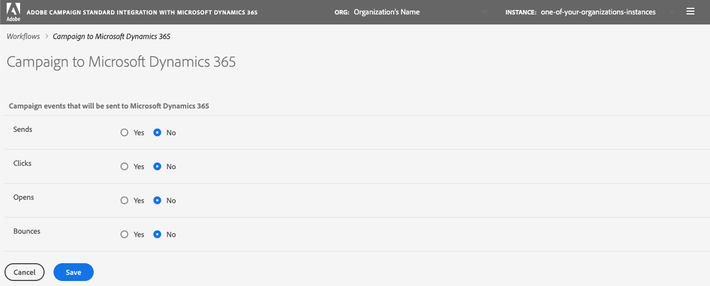

# 데이터 동기화

Microsoft Dynamics 365의 표를 Campaign 및 Campaign 마케팅 지표에 동기화할 수 있습니다. 동기화는 3개의 전용 기술 워크플로우를 통해 실행됩니다.**[!UICONTROL Microsoft Dynamics 365 to Campaign]**, **[!UICONTROL Campaign to Microsoft Dynamics 365]**, **[!UICONTROL Opt-In/Out]**. [자세한 내용](../../integrating/using/d365-acs-self-service-app-workflows.md)을 보려면 이 섹션을 참조하십시오.

>[!IMPORTANT]
>변경 사항을 고려하려면 **[!UICONTROL Microsoft Dynamics 365 to Campaign]** 작업 과정을 중지/시작해야 합니다. [자세히 알아보기](../../integrating/using/d365-acs-self-service-app-workflows.md)

## Microsoft Dynamics 365에서 Campaign으로 테이블 매핑

**[!UICONTROL Microsoft Dynamics 365 to Campaign]** 페이지에는 Microsoft Dynamics 365의 엔티티 목록과 Microsoft Dynamics 리소스와 동기화할 사용자 정의 리소스가 표시됩니다. 새 매핑을 추가하거나 기존 매핑을 편집 또는 삭제할 수 있습니다.

이 표의 각 열에 대한 설명은 다음과 같습니다.

* **[!UICONTROL MICROSOFT DYNAMICS 365 TABLE]**:이 열은 Microsoft Dynamics 365에서 매핑의 데이터 소스가 될 엔터티를 식별합니다.

* **[!UICONTROL CAMPAIGN TABLE]**:이 열은 Adobe Campaign에서 매핑에 대한 데이터의 대상이 될 리소스를 식별합니다.

* **[!UICONTROL ACTIONS]**:가능한 작업이 아래에 나열되어 있습니다.

   * 이 매핑을 편집하려면 **[!UICONTROL Edit]** 아이콘을 클릭합니다.

   * 테이블 매핑을 삭제하려면 **[!UICONTROL Delete]** 아이콘을 사용합니다.

   * **[!UICONTROL Replay Data]** 아이콘을 클릭하여 Microsoft Dynamics 365 테이블의 모든 데이터를 다시 동기화합니다. 일반적으로 통합 응용 프로그램은 최근에 변경된 Microsoft Dynamics 365의 데이터만 동기화합니다.  그러나 일부 경우(예: 변경했거나 오류가 발생) 모든 데이터를 다시 동기화해야 할 수 있습니다.  이 경우 이 단추를 클릭하고 다음에 **[!UICONTROL Microsoft Dynamics 365 to Campaign]** 작업 과정을 중지/시작할 때 데이터가 동기화되기 시작합니다.

      **[!UICONTROL Replay Data]** 단추를 클릭하면 검사가 성공적으로 수행되면 아이콘이 비활성화됩니다.이것은 이 테이블 매핑 쌍의 데이터가 **[!UICONTROL Microsoft Dynamics 365 to Campaign]** 워크플로우의 다음 실행과 다시 동기화됨을 나타냅니다.

      다음 내용이 true이면 데이터를 다시 표시하도록 선택할 수 없습니다.

      * **[!UICONTROL Microsoft Dynamics 365 to Campaign]** 작업 과정과 연결된 백로그 지표에 2,000,000개 이상의 항목이 있는 경우(**[!UICONTROL Workflows]** 페이지에 표시됨)
      * Microsoft Dynamics 365 표에 2,000,000개 이상의 레코드가 있는 경우

      다시 동기화해야 하는 레코드 수는 다릅니다. 레코드가 많으면 동기화 프로세스를 완료하는 데 시간이 걸릴 수 있습니다. 통합 응용 프로그램이 동기화 프로세스를 완료하기 위해 작동하므로 **[!UICONTROL Workflows]** 페이지의 **[!UICONTROL Backlog]** 지표를 참조하십시오.

      >[!IMPORTANT]
      >
      > Adobe Campaign Standard 또는 Microsoft Dynamics 365에 변경 내용을 게시할 때는 통합 워크플로우를 중단하는 것이 좋습니다. 적용 가능한 변경 사항은 다음과 같습니다.리소스/개체(및 관련 필드), 링크, 식별자 열 등에 대한 업데이트. 현재 통합에서 사용 중입니다.

## 새 매핑 {#add-a-new-mapping} 만들기

새 매핑을 만들려면 아래 단계를 수행하십시오.

1. **[!UICONTROL Microsoft Dynamics 365 to Campaign]** 페이지에서 **[!UICONTROL Add New Mapping]** 단추를 클릭합니다.

1. 드롭다운 목록을 사용하여 매핑할 Microsoft Dynamics 365 및 Campaign 테이블을 선택합니다.
페이지의 다른 대부분의 입력은 선택하는 표에 따라 달라집니다.

   

   >[!NOTE]
   >각 테이블을 두 번 이상 매핑할 수 없습니다. 따라서 드롭다운 선택 사항에는 이미 매핑된 테이블이 포함되지 않습니다.

1. **[!UICONTROL OK]**&#x200B;을 클릭하여 다음을 확인합니다.선택한 테이블과 관련된 필드 정보를 보려면 잠시 시간이 필요합니다.

그런 다음 매핑 구성을 계속할 수 있습니다. [자세히 알아보기](#new-mapping-settings)

>[!IMPORTANT]
>
>매핑을 처음 추가할 때만 이 페이지에서 표를 선택할 수 있습니다. **[!UICONTROL Save]** 단추를 클릭하기 전에 올바른 테이블을 선택했는지 확인합니다.일단 저장되면 테이블 선택 필드는 **읽기 전용**&#x200B;이 됩니다.

### 기존 매핑 편집

기존 매핑을 편집하면 테이블 선택 사항을 편집할 수 없음을 확인할 수 있습니다.

페이지에서 더 깊이 입력은 이러한 표와 연결된 필드를 기반으로 하므로 디자인에서 가져옵니다. 표를 변경하면 이 테이블과 연결된 모든 필드가 유효하지 않게 됩니다.  매핑할 테이블을 변경하려면 이전 페이지로 돌아가서 변경할 매핑을 삭제하고 새 매핑을 추가해야 합니다.

### 개별 테이블 매핑 {#new-mapping-settings} 구성

이 단원에서는 Microsoft Dynamics 365 테이블 하나를 하나의 Adobe Campaign 테이블에 대해 **단일** 매핑을 구성하는 방법을 알아봅니다.

다음 설정을 정의할 수 있습니다.

* **[!UICONTROL Tables]**:이 섹션에는 Microsoft Dynamics 365 테이블의 이름과 매핑될 캠페인 테이블이 나열됩니다.
* **[!UICONTROL Field Mappings]**:이 섹션에서 자세히  [알아보기](#field-mappings)
* **[!UICONTROL Field Replacements]**:이 섹션에서 자세히  [알아보기](#field-replacements)
* **[!UICONTROL Filters]**:이 섹션에서 자세히  [알아보기](#filters)
* **[!UICONTROL Advanced Settings]**:이 섹션에서 자세히  [알아보기](#advanced-settings)

### 필드 매핑 {#field-mappings}

#### 기본 키

새 Microsoft Dynamics 365를 캠페인 테이블 매핑에 추가할 때 ID 필드를 식별해야 합니다.

Microsoft Dynamics 365 기본 키는 응용 프로그램에서 감지하므로 읽기 전용입니다.

캠페인의 경우 고유 키가 될 필드를 선택해야 합니다. [CRM ID 사용자 지정 리소스](../../developing/using/uc-calling-resource-id-key.md)로 구성되어야 하며 중복은 없어야 합니다.

>[!NOTE]
>
>**[!UICONTROL Add New Mapping]**&#x200B;을(를) 선택한 경우에만 테이블에서 ID 필드를 선택할 수 있습니다. 편집 버튼을 클릭하여 기존 테이블 매핑을 편집하는 경우 ID 필드는 읽기 전용입니다.

기본 키는 항상 **[!UICONTROL Field Mappings]** 섹션에 나열된 첫 번째 필드 이름이 됩니다. 이 아이콘들이 기본 키임을 알려주는 다음 아이콘이 오른쪽에 나열됩니다.

#### 다른 필드 매핑 추가

**[!UICONTROL Field Mappings]** 섹션에서는 기본 키가 아닌 필드 매핑을 추가할 수 있습니다. Microsoft Dynamics 365에서 Adobe Campaign으로 필드 매핑을 새로 추가하려면 **[!UICONTROL Add new field mapping]** 단추를 클릭합니다.

목록에서 Microsoft Dynamics 365 및 캠페인 필드를 선택합니다.

이 목록에는 페이지 맨 위에서 선택한 Microsoft Dynamics 365 및 Campaign 테이블과 연결된 필드 이름이 포함되어 있습니다.

**[!UICONTROL Apply updates]** 전환기를 사용하면 이 필드에 대한 업데이트를 Microsoft Dynamics 365에서 Campaign으로 전파할지 여부를 제어할 수 있습니다.
* 을(를) 켜면 업데이트가 발생하면 Microsoft Dynamics 365의 값 업데이트가 Adobe Campaign에 전파됩니다.

* 을 해제하면 데이터가 처음에 로드되거나 재생될 때 값이 전파되지만 Microsoft Dynamics 365의 필드에 대한 증분 업데이트는 전파되지 않습니다.

>[!NOTE]
>
>**[!UICONTROL Apply updates]** 열 제목을 클릭하여 스위치의 **모두**&#x200B;를 켜거나 끕니다.

필드 값을 선택하면 드롭다운 메뉴 아래에 데이터 유형이 표시됩니다.   한 필드의 값을 다른 필드에 매핑할 때 주의해야 합니다.

>[!NOTE]
>
> 여러 Microsoft Dynamics 365 필드를 단일 캠페인 필드에 매핑할 수 없습니다.

### 필드 교체 {#field-replacements}

**[!UICONTROL Add New Field Replacement]** 단추를 사용하여 새 필드 바꾸기를 정의합니다.

필드를 대체할 경우 다음을 식별할 수 있습니다.

* 필드 매핑 섹션에 위에 추가된 Microsoft Dynamics 365 필드 이름
* 기존 값(Microsoft Dynamics 365에 있음)과
* adobe campaign에 쓸 새로운 값

선택 목록, 열거형 및 부울 값에 대한 드롭다운 목록이 제공됩니다. 텍스트 상자는 다른 문자열 및 숫자 유형에 사용됩니다.

### 필터 {#filters}

**[!UICONTROL Add New Filter]** 단추를 사용하여 Campaign에 전파할 Microsoft Dynamics 365 레코드를 선택합니다. 필터에 추가할 레코드와 연결된 필드를 선택할 수 있습니다. 필드 이름은 필드 매핑에 추가할 필요가 없습니다.

다음 정보를 입력하여 필터를 지정합니다.

* Microsoft Dynamics 365 필드 이름
* 비교 가치 및
* 값(Microsoft Dynamics 365에서)
필드 이름, 비교 및 값이 지정된 레코드에 대해 true로 평가되면 레코드가 Adobe Campaign에 전파됩니다.

**[!UICONTROL Choose the filter comparison operator]** 입력 레이블을 설정하여 이러한 필터의 평가 방법을 선택할 수 있습니다.  **And**&#x200B;을 선택하는 경우 모든 필터가 Campaign에 전파되도록 레코드에 대해 true여야 합니다. **Or**&#x200B;을 선택하면 레코드가 true로 평가되는 경우 레코드가 전파됩니다.

**[!UICONTROL Do you want to delete records in Adobe Campaign Standard that will be filtered out from Microsoft Dynamics 365?]** 옵션은 필터링된 레코드를 Campaign에서 삭제할지 여부를 제어합니다. **No**&#x200B;을 선택하면 레코드는 Adobe Campaign에 남아 있습니다. **예**&#x200B;를 선택하여 통합 논리로 삭제합니다.

>[!NOTE]
>
> 필터가 추가되지 않으면 수정된 모든 레코드는 Adobe Campaign에 전파됩니다.

### 고급 설정 {#advanced-settings}

매핑을 구성할 때 다음과 같은 추가 옵션을 설정할 수 있습니다.

* Microsoft Dynamics 365에서 발생하는 삭제를 Adobe Campaign의 해당 필드에 전파하려면 필드 이름 매핑을 기반으로 **[!UICONTROL Apply deletes in Microsoft Dynamics 365 to Campaign?]** 옵션을 **예**&#x200B;로 설정합니다. Microsoft Dynamics 365에서 삭제 내용을 무시하려면 **아니요**&#x200B;를 선택합니다.

* Campaign에 전파하려면 Microsoft Dynamics 365 선택 목록과 연결된 표시 값을 **[!UICONTROL Use technical values in Microsoft Dynamics 365 picklists?]** 옵션을 **아니요**&#x200B;로 설정합니다. 기술 값을 전파하려면 **예**&#x200B;를 선택합니다.

## Microsoft Dynamics 365에 캠페인 마케팅 이벤트 동기화

**[!UICONTROL Campaign to Microsoft Dynamics 365]** 페이지에서는 Adobe Campaign에서 Microsoft Dynamics 365로 매핑될 이메일 마케팅 이벤트를 식별할 수 있습니다.

제어할 수 있는 4가지 지표는 다음과 같습니다.**전송**, **클릭**, **열기** 및 **바운스**&#x200B;입니다.

**예**&#x200B;를 선택하여 해당 유형의 이벤트를 Microsoft Dynamics 365로 플로우할 것인지 확인합니다.

이러한 이메일 이벤트 흐름에 대한 자세한 내용을 보려면 [여기](../../integrating/using/d365-acs-self-service-app-workflows.md)를 클릭하십시오.

## 옵트인/아웃 워크플로 {#opt-in-out-wf}

**옵트인/옵트아웃** 작업 과정에서는 Microsoft Dynamics 365와 Adobe Campaign 간의 옵트인/아웃 정보 흐름을 식별할 수 있습니다. 이 경우 데이터가 Microsoft Dynamics 365 엔티티 &quot;연락처&quot; 및 Adobe Campaign 리소스 &quot;프로필&quot;과 연결되어 있다고 가정합니다.

[이 섹션](../../integrating/using/d365-acs-notices-and-recommendations.md#opt-out)에서 옵트아웃 관리에 대해 자세히 알아보십시오.

&quot;저장&quot;을 클릭하여 선택 사항을 저장해야 합니다. 또한 **Campaign to Microsoft Dynamics 365** 작업 과정을 중지한 다음 통합을 클릭하여 변경 내용을 통합해야 합니다.

### 옵트인/아웃 동기화 방향

다음은 데이터를 동기화하는 데 사용할 수 있는 옵션 목록입니다.

* **[!UICONTROL Disabled]**:이 옵션을 선택하면 Adobe Campaign과 Microsoft Dynamics 365 간에 옵트인/아웃 정보가 이동되지 않습니다.

* **[!UICONTROL Unidirectional (Microsoft Dynamics 365 to Campaign)]**:이 옵션은 Microsoft Dynamics 365에서 Adobe Campaign로만 옵트인/옵트아웃하는 데 사용됩니다. 통합 응용 프로그램에서 이 화면의 흐름을 구성할 수 없습니다.대신 **[!UICONTROL Save button]**&#x200B;을 클릭하고 **[!UICONTROL Microsoft Dynamics 365 to Campaign]** 작업 과정으로 이동합니다. 이 워크플로우에서는 연락처/프로필 테이블 매핑을 편집하여 옵트인/아웃 필드를 매핑할 방법을 식별할 수 있습니다.

* **[!UICONTROL Unidirectional (Campaign to Microsoft Dynamics 365)]**:이 옵션을 선택하면 [매핑] 섹션이  **** 표시됩니다. 이러한 입력을 통해 Microsoft Dynamics 365의 필드에 데이터를 매핑할 Adobe Campaign 필드를 정의할 수 있습니다. 즉, Microsoft Dynamics 365에서 값을 수동으로 업데이트할 경우 Adobe Campaign 값이 변경될 때 값을 덮어씁니다.

* **[!UICONTROL Bidirectional]**:이 옵션을 선택하면 [매핑] 섹션이  **** 표시됩니다. 이러한 쌍은 Microsoft Dynamics 365에서 어떤 필드를 식별하며 Adobe Campaign은 서로 매핑합니다. [자세히 알아보기](../../integrating/using/d365-acs-notices-and-recommendations.md)

### 매핑

이 섹션은 옵트인/아웃 동기화 방향 필드가 **[!UICONTROL Unidirectional (Campaign to Microsoft Dynamics 365)]** 또는 **[!UICONTROL Bidirectional]**&#x200B;으로 설정된 경우에만 적용됩니다. Microsoft Dynamics 365에서 Adobe Campaign의 입력에 매핑할 필드를 정의할 수 있습니다.

Microsoft Dynamics 365 필드 이름에는 **boolean** 유형의 필드 이름이 모두 포함됩니다.

Adobe Campaign 필드 이름은 옵트인/옵트아웃에 특정한 고정 값 세트입니다. Adobe Campaign 필드 이름은 옵트인/옵트아웃에 특정한 고정 값 세트입니다. **이 목록의 값 집합을 변경할** 수 없습니다.
