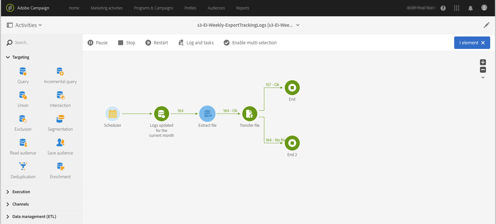

# Campaign에서 Adobe Experience Platform으로 데이터 내보내기 {#sources}

Campaign Standard 데이터를 Adobe Real-time Customer Data Platform(RTCDP)로 내보내려면 먼저 공유하려는 데이터를 Amazon 스토리지 서비스(S3) 또는 Azure Blob 스토리지 위치로 내보낼 워크플로를 Campaign Standard에 빌드해야 합니다.

워크플로우를 구성하고 데이터를 저장소 위치로 전송하면 S3 또는 Azure Blob 저장소 위치를 Adobe Experience Platform에서 **Source**(으)로 연결해야 합니다.

>[!NOTE]
>
>Campaign 생성 데이터만 내보내는 것이 좋습니다(예: 전송, 열기, 클릭 등). Adobe Experience Platform으로. CRM과 같은 타사 소스에서 수집된 데이터는 Adobe Experience Platform으로 직접 가져와야 합니다.

## Campaign Standard에서 내보내기 워크플로우 만들기

Campaign Standard에서 S3 또는 Azure Blob 저장소 위치로 데이터를 내보내려면 내보낼 데이터를 타겟팅하는 워크플로우를 빌드하여 저장소 위치로 보내야 합니다.

이렇게 하려면 다음을 추가하고 구성합니다.

* 타깃팅된 데이터를 CSV 파일로 추출하는 **[!UICONTROL Extract file]** 활동입니다. 이 활동을 구성하는 방법에 대한 자세한 내용은 [이 섹션](../../automating/using/extract-file.md)을 참조하세요.

  

* CSV 파일을 저장소 위치로 전송하는 **[!UICONTROL Transfer file]** 활동입니다. 이 활동을 구성하는 방법에 대한 자세한 내용은 [이 섹션](../../automating/using/transfer-file.md)을 참조하세요.

  

예를 들어 아래 워크플로우는 정기적으로 로그를 CSV 파일로 추출한 다음 파일을 저장소 위치로 전송합니다.

데이터 관리 워크플로의 예는 [워크플로 사용 사례](../../automating/using/about-workflow-use-cases.md#management) 섹션에서 확인할 수 있습니다.

관련 항목:

* [데이터 관리 활동](../../automating/using/about-data-management-activities.md)
* [데이터 가져오기 및 내보내기 기본 정보](../../automating/using/about-data-import-and-export.md)

## 저장소 위치를 Source으로 연결

Amazon 저장소 서비스(S3) 또는 Azure Blob 저장소 위치를 Adobe Experience Platform의 **Source**(으)로 연결하는 주요 단계는 아래에 나와 있습니다. 이러한 각 단계에 대한 자세한 내용은 [Source 커넥터 설명서](https://experienceleague.adobe.com/docs/experience-platform/sources/home.html?lang=ko)를 참조하세요.

1. Adobe Experience Platform **[!UICONTROL Sources]** 메뉴에서 저장소 위치에 대한 연결을 만듭니다.

   * [Amazon S3 원본 연결 만들기](https://experienceleague.adobe.com/docs/experience-platform/sources/ui-tutorials/create/cloud-storage/s3.html)
   * [Azure Blob 커넥터](https://experienceleague.adobe.com/docs/experience-platform/sources/connectors/cloud-storage/blob.html)

   >[!NOTE]
   >
   >저장소 위치는 Amazon S3, 암호가 있는 SFTP, SSH 키가 있는 SFTP 또는 Azure Blob 연결일 수 있습니다. Adobe Campaign에 데이터를 보내는 기본 방법은 Amazon S3 또는 Azure Blob를 사용하는 것입니다.

   

1. 클라우드 스토리지 배치 연결에 대한 데이터 흐름을 구성합니다. 데이터 흐름은 저장소 위치에서 Adobe Experience Platform 데이터 세트로 데이터를 검색하고 수집하는 예약된 작업입니다. 이 단계에서는 데이터 선택 및 CSV 필드를 XDM 스키마에 매핑하는 것을 포함하여 스토리지 위치에서 데이터 수집을 구성할 수 있습니다.

   자세한 정보는 [이 페이지](https://experienceleague.adobe.com/docs/experience-platform/sources/ui-tutorials/dataflow/cloud-storage.html)에서 확인할 수 있습니다.

   

1. Source이 구성되면 Adobe Experience Platform은 사용자가 제공한 저장소 위치에서 파일을 가져옵니다.

   이 작업은 필요에 따라 예약할 수 있습니다. 인스턴스에 이미 있는 로드에 따라 하루에 최대 6번 내보내기를 수행하는 것이 좋습니다.
