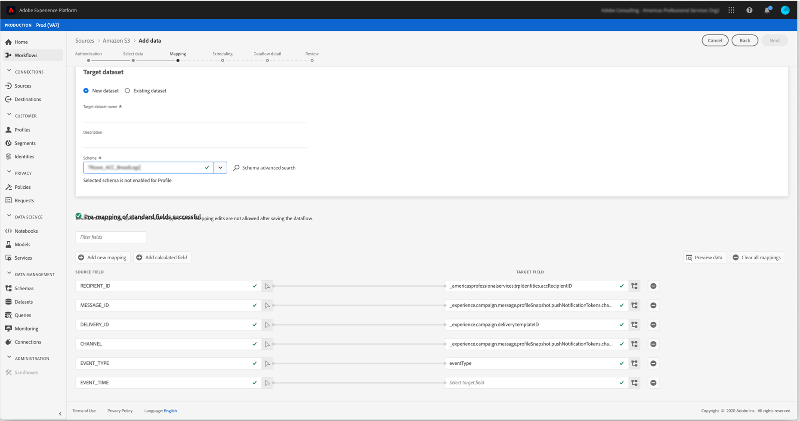

# Campaign에서 Adobe Experience Platform으로 데이터 내보내기 {#sources}

RTCDP(Adobe Real-time Customer Data Platform)으로 Campaign Standard 데이터를 내보내려면 먼저 Campaign Standard에서 워크플로우를 빌드하여 Amazon Storage Service(S3) 또는 Azure Blob 저장 공간 위치로 공유하려는 데이터를 내보내야 합니다.

워크플로우가 구성되고 데이터가 저장소 위치로 전송되면 S3 또는 Azure blob 저장 공간 위치를 로 연결해야 합니다 **소스** Adobe experience Platform에서 생성합니다.

>[!NOTE]
>
>Campaign에서 생성한 데이터만 내보내는 것이 좋습니다(예: 전송, 열기, 클릭 등). Adobe Experience Platform에 연결할 수도 있습니다. 타사 소스(CRM 등)에서 수집된 데이터는 Adobe Experience Platform에 직접 가져와야 합니다.

## Campaign Standard에서 내보내기 워크플로우 만들기

데이터를 Campaign Standard에서 S3 또는 Azure Blob 저장 공간 위치로 내보내려면 내보낼 데이터를 타겟팅하는 워크플로우를 빌드하여 저장 공간 위치로 보내야 합니다.

이렇게 하려면 다음을 추가하고 구성합니다.

* A **[!UICONTROL Extract file]** 활동을 통해 타깃팅된 데이터를 CSV 파일로 추출할 수 있습니다. 이 활동을 구성하는 방법에 대한 자세한 내용은 [이 섹션](../../automating/using/extract-file.md).

   

* A **[!UICONTROL Transfer file]** 활동을 통해 CSV 파일을 저장 위치에 전송합니다. 이 활동을 구성하는 방법에 대한 자세한 내용은 [이 섹션](../../automating/using/transfer-file.md).

   

예를 들어 아래 워크플로우는 정기적으로 로그를 CSV 파일로 추출한 다음 파일을 저장소 위치로 전송합니다.

데이터 관리 워크플로우의 예시는 [워크플로우 사용 사례](../../automating/using/about-workflow-use-cases.md#management) 섹션을 참조하십시오.

관련 항목:

* [데이터 관리 활동](../../automating/using/about-data-management-activities.md)
* [데이터 가져오기 및 내보내기 기본 정보](../../automating/using/about-data-import-and-export.md)

## 스토리지 위치를 소스로 연결

Amazon Storage Service(S3) 또는 Azure Blob 저장 공간 위치를 로 연결하는 주요 단계입니다 **소스** Adobe experience Platform은 아래에 나열되어 있습니다. 이러한 각 단계에 대한 자세한 내용은 [소스 커넥터 설명서](https://experienceleague.adobe.com/docs/experience-platform/sources/home.html?lang=ko).

1. Adobe Experience Platform에서 **[!UICONTROL Sources]** 메뉴에서 스토리지 위치에 대한 연결을 만듭니다.

   * [Amazon S3 소스 연결 만들기](https://experienceleague.adobe.com/docs/experience-platform/sources/ui-tutorials/create/cloud-storage/s3.html)
   * [Azure Blob 커넥터](https://experienceleague.adobe.com/docs/experience-platform/sources/connectors/cloud-storage/blob.html)

   >[!NOTE]
   >
   >저장소 위치는 Amazon S3, 암호가 있는 SFTP, SSH 키가 있는 SFTP 또는 Azure Blob 연결일 수 있습니다. Adobe Campaign에 데이터를 전송하는 기본 방법은 Amazon S3 또는 Azure Blob을 통해 입니다.

   

1. 클라우드 저장소 배치 연결에 대한 데이터 흐름을 구성합니다. 데이터 흐름은 저장소 위치에서 Adobe Experience Platform 데이터 집합으로 데이터를 검색하고 수집하는 예약된 작업입니다. 이 단계에서는 데이터 선택 및 XDM 스키마에 대한 CSV 필드 매핑을 포함하여 저장소 위치에서 데이터 수집을 구성할 수 있습니다.

   자세한 정보는 [이 페이지](https://experienceleague.adobe.com/docs/experience-platform/sources/ui-tutorials/dataflow/cloud-storage.html).

   

1. 소스가 구성되면 Adobe Experience Platform에서 제공한 저장소 위치에서 파일을 가져옵니다.

   이 작업은 필요에 따라 예약할 수 있습니다. 인스턴스에 이미 있는 로드에 따라 하루에 최대 6회까지 내보내기를 수행하는 것이 좋습니다.
