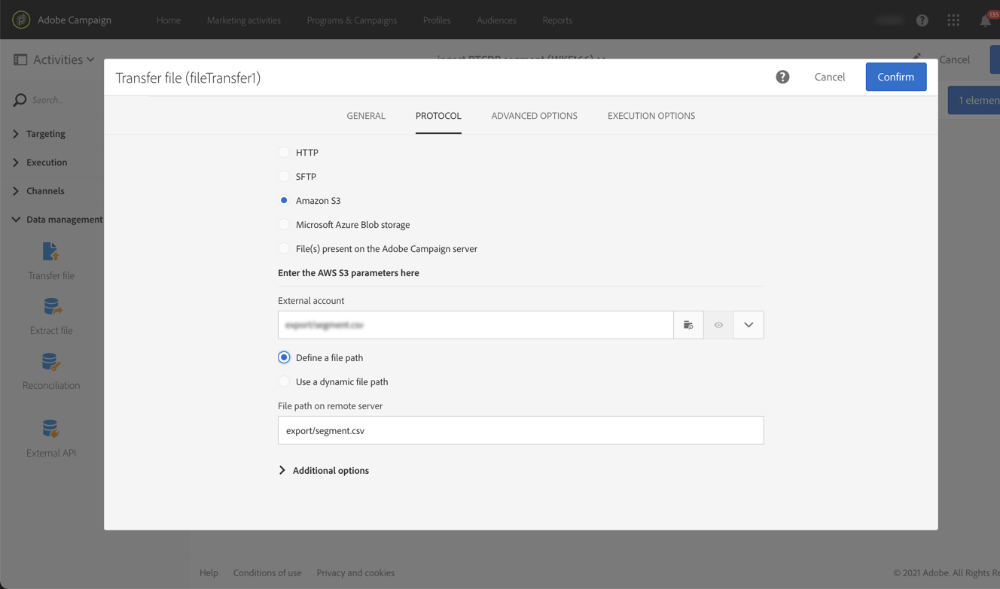

# Adobe Experience Platform 대상을 캠페인 {#destinations}에 인제스트

Adobe Experience Platform 대상을 Campaign으로 인제스트하고 워크플로우에서 사용하려면 먼저 Adobe Campaign을 Adobe Experience Platform **Destination**&#x200B;으로 연결하고 내보낼 세그먼트로 구성해야 합니다.

대상이 구성되면 데이터가 스토리지 위치로 내보내지며 Campaign Standard에서 전용 워크플로우를 구축하여 인제스트해야 합니다.

## 대상으로 Adobe Campaign 연결

Adobe Experience Platform에서 내보낸 세그먼트에 대한 저장소 위치를 선택하여 Adobe Campaign와의 연결을 구성합니다. 이 단계에서는 내보낼 세그먼트를 선택하고 포함할 추가 XDM 필드를 지정할 수도 있습니다.

자세한 내용은 [대상 설명서](https://experienceleague.adobe.com/docs/experience-platform/destinations/catalog/email-marketing/adobe-campaign.html)를 참조하십시오.

대상이 구성되면 Adobe Experience Platform은 사용자가 제공한 저장 위치에 탭으로 구분된 .txt 또는 .csv 파일을 만듭니다. 이 작업은 24일에 한 번 예약되어 수행됩니다.

이제 세그먼트를 Campaign에 인제스트하도록 Campaign Standard 워크플로우를 구성할 수 있습니다.

## Campaign Standard에서 가져오기 워크플로우 만들기

Campaign Standard이 대상으로 구성되면 Adobe Experience Platform에서 내보낸 파일을 가져오는 전용 워크플로우를 만들어야 합니다.

이렇게 하려면 **[!UICONTROL Transfer file]** 활동을 추가하고 구성해야 합니다. 이 활동을 구성하는 방법에 대한 자세한 내용은 [이 섹션](../../automating/using/transfer-file.md)을 참조하십시오.

그런 다음 필요에 따라 워크플로우를 만들 수 있습니다(세그먼트 데이터를 사용하여 데이터베이스를 업데이트하거나, 세그먼트에 크로스 채널 제공을 전송하는 등).

예를 들어 아래 워크플로우는 매일 저장소 위치에서 파일을 다운로드한 다음 세그먼트 데이터로 캠페인 데이터베이스를 업데이트합니다.

데이터 관리 워크플로우의 예는 [워크플로우 사용 사례](../../automating/using/about-workflow-use-cases.md#management) 섹션에서 사용할 수 있습니다.

관련 항목:

* [데이터 관리 활동](../../automating/using/about-data-management-activities.md)
* [데이터 가져오기 및 내보내기 기본 정보](../../automating/using/about-data-import-and-export.md)
