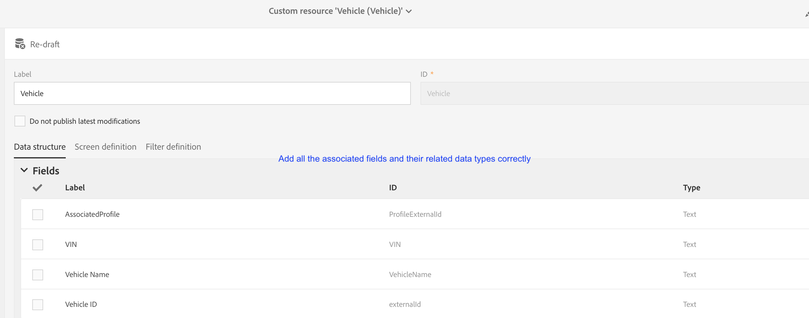

# 캠페인 사용자 지정 리소스 및 Dynamics 365 사용자 지정 엔터티 매핑

Adobe Campaign Standard와 Microsoft Dynamics 365 간의 통합을 통해 사용자 지정 리소스와 사용자 지정 엔티티를 매핑하는 방법을 살펴봅니다.

## 사전 요구 사항

새로운 버전의 Microsoft Dynamics [365-Adobe Campaign Standard 통합은](../../integrating/using/working-with-campaign-standard-and-microsoft-dynamics-365.md) 사용자 지정 개체에 대한 지원을 제공합니다.  이렇게 하면 Dynamics 365의 사용자 지정 개체가 캠페인의 해당 사용자 지정 리소스로 복제될 수 있습니다.

복제한 후에는 사용자 지정 리소스의 새 데이터를 세그멘테이션 및 개인화를 비롯한 여러 용도로 사용할 수 있습니다.

>[!CAUTION]
>
>Campaign 사용자 지정 리소스 레코드에 고객의 Campaign 사용에 적용되는 개인 정보가 포함되어 있는 경우, 이러한 레코드는 해당 Campaign 프로필 레코드(직접 또는 다른 사용자 지정 리소스를 통해)에 연결되어 프로필 레코드에 대한 개인 정보 관련 삭제도 개인 정보가 포함된 연결된 사용자 지정 리소스 레코드를 삭제할 수 있습니다.연결된 레코드의 캐스케이드처럼 제거를 활성화하려면 엔티티 간 링크 및 삭제 옵션을 구성해야 합니다. 프로필에 연결되지 않은 사용자 지정 리소스에 개인 정보를 입력하지 마십시오.

캠페인 사용자 지정 리소스에 대한 보다 포괄적인 개요는 [이 링크에서](../../developing/using/key-steps-to-add-a-resource.md)찾을 수 있습니다.

사용자 지정 엔티티에 대한 통합을 설정하려면 adobe-support@unifisoftware.com [으로 이동하여](mailto:adobe-support@unifisoftware.com) 요청하십시오.  Unifi는 두 시스템의 사용자 지정 엔티티 테이블 이름과 원하는 속성 매핑이 필요합니다.  그러면 Unifi가 해당 작업 및 일정을 만듭니다.

사용자 지정 엔티티 지원의 사용 사례는 사용 사례 [섹션에서](../../integrating/using/map-campaign-custom-resources-and-dynamics-365-custom-entities.md#UC)확인할 수 있습니다.

>[!CAUTION]
>
>* Campaign Standard 19.4 버전 이전에 게시된 사용자 지정 리소스를 통합과 함께 사용하려면 다시 게시해야 **합니다** .
>* Campaign Standard 사용자 지정 리소스 만들기 및 수정은 전문 사용자만 수행해야 하는 민감한 작업입니다.

## 사용 사례

### 시작 상태

고객은 Dynamics 365에 사전 정의된 사용자 지정 개체 차량과 Campaign Standard에 미리 정의된 해당 사용자 지정 리소스 차량을 가지고 있습니다.  고객은 Unifi에 사용자 지정 개체 매핑 세부 정보를 제공하고 Unifi는 Unifi에서 차량 사용자 지정 리소스에 대한 작업 및 일정을 설정했습니다.

|   | Microsoft Dynamics 365 | Adobe Campaign Standard | 참고 |
|---|---|---|---|
| 최상위 엔티티 | 연락처 | 프로필 | 표준, 즉시 사용 가능한 엔티티 |
| 연결된 엔티티 | 차량 - 새 사용자 지정 엔티티 | 차량 - 새로운 사용자 지정 리소스 | 새로운 사용자 정의 엔티티 |
| 링크 유형 | N:1의 연락처에 대한 부모 연결 | Dynamics 365와 유사 - 자세한 내용은 아래 캠페인 섹션을 참조하십시오. |   |

### Dynamics 365의 구성

Dynamics 365에서 이 고객의 사용자 지정 개체는 Dynamics 365 옆의 드롭다운을 클릭하여 판매 대시보드에서 볼 수 있습니다.  이 고객의 사용자 지정 개체는 아래에서 함께 **[!UICONTROL Extensions]**&#x200B;그룹화됩니다.

차량 데이터는 **[!UICONTROL vehicle]** 사용자 지정 엔티티를 클릭하여 볼 수 있습니다.  아래 차량 목록을 참조하십시오.

엔티티와 엔티티의 관계는 아래에 표시될 수 **[!UICONTROL vehicle]** **[!UICONTROL Contact]** 있습니다. **[!UICONTROL Parental]** 가 선택되었습니다 **[!UICONTROL Type of Behavior]**.

### Campaign Standard의 구성

Campaign에서 고객의 사용자 지정 리소스는 왼쪽 **[!UICONTROL Adobe Campaign]** 위 모서리를 클릭한 다음 선택하여 볼 수 **[!UICONTROL Client data]**&#x200B;있습니다.

### 사용자 정의 리소스 및 사용자 정의 엔티티 매핑

사용자 **[!UICONTROL vehicle]** 지정 리소스는 고객이 이전에 미리 정의했으므로 클라이언트 데이터에 표시되어야 합니다.그러나 아래의 이 **[!UICONTROL vehicle]** 사용자 지정 리소스를 만드는 단계를 살펴보도록 하겠습니다.

왼쪽 **[!UICONTROL Adobe Campaign]** 위 모서리에서 을 클릭한 다음 아이콘을 클릭합니다 **[!UICONTROL Administration > Development > Custom Resources]**.

1. 을 **[!UICONTROL Custom Resources]**&#x200B;클릭합니다.
1. 단추를 **[!UICONTROL Create]** 클릭합니다.  팝업 창이 열립니다.
1. 레이블과 ID를 **[!UICONTROL Create a new resource]** 선택하고 **[!UICONTROL Vehicle]** 입력합니다.
1. 클릭 **[!UICONTROL Create]**.

그러면 캠페인이 데이터 구조와 링크 페이지를 표시합니다.  여러 필드가 추가되었음을 확인할 수 있습니다.

* 차량 ID는 **[!UICONTROL Vehicle]** 엔티티의 고유 식별자입니다.통합이 작동하려면 아래에 표시된 **[!UICONTROL externalId]**&#x200B;것과 같이 ID가 정확히 일치해야 합니다.
* 연관된 프로파일은 차량 레코드가 연결된 프로파일의 ID입니다.이 항목이 연결되면 프로필 테이블의 **[!UICONTROL externalId]** 필드에 연결됩니다.
* VIN 및 차량 이름은 차량에 대한 정보를 수집하기 위한 필드입니다.

>[!CAUTION]
>
>각 사용자 지정 리소스에는 externalId의 ID가 있는 고유한 필드가 있어야 합니다(정확히).  이 필드는 Dynamics 365에서 사용자 지정 리소스의 ID 필드에 매핑됩니다(아래 참조).

### 식별 키 정의

다음 단계는 식별 키를 정의하는 것입니다.  먼저 아래에 표시된 대로 ID 키를 만듭니다.

키 정의 화면에서 **[!UICONTROL externalId]** 필드를 선택해야 합니다.

>[!CAUTION]
>
>각 사용자 지정 리소스에는 &quot;externalId&quot;의 경로(정확히)가 있는 식별 키가 있어야 합니다.

### 필터 정의

다음 단계는 필터 정의를 지정하는 것입니다.

아래에서 **[!UICONTROL Filter Definition]**&#x200B;을 클릭합니다 **[!UICONTROL Add an element]**.\
레이블과 ID에 이름을 **[!UICONTROL ExternalId]**지정합니다.
클릭 **[!UICONTROL Add]**.

이제 새로 추가된 필터 요소를 클릭하고 아래 이미지별로 필터를 구성합니다.  필드에 **[!UICONTROL externalId]** 입력하고 더하기 기호를 클릭하면 **[!UICONTROL Parameters]** **[!UICONTROL externalId_parameter]** 표시됩니다.  매개 변수로 선택합니다.

### 링크 정의

다음으로 사용자 지정 리소스의 연결을 지정합니다.  이 경우, Adobe는 **[!UICONTROL Vehicles]** 사용자 지정 엔티티(소스)에서 프로필 엔티티(대상)에 대한 링크를 a를 사용하여 **[!UICONTROL 1 cardinality simple link]**&#x200B;선택했습니다.

(../assets/DefineTheLink.png)

1. 화면에서 **[!UICONTROL Link definitions]** 삭제 옵션을 선택합니다. **[!UICONTROL Deleting the target record implies deleting records referenced by the link]** Adobe 프로필이 삭제되면 해당 프로필에 연결된 모든 **[!UICONTROL Vehicle]** 레코드도 삭제되도록 이 옵션을 선택합니다.
1. 에서 **[!UICONTROL Join Definitions]**&#x200B;을 선택합니다 **[!UICONTROL Define specific join conditions]**.
1. 그런 다음 을 **[!UICONTROL Add an element]**&#x200B;클릭합니다.

조인 정의에 대해 아래에 값을 입력합니다.

이 **[!UICONTROL @externalId]** 항목은 프로필 테이블의 externalId 필드이며 **[!UICONTROL ProfileExternalId]** 항목은 자동차 사용자 지정 리소스에 있는 해당 필드의 ID입니다.  프로필 레코드의 externalId 값을 차량 레코드의 **[!UICONTROL ProfileExternalId]** 필드에 입력하면 두 레코드가 함께 연결됩니다.

변경 사항을 확인하고 사용자 지정 엔티티를 저장합니다.

### 업데이트 게시 및 확인

최종 단계는 사용자 지정 리소스를 게시하는 것입니다.

1. 왼쪽 **[!UICONTROL Adobe Campaign]** 위 모서리에서 을 클릭하고 아이콘을 클릭합니다 **[!UICONTROL Administration > Development > Publishing]**.
1. 기본 옵션 유지: **[!UICONTROL Determine modifications since the last publication]** Adobe
1. 클릭하여 완료될 때까지 **[!UICONTROL Prepare Publication]** 기다립니다.

그런 다음 클릭하여 **[!UICONTROL Publish]** 완료될 때까지 기다립니다.

### 수신 대기 일정

고객이 Dynamics 365에서 차량 사용자 지정 엔티티를 이미 채우고 Unifi에서 차량 사용자 지정 개체 작업 및 일정을 설정했다고 가정할 경우 고객은 차량 엔티티의 수신 일정을 시작할 수 있습니다.

이제 수신 작업이 완료되면 Campaign에서 새로 채워진 **[!UICONTROL Vehicle]** 사용자 지정 리소스에서 차량 데이터를 볼 수 있습니다.

**관련 항목**

* Adobe Campaign Standard 작업 - Microsoft Dynamics 365
* Campaign에서 사용자 지정 리소스를 추가하는 주요 단계
