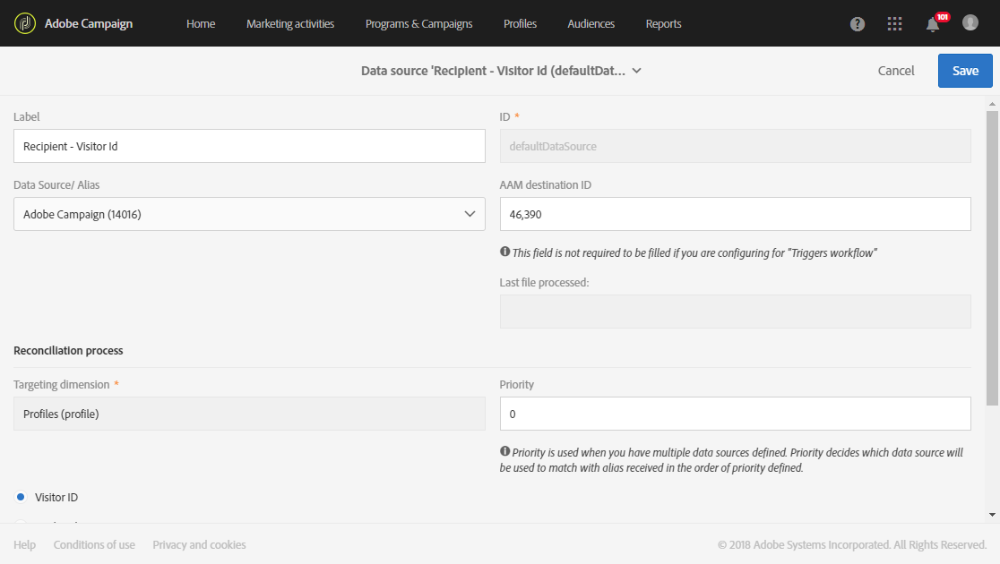

# Provisioning and configuring integration with Audience Manager or People core service{#provisioning-and-configuring-integration-with-audience-manager-or-people-core-service}

The provisioning and configuring of Audience Manager and People core in Adobe Campaign take two steps: [Submitting request to Adobe](../../integrating/using/provisioning-and-configuring-integration-with-audience-manager-or-people-core-service.md#submitting-request-to-adobe) then [Configuring the integration in Adobe Campaign](../../integrating/using/provisioning-and-configuring-integration-with-audience-manager-or-people-core-service.md#configuring-the-integration-in-adobe-campaign).

## Submitting request to Adobe {#submitting-request-to-adobe}

Audience Manager (AAM) 또는 핵심 서비스 통합을 통해 Adobe Campaign에서 고객 또는 세그먼트를 가져오거나 내보낼 수 있습니다.

이 통합을 먼저 구성해야 합니다. To request provisioning of this integration, write an email to [Digital-Request@adobe.com](mailto:Digital-Request@adobe.com) with the following information:

<table> 
 <tbody> 
  <tr> 
   <td> <strong>요청 유형:</strong>  </td> 
   <td> AAM/People 핵심 서비스 캠페인 통합 구성 </td> 
  </tr> 
  <tr> 
   <td> <strong>조직명:</strong>  </td> 
   <td> 조직명 </td> 
  </tr> 
  <tr> 
   <td> <strong>IMS 조직 ID</strong>  </td> 
   <td> IMS 조직 ID * </td> 
  </tr> 
  <tr> 
   <td> <strong>환경:</strong>  </td> 
   <td> 예: 프로덕션 </td> 
  </tr> 
  <tr> 
   <td> <strong>AAM 또는 People 서비스</strong>  </td> 
   <td> 예: Adobe Audience Manager </td> 
  </tr> 
  <tr> 
   <td> <strong>선언된 ID 또는 방문자 ID</strong>  </td> 
   <td> 예: 선언된 ID </td> 
  </tr> 
  <tr> 
   <td> <strong>추가 정보</strong>  </td> 
   <td> 유용한 정보 또는 주석 </td> 
  </tr> 
 </tbody> 
</table>

* You can find your IMS Org ID on the Experience Cloud, in the **Administration** menu. Adobe Experience Cloud에 처음 연결할 때도 제공됩니다.

## Configuring the integration in Adobe Campaign {#configuring-the-integration-in-adobe-campaign}

이 요청을 제출하면 Adobe는 귀하를 위해 통합의 제공을 계속하고, 구성을 완료해야 하는 세부 정보와 정보를 제공하기 위해 사용자에게 연락합니다.

* [1 단계: Adobe Campaign에서 외부 계정 구성 또는 확인](../../integrating/using/provisioning-and-configuring-integration-with-audience-manager-or-people-core-service.md#step-1--configure-or-check-the-external-accounts-in-adobe-campaign)
* [2 단계: Data Sources 구성](../../integrating/using/provisioning-and-configuring-integration-with-audience-manager-or-people-core-service.md#step-2--configure-the-data-sources)
* [3 단계: 캠페인 추적 서버 구성](../../integrating/using/provisioning-and-configuring-integration-with-audience-manager-or-people-core-service.md#step-3--configure-campaign-tracking-server)
* [4 단계: 방문자 ID 서비스 구성](../../integrating/using/provisioning-and-configuring-integration-with-audience-manager-or-people-core-service.md#step-4--configure-the-visitor-id-service)

### Step 1: Configure or check the external accounts in Adobe Campaign {#step-1--configure-or-check-the-external-accounts-in-adobe-campaign}

먼저 Adobe Campaign에서 외부 계정을 구성하거나 확인해야 합니다. 이러한 계정은 Adobe에 의해 구성되어 있어야 하며 필요한 정보가 사용자에게 전달되었어야 합니다.

이렇게 하려면:

1. From the advanced menu, select **Administration &gt; Application settings &gt; External accounts**.

   이 통합에 사용할 수 있는 외부 계정 중 하나를 선택합니다.

   

1. Enter **[!UICONTROL Receiver server]** in following format
1. Enter the **[!UICONTROL AWS Access Key ID]**, **[!UICONTROL Secret Access Key]** and **[!UICONTROL AWS Region]**.

이제 이 통합에 대해 외부 계정이 구성됩니다.

### Step 2: Configure the Data Sources {#step-2--configure-the-data-sources}

다음 두 데이터 소스가 Audience Manager 내에서 생성됩니다. Adobe Campaign (MID) 및 Adobe Campaign (declaredid) 를 추가했습니다. 이와 동시에 이 두 데이터 소스는 Adobe Campaign에서 사용할 수 있습니다.

* **[!UICONTROL Recipient - Visitor ID (Defaultdatasources)]**: 방문자 ID에 대해 기본적으로 구성된 기본 데이터 소스입니다. 캠페인에서 만들어진 세그먼트는 이 데이터 소스의 일부가 됩니다.
* **선언된 ID** 데이터 소스: 이 데이터 소스는 Audience Manager의 **[!UICONTROL DeclaredId]** 데이터 소스 정의와 만들고 매핑해야 합니다.

도메인이 다른 여러 웹 사이트의 경우 Adobe Campaign는 ECID를 기반으로 조정을 지원하지 않습니다.

To configure the **[!UICONTROL Recipient - Visitor ID (Defaultdatasources)]** data source:

1. In **[!UICONTROL Administration]** &gt; **[!UICONTROL Application settings]** &gt; **[!UICONTROL Shared Data Sources]**, select **[!UICONTROL Recipient - Visitor ID (Defaultdatasources)]**.

   

1. **[!UICONTROL Adobe Campaign]****[!UICONTROL Data Source/ Alias]** 드롭다운에서 선택합니다.
1. Enter the **[!UICONTROL AAM Destination ID]** provided by Adobe.

   

1. **[!UICONTROL Reconciliation process]** 카테고리에서는 조정 기준을 변경하지 않고 항상을 **[!UICONTROL Visitor ID]**&#x200B;사용할 것을 권장합니다.
1. **[!UICONTROL Save]**&#x200B;을 클릭합니다.

**[!UICONTROL Declared ID]** 데이터 소스를 만들려면:

1. In **[!UICONTROL Administration]** &gt; **[!UICONTROL Application settings]** &gt; **[!UICONTROL Shared Data Sources]**, click the **[!UICONTROL Create]** button.
1. Edit the **[!UICONTROL Label]** of your data source.
1. **[!UICONTROL Data Source/ Alias]** 드롭다운에서 Audience Manager의 **[!UICONTROL DeclaredID]** 데이터 소스에 해당하는 데이터 소스를 선택합니다.
1. Configure your data source by entering the **[!UICONTROL Data Source / Alias]** and **[!UICONTROL AAM Destination ID]** provided by Adobe.
1. **[!UICONTROL Reconciliation process]** 필요에 따라 설정합니다.
1. **[!UICONTROL Save]**&#x200B;을 클릭합니다.

>[!NOTE]
>
>The **[!UICONTROL AAM Destination ID]** field is not required if you are configuring the shared data source for the [Campaign-Triggers integration](../../integrating/using/configuring-triggers-in-experience-cloud.md). **[!UICONTROL Priority]** 는 트리거 - 캠페인 통합을 구성할 때에만 필요합니다. 우선 순위는 먼저 구성할 데이터 소스를 결정합니다. 우선 순위는 1 또는 100와 같은 임의의 숫자일 수 있습니다. 우선 순위가 높을수록 조정 중에 선호도가 높아집니다.

### Step 3: Configure Campaign Tracking server {#step-3--configure-campaign-tracking-server}

사용자 핵심 서비스 또는 Audience Manager 와의 통합에 대한 구성을 위해 캠페인 추적 서버를 구성해야 합니다.

여기에서 캠페인 추적 서버가 도메인 (CNAME) 에 등록되어 있는지 확인해야 합니다. You can find more information about domain name delegation in [this article](https://docs.campaign.adobe.com/doc/AC/en/technicalResources/Technotes/AdobeCampaign_Deliverability_Sub_Domain_Delegation.pdf).

### Step 4: Configure the Visitor ID Service {#step-4--configure-the-visitor-id-service}

In the case that your Visitor ID service has never been configured on your web properties or websites, refer to the following [document](https://marketing.adobe.com/resources/help/en_US/mcvid/mcvid-setup-aam-analytics.html) to learn how to configure your service or the following [video](https://helpx.adobe.com/marketing-cloud/how-to/email-marketing.html#step-two).

구성 및 프로비저닝이 종결되면 통합을 사용하여 대상 또는 세그먼트를 가져오고 내보낼 수 있습니다.
