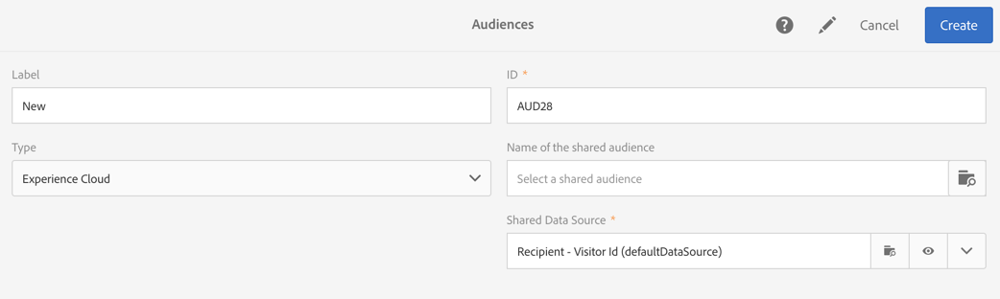

# Audience Manager 또는 People 핵심 서비스와 대상자 공유{#sharing-audiences-with-audience-manager-or-people-core-service}

## 대상자 가져오기 {#importing-an-audience}

People 코어 서비스 통합을 사용하면 기술 워크플로우를 통해 고객을 Adobe Campaign으로 직접 가져와 데이터베이스를 강화할 수 있습니다. 사람 핵심 서비스의 대상 공유에 대한 자세한 내용은 이 [설명서를 참조하십시오](https://docs.adobe.com/content/help/en/analytics/components/segmentation/segmentation-workflow/seg-publish.html).

Adobe Campaign의 사람 핵심 서비스에서 대상/세그먼트 가져오기를 사용하면 IMS를 통해 연결된 사용자만 메뉴에서 수행할 수 있습니다(Adobe ID을 통한 인증). **[!UICONTROL Audiences]**

1. Go to the **[!UICONTROL Audiences]** menu.
1. 작업 표시줄에서 화면 **[!UICONTROL Create]** 으로 이동하여 대상을 만듭니다.
1. 새 대상의 레이블을 지정합니다.
1. 만들고 있는 대상 **[!UICONTROL Type]** 이 사람 핵심 서비스에서 가져온 대상임을 나타내도록 대상을 **[!UICONTROL Experience Cloud]** 설정합니다.
1. 필드에서 가져올 대상을 **[!UICONTROL Name of the shared audience]** 선택합니다. 세그먼트만 가져올 수 있습니다. 키-값 쌍, 특성 및 규칙을 포함한 세부적인 데이터는 지원되지 않습니다.

   

1. 해당 항목을 선택합니다 **[!UICONTROL Shared Data Source]**.

   선택한 데이터 소스가 암호화 알고리즘을 사용하도록 구성된 경우 추가 옵션을 사용하면 됩니다 **[!UICONTROL Force reconciliation with a profile]**. 데이터 소스의 **[!UICONTROL Channel]** 필드가 이메일 또는 모바일(SMS)으로 설정되어 있고 프로필 데이터를 활용하려는 경우 이 옵션을 선택합니다.

   을 선택하지 않고 AMC 데이터 소스 **[!UICONTROL Force reconciliation with a profile]** 에서 이메일 또는 모바일(SMS) **[!UICONTROL Channel]** 으로 설정된 경우, 암호화된 등록 ID가 암호화됩니다. 모든 이메일 **주소** /휴대폰 번호 목록이 있는 파일 유형의 대상이 생성/업데이트됩니다. 이렇게 하면 Campaign에 해당 프로필이 존재하지 않더라도 이 통합을 통해 공유 대상을 가져오는 동안 이메일 주소/휴대폰 번호가 손실되지 않습니다. 이 유형의 대상은 워크플로우를 사용하여 수동으로 조정해야 하므로 직접 사용할 수 없습니다.

1. 대상을 만들려면 확인합니다.

   그런 다음 대상을 기술 워크플로우를 통해 가져옵니다. 이 ID(&#39;방문자 ID&#39; 또는 &#39;선언된 ID&#39;)가 프로필 차원과 조정될 수 있었던 레코드로 구성됩니다. Adobe Campaign에서 인식할 수 없는 사람 핵심 서비스 세그먼트의 ID는 가져올 수 없습니다.

이제 대상을 Adobe Campaign 데이터베이스에 가져옵니다. 사용자 핵심 서비스 또는 Audience Manager에서 직접 세그먼트를 가져오는 경우 가져오기 프로세스를 완료하는 데 24-36시간이 소요됩니다. 이 기간이 지나면 Adobe Campaign에서 새로운 고객을 찾아 사용할 수 있습니다.

>[!NOTE]
>
>Adobe Analytics에서 Adobe Campaign으로 대상을 가져오는 경우, 이러한 대상을 먼저 사람 코어 서비스 또는 Audience Manager에서 공유해야 합니다. 이 프로세스는 12-24시간이 소요되며 Campaign과 24-36시간 동기화에 추가해야 합니다. 이 경우 대상 공유 기간은 최대 60시간까지 될 수 있습니다. People 코어 서비스 및 Audience Manager의 Adobe Analytics 고객 공유에 대한 자세한 내용은 이 [설명서를 참조하십시오](https://docs.adobe.com/content/help/en/analytics/components/segmentation/segmentation-workflow/seg-publish.html).

## 대상 내보내기 {#exporting-an-audience}

워크플로우 및 활동을 사용하여 대상을 Adobe Campaign에서 Audience Manager 또는 사용자 핵심 서비스로 내보낼 수 **[!UICONTROL Save audience]** 있습니다.

새로운 워크플로우에서 수행할 수 있으며 IMS를 통해 연결된 사용자만 수행할 수 있습니다(Adobe ID을 통한 인증).

1. 프로그램, 캠페인 또는 마케팅 활동 목록에서 새 워크플로우를 만듭니다.
1. 사용 가능한 다양한 활동을 사용하여 프로필 세트를 타깃팅합니다.
1. 타깃팅 후 활동을 워크플로우로 드래그 앤 드롭한 다음 **[!UICONTROL Save audience]** 엽니다.
1. **[!UICONTROL Share in Adobe Experience Cloud]**&#x200B;을(를) 선택합니다.

   

1. 필드를 사용하여 대상을 **[!UICONTROL Shared audience]** 지정합니다. 창이 열리면 기존 대상을 선택하거나 새 대상을 만들 수 있습니다.

   * 기존 대상을 선택하면 새 레코드만 대상에 추가됩니다.
   * 프로필 목록을 새 대상으로 내보내려면 필드를 완료한 다음 새로 만든 대상을 선택하기 **[!UICONTROL Segment name]** **[!UICONTROL Create]** 전에 클릭합니다.

   

   교환하고 대사하려면 레코드에 Adobe Experience Cloud ID(&#39;방문자 ID&#39; 또는 &#39;선언된 ID&#39;)가 있어야 합니다. 대상을 가져오고 내보낼 때 조정되지 않은 레코드는 무시됩니다.

1. 완료하려면 화면 오른쪽 상단에 있는 확인 표시를 클릭합니다.
1. 해당 항목을 선택합니다 **[!UICONTROL Shared Data Source]**.
1. 원하는 경우 내보낸 프로파일을 사용하려면 **[!UICONTROL Generate an outbound transition]** 확인란을 선택합니다. 조정할 수 있는 프로필만 내보냅니다.
1. 활동의 구성을 확인하고 워크플로우를 저장합니다.
1. 워크플로우를 시작하여 고객을 내보낼 수 있습니다. Adobe Campaign과 사용자 핵심 서비스 간의 동기화는 몇 시간이 걸릴 수 있습니다.

Adobe Campaign과 사람 핵심 서비스 간의 동기화는 24-36시간이 소요됩니다. 이 기간 이후에는 사람 핵심 서비스에서 새로운 고객을 찾아 다른 Adobe Experience Cloud 솔루션에서 재사용할 수 있습니다. Adobe 사용자 핵심 서비스에서 Adobe Campaign 공유 대상을 사용하는 방법에 대한 자세한 내용은 이 [설명서를 참조하십시오](https://docs.adobe.com/content/help/en/core-services/interface/audiences/t-audience-create.html).

**관련 항목:**

* [워크플로우](../../automating/using/get-started-workflows.md)
* [대상](../../audiences/using/about-audiences.md)

