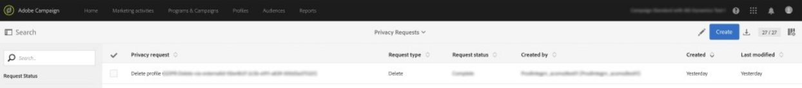

# Microsoft Dynamics 365와 Campaign Standard 통합 사용

이 통합이 수행하는 몇 가지 작업이 있습니다.

* **연락처 동기화**:연락처는 Dynamics 365에서 Campaign으로 전송됩니다(참고:단방향 동기화).
* **사용자 지정 엔티티 동기화**:사용자 지정 개체 레코드는 Dynamics 365에서 Campaign으로 전송됩니다(단방향 동기화 참고).  자세한 내용은 사용자 정의 엔티티의 페이지를 참조하십시오.
* **이벤트 표시**:특정 이메일 마케팅 이벤트는 Campaign에서 Dynamics 365로 전송됩니다. 아래 메모를 참조하십시오.
* **연락처 삭제**:Dynamics 365에서 해당 연락처를 삭제하면 캠페인 프로필이 개인 정보 관련 삭제 큐에 추가됩니다.
* **옵트아웃 동기화**:옵트아웃은 고객이 온보딩 중에 선택하는 구성(예: Dynamics 365에서 Campaign 동기화, Campaign에서 Dynamics 365 동기화 또는 양방향 동기화)에 따라 Dynamics 365와 Campaign 간에 동기화됩니다.
* **SSO(Single Sign On)**:Unifi의 통합 세부 사항은 Adobe IMS 인증을 사용하여 Campaign에서 직접 액세스할 수 있습니다.

>[!NOTE]
>
>이벤트 **디스플레이의**&#x200B;경우 송신 작업이 Unifi에서 실행될 때마다 최대 10k 이벤트가 검색됩니다.

## Adobe Campaign Standard 사용자 경험

Dynamics 365에서 연락처가 새로 만들어지거나 수정되면 연락처 동기화가 실행된 후 Campaign으로 동기화됩니다.  이러한 연락처는 Campaign의 프로필 화면에 표시되며 마케팅 캠페인에서 타깃팅될 수 있습니다.  아래의 프로필 화면을 참조하십시오.

Dynamics 365에서 연락처를 삭제하면 Campaign의 해당 프로필이 Privacy Request 화면의 Privacy Service 삭제 대기열에 추가됩니다.  Campaign의 해당 데이터 개인 정보 보호 법률을 준수하기 위해 필요한 데이터 주체의 삭제 요청 실행에 대한 자세한 내용은 Adobe Campaign Standard에서 법적으로 요구되는 삭제 요청을 실행하는 방법을 참조하십시오.

속성 화면에서 2단계 프로세스를 활성화한 경우, 마지막으로 삭제되기 전에 개인 정보 화면에서 각 레코드의 삭제를 수동으로 확인해야 합니다.  아래의 2단계 프로세스 화면을 참조하십시오.

Campaign에서 옵트아웃/블랙 리스트 속성이 수정되면, Campaign-to-Dynamics 365 또는 양방향 옵트아웃 구성을 선택하고 해당 특정 속성이 올바르게 매핑되는 경우 Dynamics 365에 반영됩니다.

Single Sign-On을 통해 통합 세부 사항에 액세스하려면 캠페인 탐색 메뉴에서 관리 > Microsoft Dynamics 365 통합을 클릭합니다.

이 페이지에는 잠재적인 법적 의무에 따라 기능을 사용하는 방법에 대한 지침과 통합에 대한 설명서에 대한 링크가 포함되어 있습니다. 지구본 아이콘을 클릭하면 자동으로 라우팅되고 Unifi 인스턴스에 로그인되어 통합 세부 사항을 관리할 수 있습니다.

아래 비디오에서 이 기능의 비디오를 볼 수 있습니다.

>[!VIDEO](https://video.tv.adobe.com/v/29254)

>[!NOTE]
>
>Adobe 고객 지원 센터(직접 또는 Adobe 담당자를 통해)에 티켓을 제출하여 Campaign 인스턴스에서 Single Sign-On 기능 플래그를 활성화해야 합니다.

>[!NOTE]
>
>Microsoft Dynamics 365 통합 아이콘은 관리 패널에 즉시 표시되지 않습니다.  Adobe 담당자(또는 귀하의 Adobe 담당자)가 Campaign 인스턴스에 대해 이 기능 플래그를 사용하도록 설정하려면 티켓을 제출해야 합니다.
>
>또한 Unifi 사용자는 Campaign에서 SSO를 통해 성공적으로 로그온하기 전에 SSO 액세스를 활성화해야 합니다.

## Microsoft Dynamics 365 사용자 경험

이벤트의 경우 다음 이메일 마케팅 이벤트가 Campaign에서 Dynamics 365로 전송되고 Dynamics 365 타임라인 보기에 사용자 지정 활동으로 표시됩니다.

* Adobe Campaign 이메일 보내기

* Adobe Campaign 이메일 열기

* Adobe Campaign 이메일 URL 클릭

* Adobe Campaign 이메일 바운스

연락처의 타임라인을 보려면 Dynamics 365 드롭다운 메뉴에서 영업 허브를 클릭하여 연락처 목록으로 이동합니다.  그런 다음 왼쪽 메뉴 모음에서 연락처를 클릭하고 연락처를 선택합니다.

>[!NOTE]
>
>이러한 이벤트를 보려면 AppSource의 Adobe Campaign for Dynamics 365 앱을 Dynamics 365 인스턴스에 설치해야 합니다.

아래에서 &quot;Dynamics 사용자&quot;에 대한 연락처 화면의 스냅숏을 볼 수 있습니다.  타임라인 보기에서는 Dynamics 사용자가 캠페인 이름 &quot;2019LoyaltyCamp&quot; 및 배달 이름 &quot;DM190&quot;과 연결된 이메일을 수신하게 됩니다.  Dynamics 사용자가 이메일을 열고 이메일의 URL을 클릭했습니다.이 두 작업 모두 아래 표시된 이벤트를 만들었습니다.  오른쪽 모퉁이를 보면 관계 도우미(RA) 카드가 표시됩니다.현재, 여기에는 클릭한 URL에 대한 후속 작업이 포함되어 있습니다.

Dynamics 사용자를 위한 타임라인 보기에 대한 자세한 내용은 아래를 참조하십시오.

다음은 RA(Relationship Assistant) 카드의 일부입니다.  AppSource 앱에는 Adobe 이메일 URL 클릭 이벤트를 확인하는 워크플로우가 포함되어 있습니다.  이 이벤트가 발생하면 작업을 만들고 기한을 설정합니다.  이렇게 하면 작업이 RA 카드에 표시되어 추가적인 가시성을 제공할 수 있습니다.  Adobe 이메일 바운스 이벤트에 대한 유사한 워크플로우가 있으며, 잘못된 이메일 주소를 조정하는 작업을 추가합니다.  이러한 워크플로우는 솔루션에서 끌 수 있습니다.

전송 이벤트의 제목을 클릭하면 아래 양식과 유사한 양식이 표시됩니다.  열린 이벤트와 바운스 이벤트의 양식은 유사합니다.

이메일 URL 클릭 이벤트에 대한 양식은 클릭한 URL에 대한 추가 속성을 추가합니다.

다음은 속성 및 설명 목록입니다.

* 제목:이벤트 제목;이메일 배달의 캠페인 ID 및 배달 ID로 구성됨

* 소유자:사후 제공 단계에서 생성된 응용 프로그램 사용자

* 관련:연락처의 이름

* 캠페인 이름:Campaign Standard의 캠페인 ID

* 배달 이름:Campaign Standard의 배달 ID

* 전송/열림/클릭/바운스된 날짜:이벤트를 만든 날짜/시간

* 추적 URL:클릭한 URL

* 미러 페이지 URL:전송/열기/클릭/바운스된 이메일의 미러 페이지에 대한 URL

아래 비디오에서 사용되는 미러 페이지 URL의 비디오를 볼 수 있습니다.

>[!VIDEO](https://video.tv.adobe.com/v/29253)

>[!NOTE]
>
>옵트아웃의 경우, 옵트아웃 속성이 Dynamics 365에서 수정되면 Dynamics 365에서 캠페인 또는 양방향 옵트아웃 구성을 선택한 경우 특정 속성이 올바르게 매핑되는 경우 Campaign에 반영됩니다.

**관련 항목**

* 캠페인/Dynamics 365 통합에 대한 캠페인 구성
* Campaign/Dynamics 365 통합에 대한 Dynamics 구성
* Campaign/Dynamics 365 통합을 위한 Unifi 구성
* 사용자 정의 리소스 및 사용자 정의 엔티티를 매핑하는 방법 학습