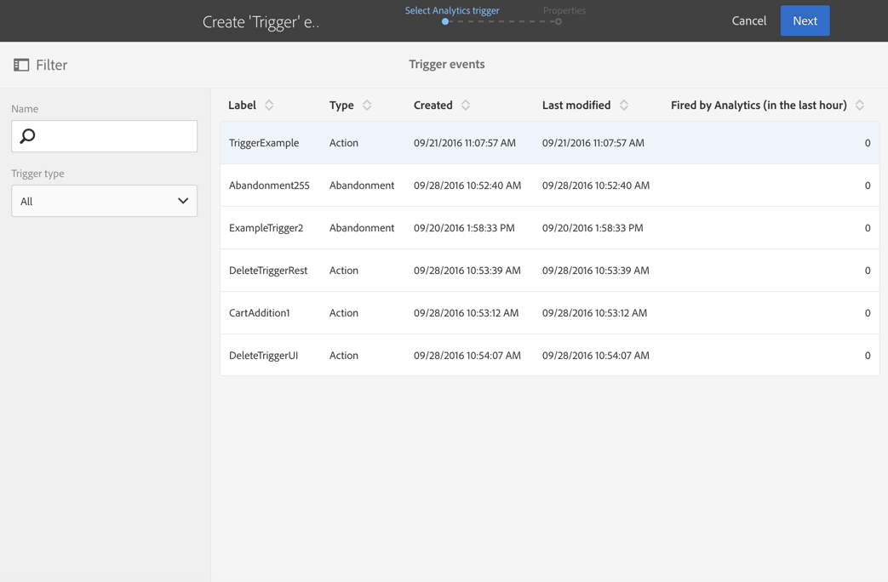

# Using Triggers in Campaign{#using-triggers-in-campaign}

## Creating a mapped trigger in Campaign {#creating-a-mapped-trigger-in-campaign}

You should make sure to define the behaviors that you want to monitor beforehand in Adobe Experience Cloud ( **[!UICONTROL Triggers]** core service). For more on this, refer to the [Adobe Experience Cloud documentation](https://marketing.adobe.com/resources/help/en_US/mcloud/triggers.html). 트리거를 정의할 때에는 별칭을 활성화해야 합니다. 각 행동 (검색/양식 포기, 제품 추가/삭제, 세션 만료 등) 에 대해 Adobe Experience Cloud에 새로운 트리거를 추가해야 합니다.

이제 기존 Adobe Experience Cloud 트리거를 기반으로 Adobe Campaign에서 트리거 이벤트를 만들어야 합니다.

You can watch this [video](https://helpx.adobe.com/marketing-cloud/how-to/email-marketing.html#step-two) to help you understand how triggers are set up in Adobe Campaign.

이를 활용하는 단계는 다음과 같습니다.

1. Click the **[!UICONTROL Adobe Campaign]** logo, in the top left corner, then select **[!UICONTROL Marketing plans]** &gt; **[!UICONTROL Transactional messages]** &gt; **[!UICONTROL Experience Cloud Triggers]**.

   

1. **[!UICONTROL Create]** 단추를 클릭합니다. 여는 만들기 마법사에 Adobe Experience Cloud에 정의된 모든 트리거의 목록이 표시됩니다. **[!UICONTROL Fired by Analytics]** 열에는 Adobe Experience Cloud 트리거 트리거로 전송된 이벤트 수가 표시됩니다. 이것은 Experience Cloud 인터페이스에서 만든 트리거를 매핑하는 것입니다.

   

1. Select the Adobe Experience Cloud trigger that you want to use and click **[!UICONTROL Next]**.
1. 트리거의 일반 속성을 구성합니다. At this step of the wizard, also specify the channel and the targeting dimension to use for the trigger (see [targeting dimensions and resources](../../automating/using/query.md#targeting-dimensions-and-resources)). 그런 다음 트리거 만들기를 확인합니다.
1. Click the button to the right of the **[!UICONTROL Event content and enrichment]** field to view the content of the payload. 또한 이 화면에서는 Adobe Campaign 데이터베이스에 저장된 프로필 데이터를 사용하여 이벤트 데이터를 보강할 수 있습니다. 강화 작업은 표준 트랜잭션 메시지의 경우와 동일한 방식으로 수행됩니다.

   

1. In the **[!UICONTROL Transactional message validity duration]** field, define the duration for which the message will stay valid after the event is sent by Analytics. 기간이 2 일이 되면 해당 기간이 경과한 후 메시지가 더 이상 전송되지 않습니다. 여러 메시지를 일시 중단하면 일정 기간 후에 다시 시작할 경우 메시지가 전송되지 않도록 합니다.

   

1. If a propensity scoring is defined in Analytics (see the [Experience Cloud documentation](https://marketing.adobe.com/resources/help/en_US/insight/client/c_visitor_propensity.html)), you can choose not to send the message if the customer has a high probability of coming back to the website in the near future. 점수와 임계값은 페이로드 컨텐츠를 통해 사용할 수 있으므로 이러한 값을 사용하여 메시지를 개인화할 수 있습니다. 이 옵션을 사용하려면 화면 하단에 있는 상자를 선택합니다. 가까운 시일 내에 사이트를 다시 방문할 가능성이 높은 클라이언트는 메시지를 받지 못합니다.
1. **[!UICONTROL Publish]** 단추를 클릭하여 트리거 이벤트를 게시합니다.
1. If you need to make a change in your trigger schema even after publishing your trigger event, click the **[!UICONTROL Update schema]** button to retrieve the latest changes.

   이 작업은 트리거와 트랜잭션 메시지를 게시 취소하므로 나중에 다시 게시해야 합니다.

   

**[!UICONTROL Show Trigger in Experience Cloud]** 이 단추를 사용하면 Adobe Experience Cloud에서 트리거 정의를 볼 수 있습니다.

이벤트가 게시되면, 새 이벤트에 연결된 트랜잭션 템플릿이 자동으로 생성됩니다. 그런 다음 방금 만든 템플릿을 수정하고 게시해야 합니다. For more on this, refer to the [Editing the template](../../start/using/about-templates.md) section.

## Editing the transactional message template {#editing-the-transactional-message-template}

트리거 이벤트를 만들고 게시하면 해당 트랜잭션 템플릿이 자동으로 생성됩니다. For more on this, refer to the [Creating a mapped trigger in Campaign](../../integrating/using/using-triggers-in-campaign.md#creating-a-mapped-trigger-in-campaign) section.

이벤트가 트랜잭션 메시지를 보내게 하려면 템플릿을 사용자 정의한 다음 테스트하여 게시해야 합니다. 이러한 단계는 표준 트랜잭션 메시지의 경우와 동일합니다. For more on this, refer to the [Transactional template](../../channels/using/event-transactional-messages.md#personalizing-a-transactional-message) section.

>[!NOTE]
>
>템플릿을 게시 취소하는 경우 트리거 이벤트가 자동으로 게시 취소됩니다.

컨텐츠를 편집할 때 Analytics 트리거가 전송한 정보를 기반으로 개인화 필드를 추가할 수 있습니다. Adobe Campaign 프로필 데이터를 사용하여 이벤트 데이터를 보강하는 경우 이 정보를 기반으로 메시지를 개인화할 수 있습니다. To personalize your message, select **[!UICONTROL Transactional event]** &gt; **[!UICONTROL Event context]** and select a field.

## Accessing the reports {#accessing-the-reports}

To view the dedicated trigger report in Adobe Campaign, open the trigger event that you previously created, and click **[!UICONTROL Show trigger report]**.

보고서는 처리된 이벤트의 수를 Analytics가 전송한 이벤트 수와 비교하여 보여줍니다. 또한 모든 최근 트리거 목록도 표시됩니다.

