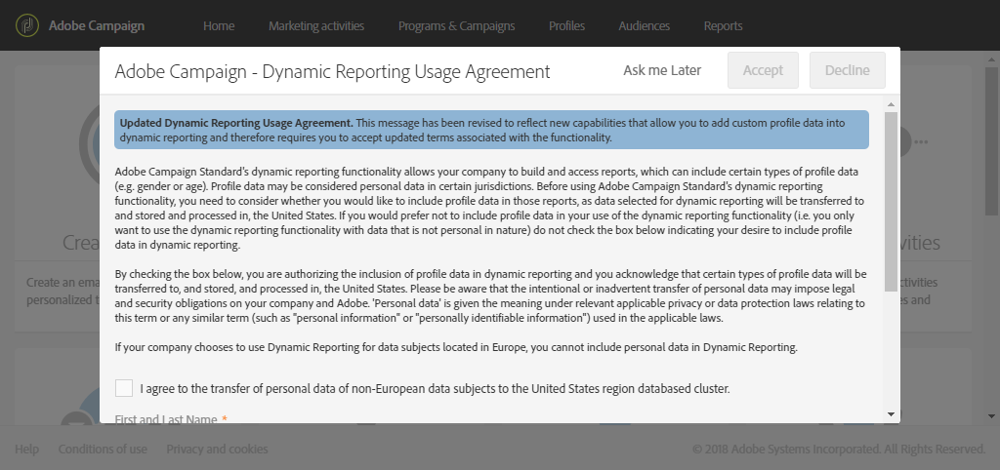

# About dynamic reports{#about-dynamic-reports}

>[!NOTE]
>
>Only users with administration rights or with organizational units set to **All** can create or save a new report. For more on this, refer to this [section](../../administration/using/users-management.md).

동적 보고는 완전히 사용자 지정 가능한 실시간 보고서를 제공합니다. 프로필 데이터에 액세스할 수 있으므로 열기 및 클릭과 같은 기능적인 이메일 캠페인 데이터뿐만 아니라 성별, 도시 및 연령과 같은 프로필 차원별 인구 통계학적 분석이 가능합니다. 드래그 앤 드롭 인터페이스에서 데이터를 검색하고, 가장 중요한 고객 세그먼트에 대해 이메일 캠페인을 수행하는 방식을 결정하고, 수신자에 대한 영향력을 측정할 수 있습니다.

드래그 앤 드롭 메뉴와 사용자 지정 가능한 시각화를 통해 다이내믹한 보고서 기능을 사용하면 모든 조합의 차원, 지표 및 시간 범위를 다양한 분류 및 비교를 통해 결합할 수 있습니다.

**관련 항목:**

* [보고서 목록](../../reporting/using/defining-the-report-period.md)
* [조직 단위](../../administration/using/organizational-units.md)
* [동적 보고서](https://helpx.adobe.com/campaign/kt/acs/using/acs-creating-a-dynamic-report-feature-video-use.html) 비디오

## Accessing dynamic reports {#accessing-dynamic-reports}

보고서에 액세스할 수 있습니다.

* From the home page by selecting **[!UICONTROL Reports]** tab in the top bar or the **[!UICONTROL Reports]** card to access reports for all deliveries.

   

* **를** **클릭합니다.**

   

정보를 수집하고 처리하는 데 걸리는 시간에 따라, 특정 보고서를 배달 직후에 사용할 수 없습니다.

동적 보고서는 두 가지 카테고리로 나뉘어져 있습니다.

* **템플릿**- 다른 이름으로 **저장** 옵션 (**프로젝트 &gt; 다른 이름으로 저장) 를 사용하여 템플릿을 복사하여 수정할 수 있습니다.**) 를 클릭합니다.
* **보고서 홈** 페이지에서 새 프로젝트 **만들기** 단추를 클릭하여 직접 생성할 수 있는 사용자 지정 보고서 **(파란색)** 입니다.

>[!NOTE]
>
>데이터는 조직 단위에 따라 필터링됩니다.

## Dynamic reporting usage agreement {#dynamic-reporting-usage-agreement}

동적 보고서를 사용하면 프로필 데이터를 기준으로 프로필 데이터를 기반으로 보고서를 필터링할 수 있습니다.

프로필 차원은 동적 보고 사용 계약에 동의한 후 보고서에서만 표시하고 사용할 수 있습니다. 기본적으로 계약서는 볼 수 있으며 관리 권한이 부여된 사용자만 허용하거나 거부할 수 있습니다.

본 계약서에서는 다음 프로필 데이터를 미국 내에서 전송 및 저장할 수 있습니다. 구/군/시, 국가/지역, 주, 성별 및 세그먼트 기준

본 계약에 동의함으로써 모든 유럽 및 비유럽 데이터가 미국으로 전송됩니다.

다음 세 가지 옵션을 사용할 수 있습니다.

* **[!UICONTROL Ask me later]**: 나중에 [묻기 요청] 를 클릭하면 창이 24 시간 동안 표시되지 않습니다.
* **[!UICONTROL Accept]**: 본 계약에 동의함으로써 귀하는 Adobe Campaign를 통해 고객의 개인 식별 정보를 수집하고 미국으로 전송할 수 있습니다.
* **[!UICONTROL Decline]**: 계약에 동의하지 않으면, 프로필 차원은 보고서에 나타나지 않으며 고객의 개인 식별 정보는 수집되거나 전송되지 않습니다.

This choice is not final, you can always change it by selecting **[!UICONTROL Enable PII data to be transferred to US region to use reporting on Profile data]** in **[!UICONTROL Administration]** &gt; **[!UICONTROL Application Settings]** &gt; **[!UICONTROL Options]**.

값은 언제든지 변경할 수 있습니다. The value -1 corresponds to **[!UICONTROL Ask me later]**, 1 **[!UICONTROL Accept]** and 0 **[!UICONTROL Decline]**.

