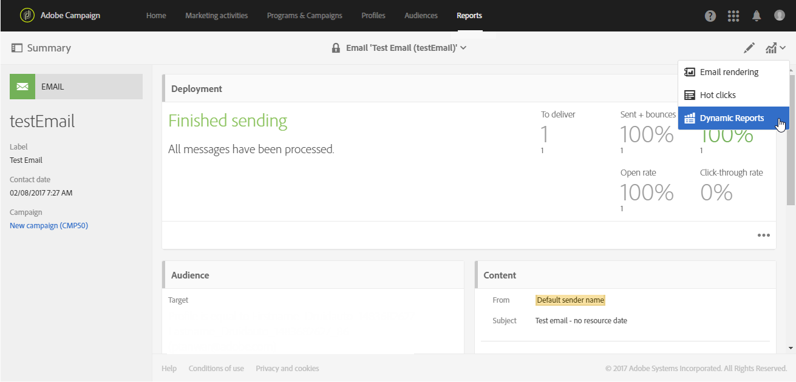

# 동적 보고서 기본 정보{#about-dynamic-reports}

Dynamic Reporting은 사용자 정의 가능하고 실시간 보고서를 제공합니다. 프로필 데이터에 대한 액세스 권한을 추가함으로써 열림 및 클릭과 같은 기능적인 이메일 캠페인 데이터 외에도 성별, 도시 및 연령 등의 프로필 차원별로 인구 통계 분석을 수행할 수 있습니다. 드래그 앤 드롭 인터페이스에서 데이터를 살펴보고 가장 중요한 고객 세그먼트에 대한 이메일 캠페인의 성과를 확인하고 수신자에게 미치는 영향을 측정할 수 있습니다.

>[!NOTE]
>
>관리 권한이 있거나 조직 구성 단위를 모두(All)로 **설정한** 사용자만 새 보고서를 만들거나 저장할 수 있습니다. For more on this, refer to this [section](../../administration/using/users-management.md).

드래그 앤 드롭 메뉴와 사용자 정의 가능한 시각화 기능을 통해 다이내믹 보고서 기능을 사용하여 차원, 지표 및 시간 범위를 모든 조합에서 결합할 수 있으며, 무제한 분류 및 비교를 수행할 수 있습니다.

**관련 항목:**

* [보고서 목록](../../reporting/using/defining-the-report-period.md)
* [조직 단위](../../administration/using/organizational-units.md)
* [동적 보고서](https://docs.adobe.com/content/help/en/campaign-learn/campaign-standard-tutorials/reporting/creating-a-dynamic-report.html) 비디오

## 동적 보고서 액세스 {#accessing-dynamic-reports}

보고서에 액세스할 수 있습니다.

* 상단 막대의 **[!UICONTROL Reports]** **[!UICONTROL Reports]** 탭이나 카드를 선택하여 홈 페이지에서 모든 게재에 대한 보고서에 액세스합니다.

   

* 각 프로그램, 캠페인 및 메시지에서 **동적** 보고서를 클릭하여 **게재와 관련된** 보고서만 볼 수 있습니다.

   

정보를 수집 및 처리하는 데 걸리는 시간에 따라 배달 후 즉시 특정 보고서를 사용할 수 없습니다.

동적 보고서는 다음 두 가지 카테고리로 분류됩니다.

* **다른 이름으로**&#x200B;저장 옵션을 사용하여 복사하여 수정할 수 있는 템플릿(프로젝트 **> 다른 이름으로****저장..**)을 클릭합니다.
* **사용자 지정 보고서** (파란색으로 표시됨) - 보고서 **홈 페이지에서 새 프로젝트** 만들기 단추를 클릭하여 직접 만들 **수** 있습니다.

>[!NOTE]
>
>데이터는 조직 단위에 따라 필터링됩니다.

## 동적 보고 사용 계약서 {#dynamic-reporting-usage-agreement}

동적 보고 사용 계약서의 목적은 데이터 처리에 대한 팝업 동의로 작동하기 위한 것입니다. 기본적으로 계약은 표시만 되며 관리 권한이 부여된 사용자만 수락하거나 거부할 수 있습니다.

다음 세 가지 옵션을 사용할 수 있습니다.

* **[!UICONTROL Ask me later]**:나중에 **묻기를**&#x200B;클릭하면 24시간 동안 창이 표시되지 않습니다. 사용자가 계약을 수락하거나 거부하기 전까지 프로필 차원은 보고서에 표시되지 않으며 고객의 개인 ID 정보는 수집되거나 전송되지 않습니다.
* **[!UICONTROL Accept]**:본 계약을 수락하면 Adobe Campaign에서 고객의 개인 ID 정보를 수집하여 보고 또는 데이터 센터로 전송할 수 있습니다.
* **[!UICONTROL Decline]**:계약을 거절하면 프로필 차원이 보고서에 표시되지 않고 고객의 개인 식별 정보가 수집되거나 전송되지 않습니다. 이 경우 externalID는 여전히 수집되어 최종 사용자를 식별하는 데 사용됩니다.

아래 표에는 해당 지역에 따라 본 계약을 수락한 후 발생하는 사항이 표시됩니다.

|  | 동적 보고 | Microsoft Dynamics 365 커넥터 |
|---|---|---|
| 미국 및 APAC(아시아 태평양) | **사용 가능한**&#x200B;기능  즉시 사용 가능한 모든 정보(예: 도시, 국가/지역, 주, 성별 및 연령 기준 세그먼트) 및 사용자 지정 프로필 정보가 미국 보고 센터로 푸시되었습니다. 프로필 차원에 대한 자세한 내용은 이 [페이지를 참조하십시오](../../reporting/using/list-of-components-.md) | **사용 가능한**&#x200B;기능  모든 특별 및 사용자 지정 프로필 필드와 Adobe Campaign Standard 이벤트 필드는 미국 데이터 센터에서 처리됩니다. |
| EMEA(유럽 중동 및 아프리카) | **사용 가능한**&#x200B;기능  EMEA 보고 센터로 전달되는 모든 특별 정보(예: 도시, 국가/지역, 주, 성별 및 세그먼트) 및 사용자 지정 프로필 정보 프로필 차원에 대한 자세한 내용은 이 [페이지를 참조하십시오](../../reporting/using/list-of-components-.md) | **기능 제공** EMEA  데이터 센터에서 처리되는 모든 특별 및 사용자 지정 프로필 필드 및 Adobe Campaign Standard 이벤트 필드.  **[!UICONTROL Control data]** 이 파일에는 Adobe I/O 등록 데이터와 미국 데이터 센터에 전송되어 저장된 고객 최종 사용자 이벤트의 ID가 들어 있습니다. |

아래 표에는 해당 지역에 따라 본 계약을 거절하고 난 후 발생하는 사항이 표시됩니다. 이 계약을 거절하더라도 게재 및 Microsoft Dynamics 365 통합에 대해 보고할 수 있습니다.

| 지역 | 동적 보고 | Microsoft Dynamics 365 커넥터 |
|---|---|---|
| 미국 및 APAC(아시아 태평양) | **사용 가능한**&#x200B;기능   ExternalID를 제외하고 즉시 사용 가능한 사용자 지정 프로필 정보가 미국 보고 센터로 푸시되지 않습니다. | **사용 가능한**&#x200B;기능  외부 ID 및 수신자 ID를 제외하고 미국 데이터 센터로 전송된 기본 또는 사용자 지정 프로필 필드가 없습니다.  미러 페이지 ID를 제외하고 미국 데이터 센터에서 처리된 모든 Adobe Campaign Standard 이벤트 필드.  Microsoft Dynamics 365 통합에 대한 자세한 내용은 이 [페이지를](../../integrating/using/working-with-campaign-standard-and-microsoft-dynamics-365.md)참조하십시오. |
| EMEA(유럽 중동 및 아프리카) | **사용 가능한**&#x200B;기능  ExternalID를 제외하고 EMEA 보고 센터로 푸시된 특별 및 사용자 지정 프로필 정보가 없습니다. | **기능 제공** 외부  ID 및 수신자 ID를 제외하고 EMEA 데이터 센터로 전송된 기본 또는 사용자 지정 프로필 필드가 없습니다.  미러 페이지 ID를 제외하고 EMEA 데이터 센터에서 처리된 모든 Adobe Campaign Standard 이벤트 필드.   **[!UICONTROL Control data]** 이 파일에는 Adobe I/O 등록 데이터와 미국 데이터 센터에 전송되어 저장된 고객 최종 사용자 이벤트의 ID가 들어 있습니다. Microsoft Dynamics 365 통합에 대한 자세한 내용은 이 [페이지를](../../integrating/using/working-with-campaign-standard-and-microsoft-dynamics-365.md)참조하십시오. |

이 선택 사항은 최종본이 아닙니다. > **[!UICONTROL Enable PII data to be transferred to US region to use reporting on Profile data]** > **[!UICONTROL Administration]** **[!UICONTROL Application Settings]** **[!UICONTROL Options]**&#x200B;에서 선택하여 언제든지 변경할 수 있습니다.

값은 언제든지 변경할 수 있습니다. 값 1은 **[!UICONTROL Ask me later]**, 2 **[!UICONTROL Decline]** 및 3 **[!UICONTROL Accept]**&#x200B;에 해당합니다.

