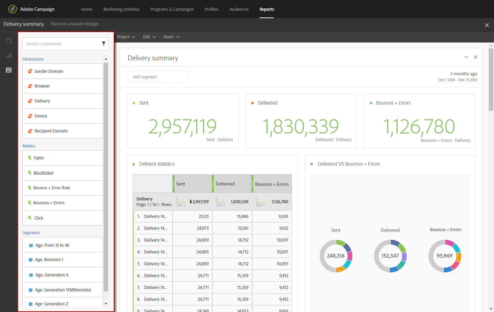

# 구성 요소 추가{#adding-components}

구성 요소를 사용하면 다양한 차원, 지표 및 기간으로 보고서를 사용자 지정할 수 있습니다.

1. 구성 요소 목록에 액세스하려면 **[!UICONTROL Components]** 탭을 클릭합니다.

   

1. **[!UICONTROL Components]** 탭에 표시된 각 카테고리에 가장 많이 사용된 5개의 항목이 표시되고, 카테고리의 이름을 클릭하면 전체 구성 요소 목록에 액세스할 수 있습니다.

   구성 요소 테이블은 4개의 카테고리로 분할됩니다.

   * **Dimension**:받는 사람의 브라우저 또는 도메인과 같은 배달 로그 또는 배달 성공과 같은 세부 정보를 가져옵니다.
   * **지표**:메시지 상태에 대한 자세한 내용을 살펴보십시오. 예를 들어 메시지가 전달되고 사용자가 메시지를 연 경우
   * **[!UICONTROL Segments]**:받는 사람의 연령 범위에 따라 데이터를 필터링합니다. **[!UICONTROL Segments]** 자유 형식 테이블 또는 패널의 상단 막대에서 바로 드래그하여 놓을 수 있습니다. 기본적으로 **[!UICONTROL Exclude proof]** 세그먼트는 이미 선택되어 있지만 필요한 경우 변경할 수 있습니다.

      이 카테고리는 관리자가 화면에 표시될 동적 보고 사용 계약의 약관을 승인한 경우에만 사용할 수 있습니다. 관리자가 계약을 거부하면 세그먼트가 **[!UICONTROL Components]** 탭에 표시되지 않고 데이터가 수집되지 않습니다.

   * **시간**:테이블 기간을 설정합니다.

1. 패널에 구성 요소를 드래그 앤 드롭하여 데이터 필터링을 시작합니다.

필요한 만큼 구성 요소를 드래그하여 놓고 서로 비교할 수 있습니다.

**관련 항목:**

* [구성 요소 목록](../../reporting/using/list-of-components-.md)
* [보고서 목록](../../reporting/using/defining-the-report-period.md)

