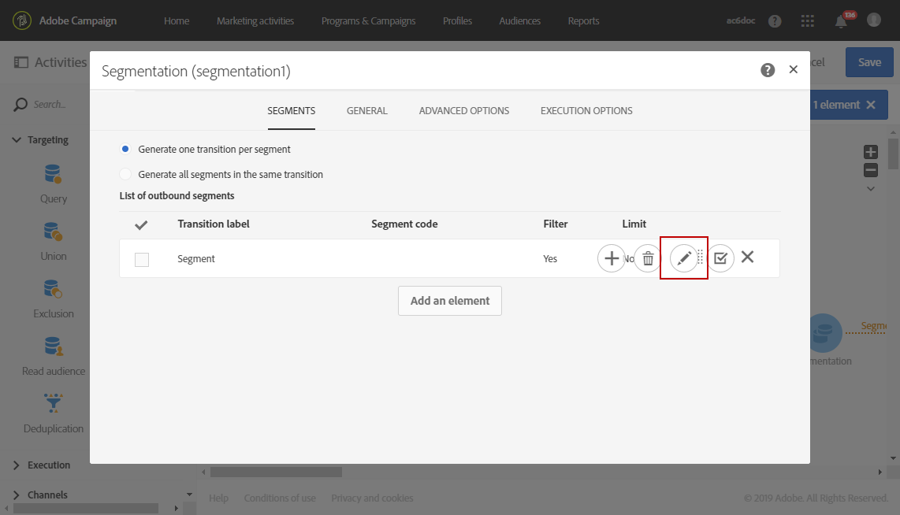

# 워크플로 세그먼트 기반 보고서 만들기{#creating-a-report-workflow-segment}

>[!CAUTION]
> **[!UICONTROL Segment code]**&#x200B;은(는) 전자 메일 및 SMS 게재만 타겟팅할 수 있습니다.

워크플로우를 만들고 모집단을 다른 타겟팅된 대상자로 필터링한 후 이 타겟팅 워크플로우에 정의된 세그먼트를 기반으로 마케팅 캠페인의 효율성을 측정할 수 있습니다.
보고서에서 이러한 세그먼트를 타겟팅하려면 다음을 수행하십시오.

* [1단계: 세그먼트를 사용하여 프로필 사용자 지정 리소스 업데이트](#step-1--update-profiles-custom-resource-segments)
* [2단계: 세그먼트를 사용하여 워크플로우 만들기](#step-2--create-a-workflow-segments)
* [3단계: 세그먼트를 필터링할 동적 보고서 만들기](#step-3--create-a-dynamic-report-filter-segments)

>[!CAUTION]
>이러한 데이터 수집을 시작하려면 동적 보고 사용 계약에 동의해야 합니다.
>
>이 계약에 대한 자세한 정보는 이 [페이지](../../reporting/using/about-dynamic-reports.md#dynamic-reporting-usage-agreement)를 참조하세요.

## 1단계: 세그먼트를 사용하여 프로필 사용자 지정 리소스 업데이트{#step-1--update-profiles-custom-resource-segments}

세그먼트 코드에 대해 보고하기 전에 세그먼트 코드가 저장될 **[!UICONTROL Profiles]** 사용자 지정 리소스를 업데이트해야 합니다.

1. 고급 메뉴에서 Adobe Campaign 로고를 통해 **[!UICONTROL Administration]** > **[!UICONTROL Development]** > **[!UICONTROL Custom resources]**&#x200B;을(를) 선택한 다음 **[!UICONTROL Profile (profile)]** 리소스를 선택합니다.
1. **[!UICONTROL Data structure]** 탭의 **[!UICONTROL Sending logs extension]** 메뉴에서 **[!UICONTROL Add segment code]**&#x200B;을(를) 선택하여 타기팅 워크플로우의 세그먼트 코드 저장을 허용하고 동적 보고로 보냅니다.

   그러면 보고서의 **[!UICONTROL Profile]** 차원 섹션에서 **[!UICONTROL Segment code]**&#x200B;을(를) 사용할 수 있습니다.

   

1. 사용자 지정 리소스를 저장합니다.

1. 이제 사용자 지정 리소스를 게시해야 합니다.
고급 메뉴에서 **[!UICONTROL Administration]** > **[!UICONTROL Development]** > **[!UICONTROL Publishing]**&#x200B;을(를) 선택합니다.

   

1. **[!UICONTROL Prepare publication]**&#x200B;을(를) 클릭한 다음 준비가 완료되면 **[!UICONTROL Publish]** 단추를 클릭합니다. 사용자 지정 리소스에 대한 자세한 내용은 이 [페이지](../../developing/using/updating-the-database-structure.md)를 참조하세요.

이제 세그먼트 코드를 사용하여 워크플로우 만들기를 시작할 수 있습니다.

**[!UICONTROL Sending logs extension]**&#x200B;에서 세그먼트 코드를 활성화하면 바로 세그먼트 코드가 수집됩니다.

## 2단계: 세그먼트를 사용하여 워크플로우 만들기 {#step-2--create-a-workflow-segments}

>[!NOTE]
>이메일 게재의 입력 전환이 비어 있으면 기본적으로 이전 전환의 세그먼트 코드가 추가됩니다.

먼저 타겟팅된 모집단이 다른 워크플로우를 만들어야 합니다. 여기에서는 대상자의 연령에 따라 개인화된 이메일을 보내려고 합니다. 20~30세 프로필에 대한 게재 하나와 30~40세 프로필에 대한 게재 하나.

1. 워크플로우를 만듭니다. 워크플로우를 만드는 방법에 대한 자세한 내용은 이 [페이지](../../automating/using/building-a-workflow.md)를 참조하세요.

1. **[!UICONTROL Query]** 활동을 팔레트에서 끌어서 작업 영역에 놓아 추가합니다.

1. 20~40세 사이의 프로필을 타겟팅하여 더 많은 타겟팅된 모집단으로 세분화합니다.

   

1. **[!UICONTROL Segmentation]** 활동을 추가하여 쿼리 결과를 두 개의 대상 모집단으로 분할합니다. 세분화에 대한 자세한 정보는 이 [페이지](../../automating/using/segmentation.md)를 참조하세요.

1. **[!UICONTROL Segmentation]** 활동을 두 번 클릭하여 구성하십시오. **[!UICONTROL Edit properties]**&#x200B;을(를) 클릭하여 첫 번째 세그먼트를 편집합니다.

   

1. 20~30세 사이의 프로필을 쿼리하고 완료되면 **[!UICONTROL Confirm]**&#x200B;을(를) 클릭합니다.

   

1. **[!UICONTROL Add an element]**&#x200B;을(를) 클릭하여 두 번째 세그먼트를 만들고 위의 단계에 설명된 대로 구성하여 30세에서 40세 사이의 프로필을 타겟팅합니다.

1. 동적 보고를 통해 전달할 각 모집단의 **[!UICONTROL Segment code]**&#x200B;을(를) 편집합니다.

   >[!NOTE]
   >이 단계는 필수입니다. 그렇지 않으면 보고할 세그먼트를 파악할 수 없습니다.

   

1. **[!UICONTROL Email delivery]** 활동을 세그먼트 뒤에 끌어다 놓습니다.

   

1. 다양한 타겟팅된 모집단에 따라 게재를 개인화합니다. 전자 메일 만들기에 대한 자세한 정보는 이 [페이지](../../designing/using/designing-content-in-adobe-campaign.md)를 참조하세요.

1. 워크플로를 저장합니다.

1. 워크플로우가 준비되면 **[!UICONTROL Start]**&#x200B;을(를) 클릭합니다.

이제 보고서에 액세스하여 세그먼트 코드를 추적할 수 있습니다.

## 3단계: 세그먼트를 필터링할 동적 보고서 만들기 {#step-3--create-a-dynamic-report-filter-segments}

워크플로우로 게재를 보낸 후 워크플로우의 세그먼트 코드를 사용하여 보고서를 분류할 수 있습니다.

1. **[!UICONTROL Reports]** 탭에서 기본 제공 보고서를 선택하거나 **[!UICONTROL Create new project]** 단추를 클릭하여 보고서를 처음부터 시작합니다.

   
1. **[!UICONTROL Delivery]** 차원을 자유 형식 테이블로 끌어서 놓습니다.

   

1. **[!UICONTROL Open]** 및 **[!UICONTROL Click]** 지표와 같은 다른 지표를 테이블에 끌어다 놓아 데이터 필터링을 시작합니다.
1. **[!UICONTROL Dimensions]** 범주에서 **[!UICONTROL Profile]** 차원을 클릭한 다음, 워크플로우의 게재에서 **[!UICONTROL Segment code]** 차원을 끌어서 놓아 타겟팅된 모집단에 따라 이메일 게재의 성공을 측정합니다.

   

1. 필요한 경우 작업 공간에 시각화를 끌어서 놓습니다.

   
