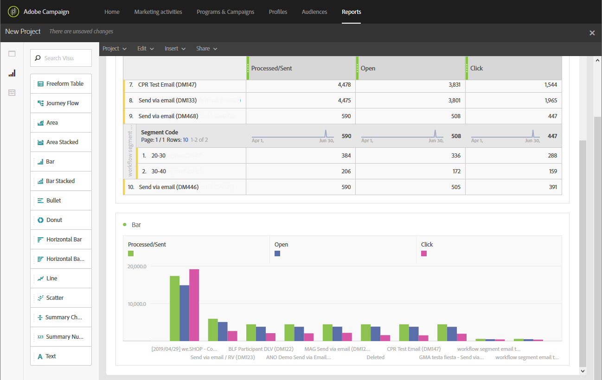

# 워크플로우 세그먼트 기반 보고서 만들기{#creating-a-report-workflow-segment}

>[!CAUTION]
> **[!UICONTROL Segment code]** 은 이메일 및 SMS 게재만 타겟팅할 수 있습니다.

워크플로우를 만들고 모집단을 다른 타겟팅된 대상자로 필터링한 후 이 타겟팅 워크플로우에 정의된 세그먼트를 기반으로 마케팅 캠페인의 효율성을 측정할 수 있습니다.
보고서에서 이러한 세그먼트를 타겟팅하려면 다음을 수행하십시오.

* [1단계: 세그먼트를 사용하여 프로필 사용자 지정 리소스 업데이트](#step-1--update-profiles-custom-resource-segments)
* [2단계: 세그먼트를 사용하여 워크플로우 만들기](#step-2--create-a-workflow-segments)
* [3단계: 세그먼트를 필터링할 동적 보고서 만들기](#step-3--create-a-dynamic-report-filter-segments)

>[!CAUTION]
>이러한 데이터 수집을 시작하려면 동적 보고 사용 계약에 동의해야 합니다.
>
>이 계약에 대한 자세한 내용은 다음을 참조하십시오. [페이지](../../reporting/using/about-dynamic-reports.md#dynamic-reporting-usage-agreement).

## 1단계: 세그먼트를 사용하여 프로필 사용자 지정 리소스 업데이트{#step-1--update-profiles-custom-resource-segments}

세그먼트 코드에 대해 보고하기 전에 **[!UICONTROL Profiles]** 세그먼트 코드를 저장할 사용자 지정 리소스입니다.

1. 고급 메뉴에서 Adobe Campaign 로고를 통해 다음을 선택합니다. **[!UICONTROL Administration]** > **[!UICONTROL Development]** > **[!UICONTROL Custom resources]**&#x200B;을(를) 선택한 다음 **[!UICONTROL Profile (profile)]** 리소스.
1. 다음에서 **[!UICONTROL Sending logs extension]** 메뉴 위치: **[!UICONTROL Data structure]** 탭, 확인 **[!UICONTROL Add segment code]** 타겟팅 워크플로우의 세그먼트 코드 저장을 허용하고 동적 보고로 전송합니다.

   다음 **[!UICONTROL Segment code]** 이(가) 그런 다음 **[!UICONTROL Profile]** 보고서의 차원 섹션.

   

1. 사용자 지정 리소스를 저장합니다.

1. 이제 사용자 지정 리소스를 게시해야 합니다.
고급 메뉴에서 다음을 선택합니다. **[!UICONTROL Administration]** > **[!UICONTROL Development]** > **[!UICONTROL Publishing]**.

   

1. 클릭 **[!UICONTROL Prepare publication]** 그런 다음 준비가 완료되면 **[!UICONTROL Publish]** 단추를 클릭합니다. 사용자 지정 리소스에 대한 자세한 내용은 다음을 참조하십시오. [페이지](../../developing/using/updating-the-database-structure.md).

이제 세그먼트 코드를 사용하여 워크플로우 만들기를 시작할 수 있습니다.

에서 세그먼트 코드를 활성화하면 바로 세그먼트 코드가 수집됩니다. **[!UICONTROL Sending logs extension]**.

## 2단계: 세그먼트를 사용하여 워크플로우 만들기 {#step-2--create-a-workflow-segments}

>[!NOTE]
>이메일 게재의 입력 전환이 비어 있으면 기본적으로 이전 전환의 세그먼트 코드가 추가됩니다.

먼저 타겟팅된 모집단이 다른 워크플로우를 만들어야 합니다. 여기에서는 대상자의 연령에 따라 개인화된 이메일을 보내려고 합니다. 20~30세 프로필에 대한 게재 하나와 30~40세 프로필에 대한 게재 하나.

1. 워크플로우를 만듭니다. 워크플로우를 만드는 방법에 대한 자세한 내용은 다음을 참조하십시오. [페이지](../../automating/using/building-a-workflow.md).

1. 추가 **[!UICONTROL Query]** 팔레트에서 활동을 끌어서 작업 영역에 놓는 방법.

1. 20~40세 사이의 프로필을 타겟팅하여 더 많은 타겟팅된 모집단으로 세분화합니다.

   

1. 추가 **[!UICONTROL Segmentation]** 활동을 통해 쿼리 결과를 두 개의 타겟팅된 모집단으로 분할할 수 있습니다. 세그멘테이션에 대한 자세한 내용은 다음을 참조하십시오 [페이지](../../automating/using/segmentation.md).

1. 를 두 번 클릭합니다. **[!UICONTROL Segmentation]** 활동을 통해 구성합니다. 다음을 클릭하여 첫 번째 세그먼트 편집 **[!UICONTROL Edit properties]**.

   

1. 20세에서 30세 사이의 프로필을 쿼리하고 **[!UICONTROL Confirm]** 완료 시.

   

1. 클릭 **[!UICONTROL Add an element]** 위의 단계에 설명된 대로 두 번째 세그먼트를 만들고 구성하여 30~40세 사이의 프로필을 타겟팅합니다.

1. 편집 **[!UICONTROL Segment code]** 동적 보고를 통해 전달될 각 모집단에 대해.

   >[!NOTE]
   >이 단계는 필수입니다. 그렇지 않으면 보고할 세그먼트를 파악할 수 없습니다.

   

1. 드래그 앤 드롭 **[!UICONTROL Email delivery]** 활동 을 참조하십시오.

   

1. 다양한 타겟팅된 모집단에 따라 게재를 개인화합니다. 이메일 만들기에 대한 자세한 내용은 다음을 참조하십시오. [페이지](../../designing/using/designing-content-in-adobe-campaign.md).

1. 워크플로우를 저장합니다.

1. 클릭 **[!UICONTROL Start]** 워크플로우가 준비되었을 때입니다.

이제 보고서에 액세스하여 세그먼트 코드를 추적할 수 있습니다.

## 3단계: 세그먼트를 필터링할 동적 보고서 만들기 {#step-3--create-a-dynamic-report-filter-segments}

워크플로우로 게재를 보낸 후 워크플로우의 세그먼트 코드를 사용하여 보고서를 분류할 수 있습니다.

1. 다음에서 **[!UICONTROL Reports]** 탭에서 기본 제공 보고서를 선택하거나 **[!UICONTROL Create new project]** 단추를 클릭하여 처음부터 새로 시작합니다.

   
1. 을(를) 끌어다 놓습니다. **[!UICONTROL Delivery]** 차원을 자유 형식 테이블에 추가합니다.

   

1. 다음과 같은 다양한 지표를 테이블에 끌어다 놓습니다. **[!UICONTROL Open]** 및 **[!UICONTROL Click]** 지표 를 참조하십시오.
1. 다음에서 **[!UICONTROL Dimensions]** 범주를 클릭하고 **[!UICONTROL Profile]** 차원 그런 다음 을(를) 끌어서 놓습니다. **[!UICONTROL Segment code]** 타겟팅된 모집단에 따라 이메일 게재의 성공을 측정하는 워크플로우 게재 차원.

   

1. 필요한 경우 작업 공간에 시각화를 끌어서 놓습니다.

   
