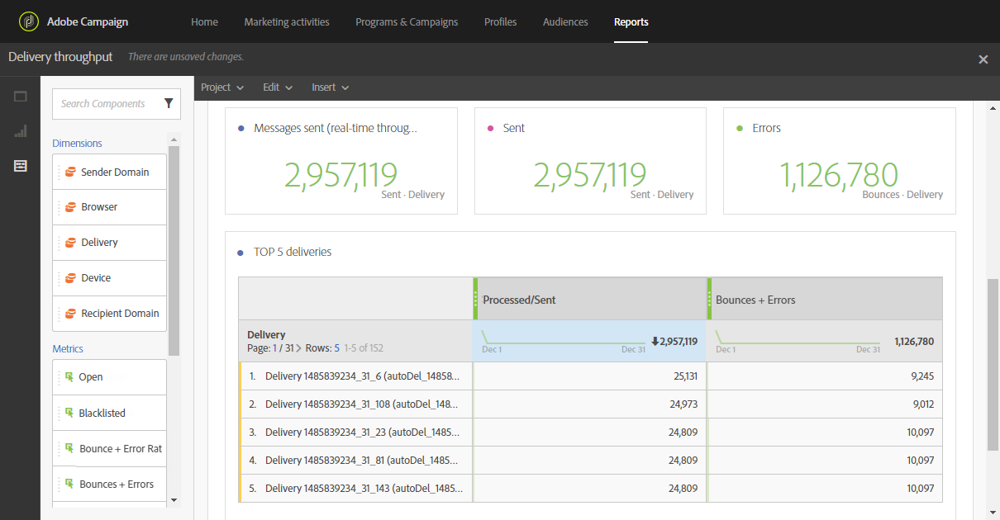

# 게재 처리량{#delivery-throughput}

이 보고서에는 한 번 또는 여러 번의 전송을 통한 게재 처리량과 관련된 데이터가 포함되어 있습니다. 다음을 제공합니다.

* 시간당 처리된 메시지 수
* 다시 시도에서 가장 높은 이득이 있는 다섯 개의 게재를 보여 주는 **[!UICONTROL Top 5 deliveries]** 테이블 및 보조 요약 번호입니다.

>[!NOTE]
>
>**[!UICONTROL Delivery throughput]** 페이지에는 Campaign에서 Adobe Campaign Enhanced MTA(메시지 전송 에이전트)로 메시지를 릴레이하는 처리량 속도가 표시됩니다.
