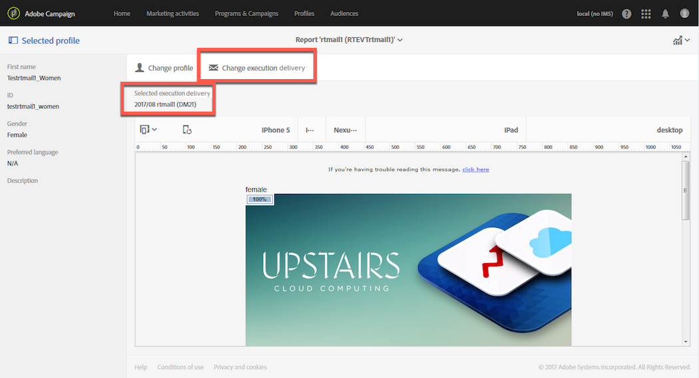

# 핫 클릭{#hot-clicks}

이 보고서는 각 배달 또는 트랜잭션 메시지의 **[!UICONTROL Reports]** 단추에서 액세스할 수 있습니다.

각 링크에 대한 클릭 수와 함께 메시지 내용(HTML 및/또는 텍스트)을 표시합니다.

게재에 대한 동적 컨텐츠를 만든 경우 정의한 각 조건에 대한 백분율을 볼 수 있습니다. 전달에 조건부 컨텐츠 삽입에 대한 자세한 내용은 동적 컨텐츠 [정의를 참조하십시오](../../designing/using/personalization.md#defining-dynamic-content-in-an-email).

예를 들어 다음과 같은 조건으로 배달을 만들었다고 가정해 봅시다.

* 받는 사람이 남자이거나 여자인 경우 기본 이미지에 있는 링크는 다릅니다.
* 또한 25세 이상의 수신자만 볼 수 있는 특별 오퍼에 대한 링크를 추가했습니다.

메시지가 전송되면 배달 대시보드에서 **[!UICONTROL Reports]** > **[!UICONTROL Hot clicks]** 를 선택합니다.

기본적으로 선택된 프로필은 없습니다. 성을 알 수 없는 수신자와 25세 미만이거나 연령을 알 수 없는 수신자에 대한 클릭 수만 표시됩니다.

여성 클릭 수를 표시하려면 **[!UICONTROL Change profile]** 단추를 클릭하고 여성 테스트 프로필을 선택합니다. 남성용 클릭 수를 표시하려면 비슷하게 진행하고 남성 테스트 프로필을 선택합니다.

25세 이상의 수신자에 대한 클릭 수를 표시하려면 **[!UICONTROL Change profile]** 단추를 클릭하고 생년월일이 이 조건과 일치하는 테스트 프로필을 선택합니다.

테스트 프로필에 대한 자세한 내용은 테스트 [프로필](../../audiences/using/managing-test-profiles.md)정보를 참조하십시오.

>[!NOTE]
>
>특정 링크에 대한 클릭 수는 게재의 모든 조건부 컨텐츠에 대한 총 클릭 수의 백분율입니다. 따라서 동적 컨텐츠를 정의한 경우 특정 테스트 프로필에 대해 표시되는 백분율의 합계가 100이 아닐 수 있습니다.

마찬가지로 반복 게재와 트랜잭션 메시지의 경우 표시할 동적 컨텐츠에 해당하는 테스트 프로파일을 선택할 수 있지만 선택한 실행 배달에 따라 클릭 비율을 볼 수도 있습니다.

실행 배달은 다음 경우에 만들어지는 실행 불가능한 비기능 기술 메시지입니다.

* 반복 배달이 실행되거나 업데이트될 때마다

   예를 들어, 이 배달을 관리하는 워크플로우가 한 달에 한 번 실행되면 한 달에 한 번 실행 배달을 수행합니다. 또한 게재 컨텐츠가 업데이트될 때마다 추가 실행 게시가 생성됩니다.

   반복되는 이메일 게재에 대한 자세한 내용은 이메일 [배달을](../../automating/using/email-delivery.md)참조하십시오.

* 트랜잭션 메시지의 경우 기본적으로 한 달에 한 번, 트랜잭션 메시지가 편집되고 다시 게시될 때마다 이러한 메시지가 나타납니다.

   트랜잭션 메시지에 대한 자세한 내용은 트랜잭션 [메시지](../../channels/using/about-transactional-messaging.md)정보를 참조하십시오.

>[!NOTE]
>
>추적된 URL의 ID는 각 실행마다 다르므로 해당 메시지의 모든 실행 배달에 대해 핫 클릭 데이터를 집계할 수 없습니다. 한 번에 한 실행에만 표시할 수 있습니다.

메시지가 전송되면 배달 대시보드에서 **[!UICONTROL Reports]** > **[!UICONTROL Hot clicks]** 를 선택합니다.

기본적으로 마지막 실행 배달이 선택됩니다. 단추를 클릭하여 다른 **[!UICONTROL Change execution delivery]** 단추를 선택합니다.

선택한 배달 실행에 대한 클릭 비율만 표시됩니다.
