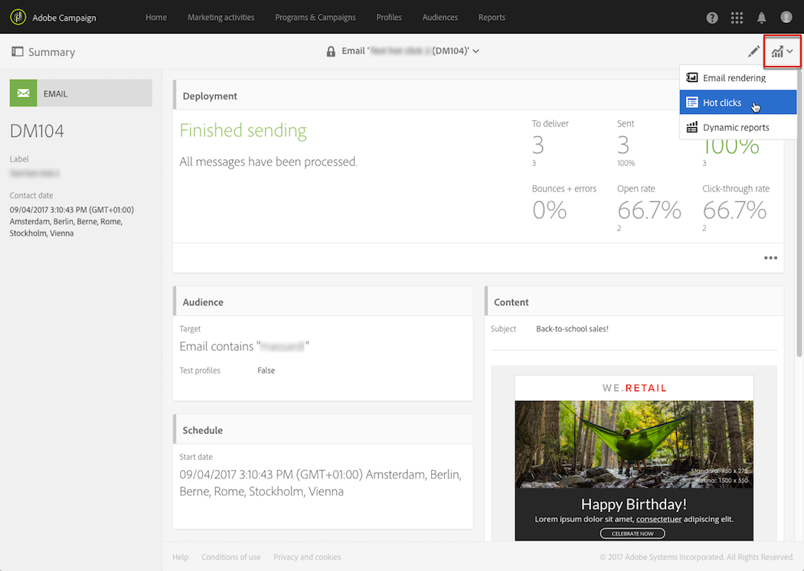

# 핫 클릭{#hot-clicks}

>[!IMPORTANT]
>
>핫 클릭 보고서는 이메일의 HTML 버전만 보여주며 텍스트 버전은 지원하지 않습니다.

이 보고서는 각 게재 또는 트랜잭션 메시지의 **[!UICONTROL Reports]** 단추에서 액세스할 수 있습니다.

각 링크에 대한 클릭 비율이 표시된 메시지 콘텐츠를 제공합니다.

게재에 대해 동적 콘텐츠를 만든 경우 정의한 각 조건에 대한 백분율을 볼 수 있습니다. 게재에 조건부 콘텐츠 삽입에 대한 자세한 내용은 [동적 콘텐츠 정의](../../designing/using/personalization.md#defining-dynamic-content-in-an-email)를 참조하십시오.

예를 들어 다음 조건을 사용하여 게재를 만들었다고 가정해 보겠습니다.

* 메인 이미지의 링크는 수신자가 남자이거나 여자인 경우 다릅니다.
* 25세 이상의 수신자에게만 표시되는 특별 오퍼에 대한 링크도 추가했습니다.

메시지가 전송되면 게재 대시보드에서 **[!UICONTROL Reports]** > **[!UICONTROL Hot clicks]**&#x200B;을(를) 선택합니다.

기본적으로 프로필은 선택되지 않습니다. 성별을 알 수 없는 수신자와 25세 미만 또는 연령을 알 수 없는 수신자에 대한 클릭만 표시됩니다.

여성 클릭 수를 표시하려면 **[!UICONTROL Change profile]** 단추를 클릭하고 여성 테스트 프로필을 선택하십시오. 남성의 클릭 수를 표시하려면 유사하게 진행하여 남성 테스트 프로필을 선택하십시오.

25세 이상 수신자의 클릭 수를 표시하려면 **[!UICONTROL Change profile]** 단추를 클릭하고 생년월일이 이 조건과 일치하는 테스트 프로필을 선택하십시오.

테스트 프로필에 대한 자세한 내용은 [테스트 프로필 정보](../../audiences/using/managing-test-profiles.md)를 참조하십시오.

>[!NOTE]
>
>특정 링크의 클릭 수는 게재에 있는 모든 조건부 콘텐츠에 대한 총 클릭 수의 백분율입니다. 따라서 동적 콘텐츠를 정의한 경우 특정 테스트 프로필에 대해 표시되는 백분율의 합계가 100이 아닐 수 있습니다.

마찬가지로 반복 게재 및 트랜잭션 메시지의 경우 표시하려는 동적 콘텐츠에 해당하는 테스트 프로필을 선택할 수 있지만 선택한 실행 게재에 따른 클릭 비율을 볼 수도 있습니다.

실행 게재는 다음과 같은 경우에 생성되는 실행 불가능하고 작동하지 않는 기술 메시지입니다.

* 반복 게재를 실행하거나 업데이트할 때마다

  예를 들어 이 게재를 관리하는 워크플로우가 한 달에 한 번 실행되는 경우 한 달에 하나의 실행 게재가 있습니다. 이 외에도 게재 콘텐츠가 업데이트될 때마다 추가 실행 게재가 생성됩니다.

  반복 전자 메일 게재에 대한 자세한 내용은 [전자 메일 게재](../../automating/using/email-delivery.md)를 참조하세요.

* 트랜잭션 메시지는 기본적으로 한 달에 한 번, 트랜잭션 메시지는 다시 편집하고 게시할 때마다 표시됩니다.

  트랜잭션 메시지에 대한 자세한 내용은 [트랜잭션 메시지 시작](../../channels/using/getting-started-with-transactional-msg.md)을 참조하세요.

>[!NOTE]
>
>추적된 URL의 ID는 실행마다 다르기 때문에, 지정된 메시지의 모든 실행 게재에 대해 핫 클릭 데이터를 집계할 수 없습니다. 한 번에 하나의 실행 게재에 대해서만 표시할 수 있습니다.

메시지가 전송되면 게재 대시보드에서 **[!UICONTROL Reports]** > **[!UICONTROL Hot clicks]**&#x200B;을(를) 선택합니다.

기본적으로 마지막 실행 게재가 선택됩니다. 다른 단추를 선택하려면 **[!UICONTROL Change execution delivery]** 단추를 클릭하십시오.

선택한 게재 실행에 대한 클릭 백분율만 표시됩니다.
