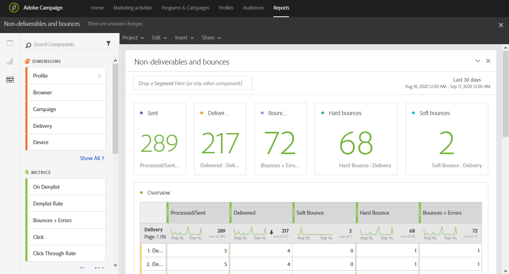

# 게재 불가 및 이탈{#non-deliverables-and-bounces}

이 **[!UICONTROL Non-deliverables and bounces]** 보고서는 배달 중 발생한 모든 오류에 대한 세부 정보를 제공합니다.

이 **[!UICONTROL Overview]** 표에는 다음과 같이 각 전달에 발생할 수 있는 오류에 대해 사용할 수 있는 데이터가 포함되어 있습니다.

* **처리/전송**:보낸 이메일 수입니다.
* **제공**:배달된 이메일 수입니다.
* **소프트 바운스**:전체 받은 편지함과 같은 총 임시 오류 수입니다.
* **하드 바운스**:잘못된 이메일 주소와 같은 영구 오류 총 수입니다.
* **바운스 수 + 오류**:배달할 수 없는 메시지 수입니다.

도메인별 **분류** 표에는 받는 사람의 도메인당 바운스 수가 나열됩니다.
