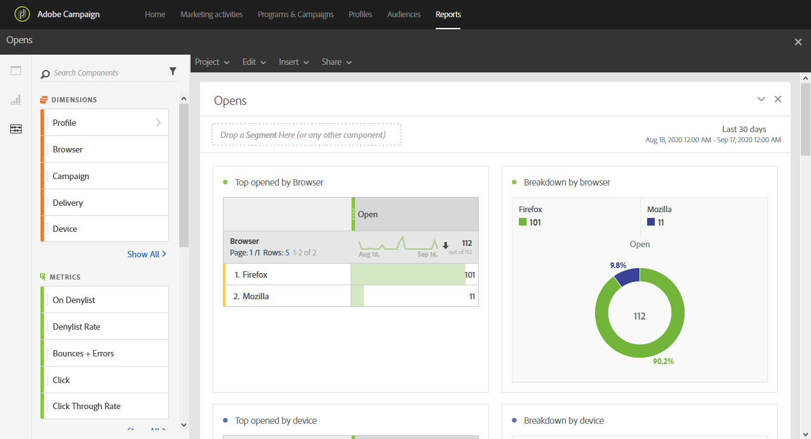

# 열람 수{#opens}

**[!UICONTROL Opens]** 보고서는 수신자가 가장 많이 본 게재 항목을 식별합니다.

4개의 테이블 및 차트는 다음을 기반으로 이메일을 열람한 총 수신자 수를 분류합니다.

* 브라우저
* 디바이스
* 플랫폼
* 도메인

**[!UICONTROL TOP 5]** 테이블 및 그래프는 메시지가 가장 많이 게재된 게재 항목을 표시합니다.
