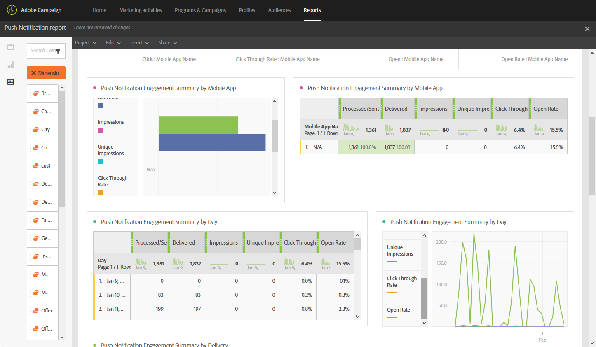

# 푸시 알림 보고서{#push-notification-report}

>[!CAUTION]
>
>배달 유형에 따라 데이터를 분할하기 위해(이 경우 푸시 알림 배달 시) **[!UICONTROL Message type]** 지표를 테이블에 드래그하여 놓아야 합니다.

**푸시 알림** 보고서는 Adobe Campaign에서 푸시 알림의 마케팅 성능에 대한 세부 정보를 제공합니다. 이 기본 보고서는 사용자가 푸시 알림, 모바일 애플리케이션 및 게재와 상호 작용하는 방식을 이해하는 데 도움이 됩니다.

푸시 추적을 구현하려면 모바일 응용 프로그램에서 일부 구성이 필요합니다. 자세한 단계는 이 [page](../../administration/using/push-tracking.md)를 참조하십시오.

각 표는 요약 번호와 차트로 표시됩니다. 각 시각화 설정에 세부 정보가 표시되는 방식을 변경할 수 있습니다.

첫 번째 테이블 **푸시 알림 관여 요약**&#x200B;은(는) 다음 세 가지 카테고리로 분할됩니다.일별, 모바일 앱 및 배달별. 이 파일에는 수신자가 배달을 다시 수행하는 데 사용할 수 있는 데이터가 포함되어 있습니다.

* **[!UICONTROL Processed/sent]**:전송된 총 푸시 알림 수입니다.
* **[!UICONTROL Delivered]**:보낸 총 푸시 알림 수와 관련하여 성공적으로 전송된 푸시 알림 수입니다.
* **[!UICONTROL Impressions]**:푸시 알림이 장치에 배달되고 알림 센터에 손상되지 않은 상태로 남아 있는 횟수입니다. 대부분의 경우 노출 횟수는 배달된 번호와 비슷해야 합니다. 이렇게 하면 장치가 메시지를 받고 해당 정보를 다시 서버로 전달합니다.
* **[!UICONTROL Unique impressions]**:수신자별 노출 횟수.
* **[!UICONTROL Click through rate]**:푸시 알림과 상호 작용한 사용자의 비율입니다.
* **[!UICONTROL Open rate]**:연 푸시 알림의 비율입니다.

두 번째 테이블 **푸시 알림 클릭 및 열기**&#x200B;는 다음 세 가지 카테고리로 분할됩니다.일별, 모바일 앱 및 배달별. 배달당 받는 사람 행동에 사용할 수 있는 데이터가 포함되어 있습니다.

* **[!UICONTROL Impressions]**:받는 사람이 본 푸시 알림의 총계.
* **[!UICONTROL Unique impressions]**:수신자별 노출 횟수.
* **[!UICONTROL Click]**:푸시 알림이 장치에 배달되고 사용자가 클릭한 횟수입니다. 사용자가 알림을 보려고 할 때 푸시 열기 추적으로 이동되거나 알림을 해지할 수 있습니다.
* **[!UICONTROL Unique clicks]**:고유 사용자가 푸시 알림과 상호 작용하는 횟수(예: 알림 또는 단추 클릭).
* **[!UICONTROL Open]**:장치에 배달되고 사용자가 클릭한 총 푸시 알림 수로 앱을 엽니다. 알림이 해제된 경우 열린 푸시를 트리거하지 않는다는 점을 제외하고 푸시 클릭과 유사합니다.
* **[!UICONTROL Unique Opens]**:배달을 연 받는 사람 수입니다.

