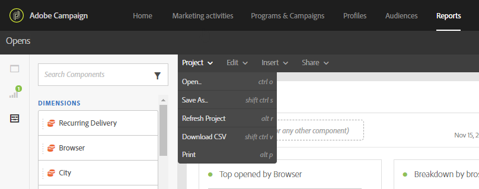
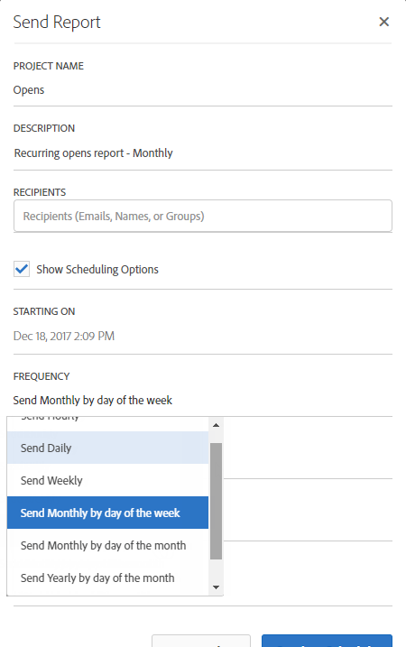
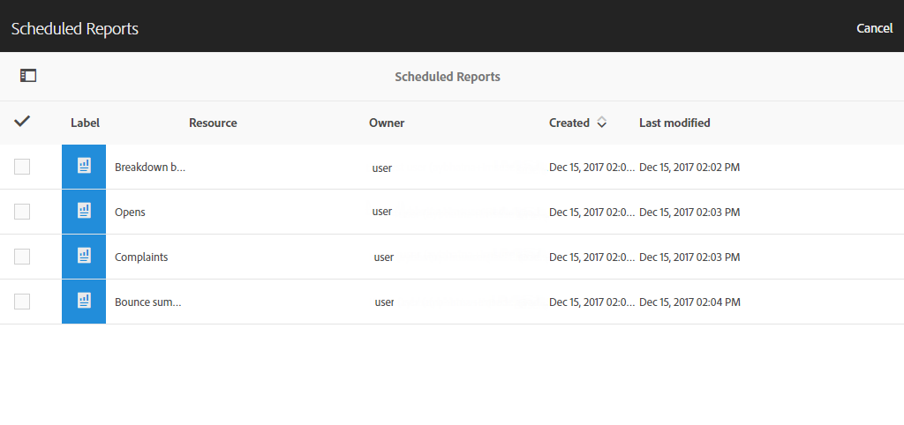

# 보고 인터페이스{#reporting-interface}

상단 도구 모음에서 보고서를 수정, 저장 또는 인쇄할 수 있습니다.

프로젝트 **탭을 사용하여** 다음을 수행할 수 있습니다.

* **열기...**:이전에 만든 보고서 또는 템플릿을 엽니다.
* **다른 이름으로 저장..**:수정할 수 있는 템플릿을 복제합니다.
* **프로젝트 새로 고침**:새 데이터 및 필터 변경 사항에 따라 보고서를 업데이트합니다.
* **CSV 다운로드**:보고서를 CSV 파일로 내보냅니다.

편집 **탭에서는** 다음을 수행할 수 있습니다.

* **실행 취소**:대시보드에서 마지막 작업을 취소합니다.
* **모두**&#x200B;지우기:대시보드의 모든 패널을 삭제합니다.

삽입 **표를** 사용하면 대시보드에 그래프와 테이블을 추가하여 보고서를 사용자 지정할 수 있습니다.

* **새 빈 패널**:대시보드에 새 빈 패널을 추가합니다.
* **새 자유 형식**:대시보드에 새 자유 형식 테이블을 추가합니다.
* **새 줄**:대시보드에 새 선 그래프를 추가합니다.
* **새 막대**:대시보드에 새 막대 그래프를 추가합니다.

**관련 항목:**

* [패널 추가](../../reporting/using/adding-panels.md)
* [시각화 추가](../../reporting/using/adding-visualizations.md)
* [구성 요소 추가](../../reporting/using/adding-components.md)
* [이메일을 통해 이해 관계자와 자동으로 보고서 공유](https://helpx.adobe.com/campaign/kb/simplify-campaign-management.html#Reportandshareinsightswithallstakeholders)

## 탭 {#tabs}

왼쪽 탭에서는 보고서를 작성하고 필요에 따라 데이터를 필터링할 수 있습니다.

이러한 탭에서는 다음 항목에 액세스할 수 있습니다.

* **[!UICONTROL Panels]**:보고서에 빈 패널이나 자유 형식을 추가하여 데이터 필터링을 시작합니다. 자세한 내용은 패널 추가 섹션을 참조하십시오.
* **[!UICONTROL Visualizations]**:시각화 항목 선택을 드래그하여 놓아 보고서에 그래픽 차원을 지정합니다. 자세한 내용은 시각화 추가 섹션을 참조하십시오.
* **[!UICONTROL Components]**:다양한 차원, 지표, 세그먼트 및 기간으로 보고서를 사용자 정의할 수 있습니다.

## 도구 모음 {#toolbar}

도구 모음은 작업 영역 위에 있습니다. 서로 다른 탭으로 구성되므로 보고서를 수정, 저장, 공유 또는 인쇄할 수 있습니다.

**관련 항목:**

* [패널 추가](../../reporting/using/adding-panels.md)
* [시각화 추가](../../reporting/using/adding-visualizations.md)
* [구성 요소 추가](../../reporting/using/adding-components.md)

### 프로젝트 탭 {#project-tab}

프로젝트 **탭을 사용하여** 다음을 수행할 수 있습니다.

* **열기...**:이전에 만든 보고서 또는 템플릿을 엽니다.
* **다른 이름으로 저장..**:수정할 수 있는 템플릿을 복제합니다.
* **프로젝트 새로 고침**:새 데이터 및 필터 변경 사항에 따라 보고서를 업데이트합니다.
* **CSV 다운로드**:보고서를 CSV 파일로 내보냅니다.
* **[!UICONTROL Print]**:보고서 인쇄

### 편집 탭 {#edit-tab}

편집 **탭에서는** 다음을 수행할 수 있습니다.

* **실행 취소**:대시보드에서 마지막 작업을 취소합니다.
* **모두**&#x200B;지우기:대시보드의 모든 패널을 삭제합니다.

### 삽입 탭 {#insert-tab}

삽입 **탭에서는** 대시보드에 그래프와 테이블을 추가하여 보고서를 사용자 지정할 수 있습니다.

* **새 빈 패널**:대시보드에 새 빈 패널을 추가합니다.
* **새 자유 형식**:대시보드에 새 자유 형식 테이블을 추가합니다.
* **새 줄**:대시보드에 새 선 그래프를 추가합니다.
* **새 막대**:대시보드에 새 막대 그래프를 추가합니다.

### 공유 탭 {#share-tab}

이 **[!UICONTROL Share]** 탭에서는 Adobe Campaign 사용자와 함께 한 샷 또는 반복 이메일을 통해 보고서를 보낼 수 있습니다. 그러면 타깃팅된 사용자가 보고서가 첨부된 이메일을 수신하게 됩니다.

* **[!UICONTROL Send report now]**:한 번의 클릭으로 이메일을 통해 선택한 수신자 목록으로 보고서를 보낼 수 있습니다.

   1. 필요한 경우 **[!UICONTROL Send report]** 창에서 설명을 추가합니다.

      

   1. 필드를 클릭하고 드롭다운에서 선택하거나 이메일 주소를 입력하여 이메일에 받는 사람을 선택합니다.
   1. 반복 이메일을 보내려는 **[!UICONTROL Show scheduling options]** 경우 확인합니다. 이 작업은 탭 **[!UICONTROL Send Report on schedule]** 에서 선택하여 수행할 수도 **[!UICONTROL Share]** 있습니다.
   1. **[!UICONTROL Send now]**&#x200B;을(를) 클릭합니다. 그러면 수신자는 보고서가 첨부된 이메일을 수신하게 됩니다.

* **[!UICONTROL Send report on schedule]**:보고서를 예약하고 반복되는 이메일을 수신자에게 보냅니다.

   1. 필요한 경우 **[!UICONTROL Send report]** 창에서 설명을 추가합니다.
   1. 필드를 클릭하고 드롭다운에서 선택하거나 이메일 주소를 입력하여 이메일에 받는 사람을 선택합니다.

      

   1. 시작 및 종료 날짜를 선택하여 **[!UICONTROL Starting on]** 및 **[!UICONTROL Ending on]** 필드에 이메일 유효성을 구성합니다.
   1. 이메일을 보낼 빈도를 선택합니다.

      

   1. 아이콘을 **[!UICONTROL Send on schedule]**&#x200B;클릭하면 수신자는 선택한 빈도에 따라 반복되는 이메일을 수신하게 됩니다.

* **[!UICONTROL Scheduled reports]**:예약된 보고서를 모두 찾아 구성합니다.

   1. 창에서 **[!UICONTROL Scheduled reports]** 반복해서 전송된 보고서를 모두 찾습니다.

      

   1. 예약된 보고서 중 하나를 삭제해야 하는 경우 삭제할 예약된 보고서를 선택한 다음 을 클릭합니다 **[!UICONTROL Delete the section]**.
   1. 예약된 보고서를 구성하거나 확인하려면 변경해야 하는 보고서를 직접 클릭합니다.
   1. 이제 **[!UICONTROL Edit scheduled report]** 이메일의 수신자나 빈도를 변경할 수 있습니다.

그러면 타깃팅된 사용자는 이메일로 보고서를 받은 편지함에 직접 첨부합니다. 사용자는 각 반복 이메일에서 사용할 수 있는 구독 취소 링크를 사용하여 반복되는 이메일 수신을 중단하기로 언제든지 결정할 수 있습니다.

**관련 항목:**

* [이메일을 통해 이해 관계자와 자동으로 보고서 공유](https://helpx.adobe.com/campaign/kb/simplify-campaign-management.html#Reportandshareinsightswithallstakeholders)
