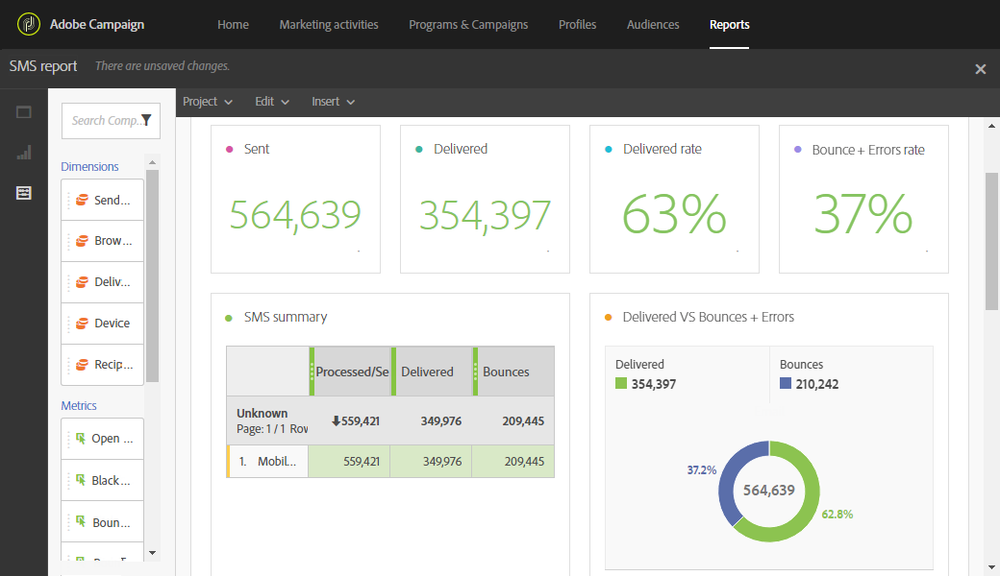

# SMS 보고서{#sms-report}

**SMS** 보고서는 배달된 SMS 및 바운스 비율과 같은 SMS 전달에 대한 세부 정보를 제공합니다.

**SMS 요약** 표, 그래프 및 요약 번호에는 전송된 SMS 전달에 사용할 수 있는 데이터가 포함되어 있습니다.

* **처리/전송**:보낸 SMS 수입니다.
* **배달됨**:배달된 SMS 수입니다.
* **바운스 수 + 오류**:배달할 수 없는 메시지 수입니다.

