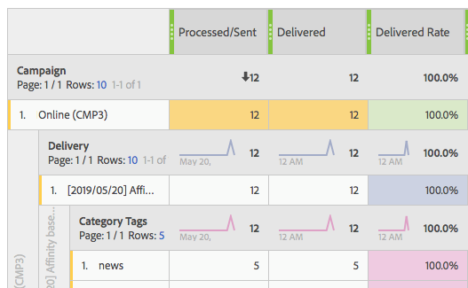

# 문제 해결{#troubleshooting}

이 섹션에서는 동적 보고와 관련된 일반적인 질문을 찾을 수 있습니다.

## 고유 열기 및 고유 클릭 수의 경우 집계 행의 개수가 개별 행 {#unique-open-clicks-no-match}의 개수와 일치하지 않습니다.

이는 예상되는 동작입니다.
다음 예제를 통해 이러한 행동을 설명할 수 있습니다.

프로필 P1 및 P2로 이메일이 전송됩니다.

P1은 첫 번째 날에 두 번 이메일을 연 다음 두 번째 날에 세 번 이메일을 엽니다.

반면 P2는 첫 번째 날에 이메일을 한 번 열고 다음 날 다시 열지 않습니다.
전송된 이메일과 프로필의 상호 작용을 시각적으로 보여줍니다.

<table> 
 <thead> 
  <tr> 
   <th align="center"> <strong>Day</strong>   </th> 
   <th align="center"> <strong>열어 본 기록</strong>   </th> 
   <th align="center"> <strong>고유 열기</strong>   </th> 
  </tr> 
 </thead> 
 <tbody> 
  <tr> 
   <td align="center"> 1일  </td> 
   <td align="center"> 2 + 1 = 3  </td> 
   <td align="center"> 1 + 1 = 2  </td> 
  </tr> 
  <tr> 
   <td align="center"> 2일  </td> 
   <td align="center"> 3 + 0 = 3  </td> 
   <td align="center"> 1 + 0 = 1  </td> 
  </tr>
 </tbody> 
</table>

고유 열기 개수의 전체 수를 이해하려면 값 3을 제공하는 **[!UICONTROL Unique Opens]**&#x200B;의 행 개수를 합계해야 합니다. 그러나 이메일이 2개의 프로필만 대상으로 작성되었으므로 공개 비율은 150%로 표시되어야 합니다.

100보다 높은 백분율을 얻지 않기 위해 **[!UICONTROL Unique Opens]**&#x200B;의 정의는 열린 고유 브로드로그 수로 유지됩니다. 이 경우 P1이 1일과 2일에 이메일을 열더라도 그의 고유 열기 시간은 1입니다.

이 경우 다음 테이블이 나타납니다.

<table> 
 <thead> 
  <tr> 
   <th align="center"> <strong>일</strong>   </th> 
   <th align="center"> <strong>열어 본 기록</strong>   </th> 
   <th align="center"> <strong>고유 열기</strong>   </th> 
  </tr> 
 </thead> 
 <tbody> 
  <tr> 
   <td align="center"> 1일  </td> 
   <td align="center"> 6  </td> 
   <td align="center"> 2  </td>
  </tr> 
  <tr> 
   <td align="center"> 2일  </td> 
   <td align="center"> 3  </td> 
   <td align="center"> 2  </td> 
  </tr> 
 </tbody> 
</table>

>[!NOTE]
>
>고유 카운트는 HLL 기반의 스케치를 기반으로 하므로 큰 수에 약간 오류가 발생할 수 있습니다.

## 열린 카운트가 데이터베이스 개수 {#open-counts-no-match-database}과(와) 일치하지 않습니다.

이것은 **[!UICONTROL Open]** 동작을 추적할 수 없는 경우에도 동적 보고에서 추론을 추적하여 여는 횟수를 추적하는 데 특성 사용이 사용되기 때문일 수 있습니다.

예를 들어, 사용자가 클라이언트에서 이미지를 비활성화하고 이메일의 링크를 클릭하면 **[!UICONTROL Open]**&#x200B;이(가) 데이터베이스에 의해 추적되지 않을 수 있지만 **[!UICONTROL Click]**&#x200B;은(는) 추적됩니다.

따라서 **[!UICONTROL Open]** 추적 로그 카운트는 데이터베이스에서 동일한 수를 가질 수 없습니다.

이러한 항목은 **&quot;이메일 클릭은 이메일 열기&quot;**&#x200B;를 의미합니다.

>[!NOTE]
>
>고유 카운트는 HLL 기반 스케치를 기반으로 하므로 카운트 간 사소한 불일치를 경험할 수 있습니다.

## 반복/거래 배달의 수는 어떻게 계산됩니까?{#counts-recurring-deliveries}

반복 및 거래 배달로 작업할 때 카운트는 상위 및 하위 배달이 모두 계산됩니다.
1일(RC1), 2일(RC2) 및 3일(RC3)에 매일 실행되도록 설정된 **R1**이라는 반복 배달의 예를 들 수 있습니다.
한 사람만이 모든 하위 배달을 여러 번 열었다고 가정해 봅시다. 이 경우 개별 반복 하위 배달은 각각 **[!UICONTROL Open]** 카운트를 1로 표시합니다.
그러나 동일한 사람이 모든 배달을 클릭했으므로 상위 반복 배달은 **[!UICONTROL Unique open]**&#x200B;도 1로 지정됩니다.

보고서는 다음과 같아야 합니다.

<table> 
 <thead> 
  <tr> 
   <th align="center"> <strong>게재</strong>   </th> 
   <th align="center"> <strong>전송</strong>   </th> 
   <th align="center"> <strong>배달됨</strong>   </th>
   <th align="center"> <strong>열어 본 기록</strong>   </th> 
   <th align="center"> <strong>고유 열기</strong>   </th>
  </tr> 
 </thead> 
 <tbody> 
  <tr> 
   <td align="center"> <strong>R1  </td> 
   <td align="center"> <strong>100년  </td> 
   <td align="center"> <strong>90  </td> 
   <td align="center"> <strong>10  </td> 
   <td align="center"> <strong>1  </td> 
  </tr> 
  <tr> 
   <td align="center"> RC1  </td> 
   <td align="center"> 20  </td> 
   <td align="center"> 20  </td> 
   <td align="center"> 6  </td> 
   <td align="center"> 1  </td> 
  </tr>
    <tr> 
   <td align="center"> RC2  </td> 
   <td align="center"> 40  </td> 
   <td align="center"> 30  </td> 
   <td align="center"> 2  </td> 
   <td align="center"> 1  </td> 
  </tr> 
    <tr> 
   <td align="center"> RC3  </td> 
   <td align="center"> 40  </td> 
   <td align="center"> 40  </td> 
   <td align="center"> 2  </td> 
   <td align="center"> 1  </td> 
  </tr> 
 </tbody> 
</table>

## 보고서 테이블의 색상은 무엇입니까?{#reports-color-signification}

보고서에 표시되는 색상은 무작위 지정되므로 개인화할 수 없습니다. 진행률 표시줄을 나타내며 보고서에서 도달한 최대값을 더 잘 강조할 수 있도록 표시됩니다.

아래 예에서 셀의 값은 100%이므로 이 셀의 색상이 같습니다.

**[!UICONTROL Conditional formatting]**&#x200B;을 사용자 정의로 변경하면 값이 상한에 도달하면 셀이 더 푸르게 됩니다. 반면에, 그것이 하한값에 도달하면, 더 붉어질 것이다.

예를 들어 여기서는 **[!UICONTROL Upper limit]**&#x200B;을 500으로 설정하고 **[!UICONTROL Lower limit]**&#x200B;을 0으로 설정합니다.

## 내 보고서에 N/A 값이 표시되는 이유는 무엇입니까?

값 **N/A**&#x200B;이 동적 보고서에 나타나는 경우가 있습니다. 다음 두 가지 이유로 표시할 수 있습니다.

* 배달이 삭제되었으며 결과에 불일치가 발생하지 않도록 **N/A**&#x200B;로 여기에 표시됩니다.
* **[!UICONTROL Transactional Delivery]** 차원을 보고서에 드래그하여 놓을 때 **N/A** 값이 결과로 나타날 수 있습니다. 이것은 동적 보고서가 트랜잭션 형식이 아닌 경우에도 모든 전달을 가져오기 때문에 발생합니다.
이 문제는 **[!UICONTROL Delivery]** 차원을 보고서에 끌어다 놓을 때도 발생할 수 있지만 이 경우 **N/A** 값은 트랜잭션 배달을 나타냅니다.
