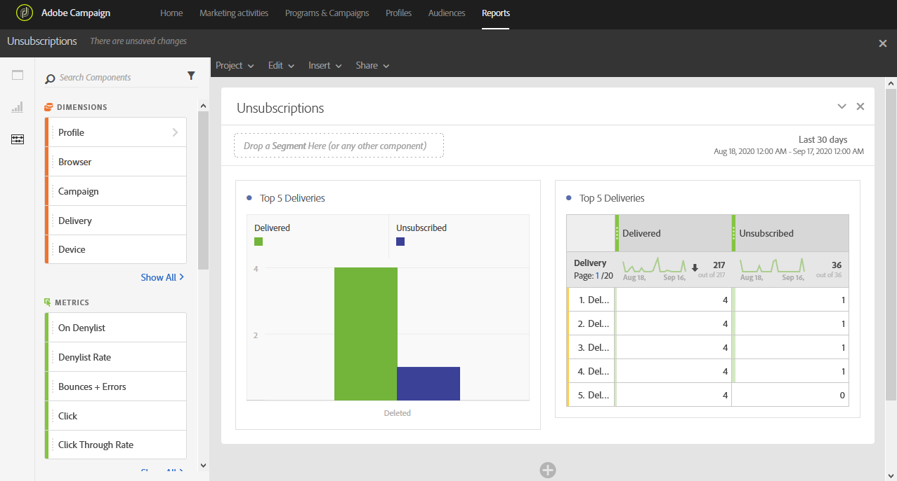

# 구독 취소{#unsubscriptions}

**[!UICONTROL Unsubscriptions]** 보고서는 구독이 가장 적은 배달을 식별합니다.

**[!UICONTROL TOP 5 deliveries]** 테이블 및 그래프는 배달된 메시지 수와 구독이 취소된 받는 사람 수가 가장 많은 상위 5개 배달이 표시됩니다. 여기에 나열된 데이터는 메시지의 구독 취소 링크에 대한 클릭 수를 기반으로 합니다.
