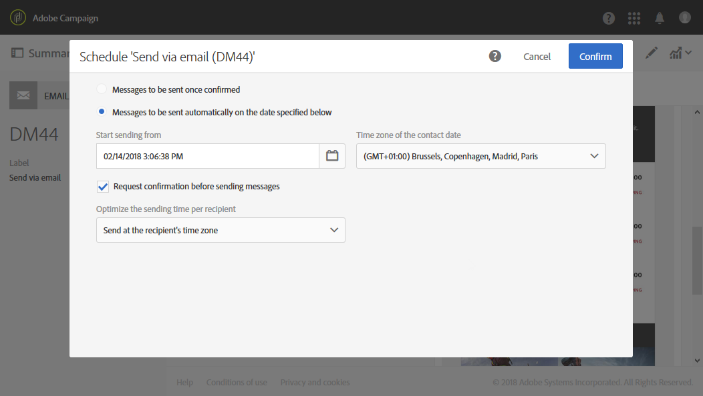

# About scheduling messages{#about-scheduling-messages}

>[!CAUTION]
>
>Whenever making changes to a delivery’s schedule, you must re-prepare the delivery by clicking on the **Prepare** button before clicking **Confirm**.

In the message dashboard, the **[!UICONTROL Schedule]** block allows you to define when messages (email, SMS or Push notifications) will be sent.

**[!UICONTROL Schedule]** 속성을 사용하여 이메일, SMS 또는 푸시 알림에 대한 전송 옵션을 설정할 수 있습니다.

* **[!UICONTROL Messages to be sent once confirmed]**: 메시지는 전송이 확인되면 즉시 전송됩니다. See [Confirming the send](../../sending/using/confirming-the-send.md).

   

* **[!UICONTROL Messages to be sent automatically on the date specified below]**: 메시지는 이후 날짜와 시간에 전송됩니다. Specify the **contact date** in the **Start sending from** field.

   전송을 준비하고 확인할 수 있지만, 메시지는 선택한 날짜와 시간 시작만 하면 전송됩니다. Preparing and confirming the send are presented in the [Preparing the send](../../sending/using/preparing-the-send.md) and [Confirming the send](../../sending/using/confirming-the-send.md) sections.

   **[!UICONTROL Time zone of the contact date]** 드롭다운 목록을 통해 전송 시간에 고려되는 시간대를 수정할 수 있습니다. For example, if you enter 9:00 AM in the **[!UICONTROL Start sending from]** field and if you select Brussels, Copenhagen, Madrid, Paris (GMT+1) in the **[!UICONTROL Time zone of the contact date]** drop-down list, all recipients will receive the message at 9:00 AM Paris time. 따라서 모스크바 (GMT +3) 에 위치한 수신자는 오전 11 시 모스크바 시에 메시지를 받게 됩니다.

   If you would like to manually confirm the send, check the **[!UICONTROL Request confirmation before sending messages]** option. 이 옵션은 기본적으로 활성화되어 있습니다.

   

>[!CAUTION]
>
>게재를 복제할 때 모든 예약 설정이 삭제됩니다. 새 연락처 날짜를 예약하지 않으면 전송이 확인되면 중복 배달이 전송됩니다.

**관련 항목**:

* [전송 시간 최적화](../../sending/using/optimizing-the-sending-time.md)
* [수신자의 시간대에서 메시지 보내기](../../sending/using/sending-messages-at-the-recipient-s-time-zone.md)
* [전송 날짜 계산](../../sending/using/computing-the-sending-date.md)

