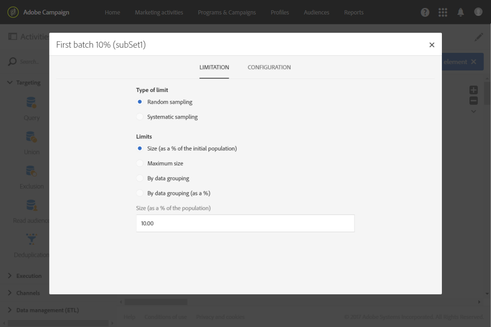
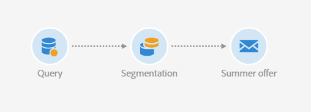
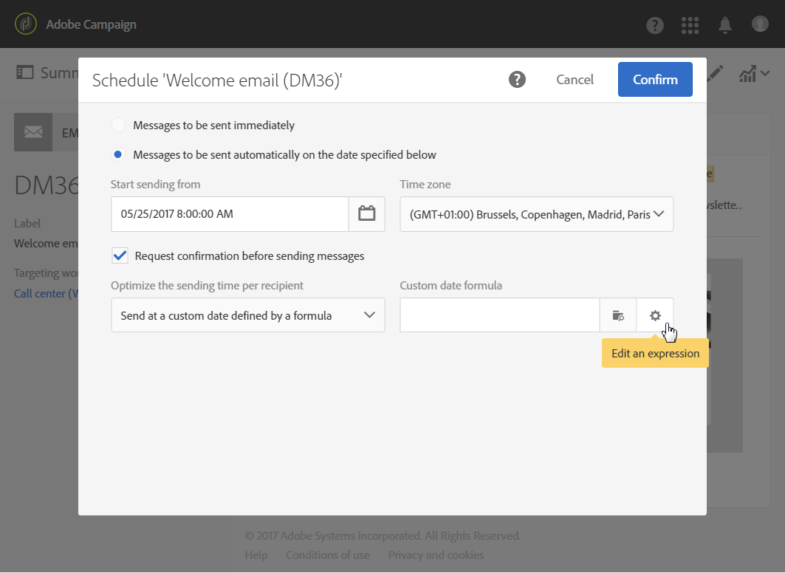

# 보내는 날짜 계산{#computing-the-sending-date}

특정 날짜 및 시간에 각 수신자에게 메시지를 전송하는 공식을 정의할 수 있습니다.

## 날짜 공식 사용자 지정 {#customizing-date-formula}

예를 들어, 램프업 프로세스 동안 전송 시간 최적화를 사용할 수 있습니다.

새로운 플랫폼을 사용하여 이메일이 전송되면 인터넷 서비스 제공업체(ISP)는 인식할 수 없는 IP 주소를 의심하게 됩니다. 대량의 이메일이 갑자기 전송되는 경우 ISP는 종종 이메일을 스팸으로 표시합니다.

스팸으로 표시되지 않도록 하려면 여러 시간에 걸쳐 대량의 이메일을 배포하여 보낸 양을 점진적으로 늘릴 수 있습니다. 이렇게 하면 시작 단계를 원활하게 개발하고 잘못된 주소의 전체 비율을 줄일 수 있습니다.

예를 들어 대상 고객을 무작위로 세그먼트화하여 5개의 배치로 배달을 보낼 수 있습니다. 6월 1일 오전 10시에 타겟 대상자의 10%를 나타내는 첫 번째 배치를 전송하고, 24시간 후에 15%의 고객을 포함한 두 번째 일괄 처리를 전송하게 됩니다.

워크플로우를 사용하여 예약할 수 있습니다.


1. 마케팅 활동 목록에 액세스하고 새 워크플로우를 만듭니다. See [Creating a workflow](../../automating/using/building-a-workflow.md#creating-a-workflow).
1. Drag and drop a **Query** activity into your workflow and open it. 쿼리 [섹션을](../../automating/using/query.md) 참조하십시오.
1. 모든 Gold 고객 등 고객을 선택하고 을 클릭하여 쿼리 **[!UICONTROL Confirm]** 를 저장합니다.
1. Drag and drop a **Segmentation** activity into your workflow and open it. 세그멘테이션 [섹션을](../../automating/using/segmentation.md) 참조하십시오.
1. 5개의 세그먼트를 정의합니다. 각 세그먼트에 대해:

   * 필드를 **[!UICONTROL Segment code]** 채웁니다.메시지를 보낼 날짜와 시간을 수동으로 입력합니다.

      예를 들어, 6월 1일 오전 10시 GMT+1에 첫 번째 배치를 전송하려고 합니다. 다음 형식을 사용하십시오. **YYYY-MM-DD hh:mm:ss+tz**.

      

      다음 배치를 그 다음 날짜로 전송하려면 두 번째 세그먼트에 **2017-06-02 10:00:00+01을** 입력합니다.

      나머지 세그먼트의 경우 다음 배치를 다음과 같이 정의합니다.

      * **2017-06-03 10:00:00+01**
      * **2017-06-04 10:00:00+01**
      * **2017-06-05 10:00:00+01**
   * 옵션을 선택해야 **[!UICONTROL Limit the population of this segment]** 합니다.

      탭에서 **[!UICONTROL Limitation]** 각 세그먼트 **[!UICONTROL Random sampling]** 에 대해 원하는 비율을 선택하고 입력합니다.첫 번째 배치의 경우 10, 두 번째 배치의 경우 15 등.

      


1. 모든 세그먼트가 정의되면, 선택하고 **[!UICONTROL Generate all segments in the same transition]** 클릭합니다 **[!UICONTROL Confirm]**.

   

1. Drag and drop an **Email delivery** activity into your workflow and open it. 이메일 [배달](../../automating/using/email-delivery.md) 섹션을 참조하십시오.
1. 이메일 대시보드의 **[!UICONTROL Schedule]** 섹션을 클릭하고 선택합니다 **[!UICONTROL Messages to be sent automatically on the date specified below]**.
1. 필드에서 **[!UICONTROL Start sending from]** 연락처 날짜를 정의합니다.
1. 보내기 시간 최적화 드롭다운 메뉴에서 을 선택합니다 **[!UICONTROL Send at a custom date defined by a formula]**.
1. 필드의 **[!UICONTROL Edit an expression]** 단추를 **[!UICONTROL Custom date formula]** 클릭합니다.

   

1. 함수 및 필드를 사용하여 **[!UICONTROL ToDateTime]** 다음 표현식을 **[!UICONTROL Segment code]** 만듭니다. 표현식에 직접 입력할 수도 있지만 올바른 구문과 맞춤법을 사용해야 합니다.

   ```
   ToDateTime([targetData/@segmentCode])
   ```

   이 **[!UICONTROL ToDateTime]** 함수는 세그먼트 코드를 텍스트 문자열에서 날짜 및 시간 값으로 변환합니다.

   이전 화면으로 돌아가도록 표현식을 확인합니다.

   

   창에서 **[!UICONTROL Schedule]** 사용자 지정 날짜 공식이 다음과 같이 표시됩니다.

   ```
   ToDateTime([targetData/@segmentCode])
   ```

   

1. 일정을 확인하고, 전달을 저장하고 워크플로우를 실행합니다.

배송 행사는 5일 동안 모든 대상 수신자에게 점진적으로 보내집니다.

>[!NOTE]
>
>전송을 확인할 때 모든 날짜가 미래 날짜인지 확인하십시오. 그렇지 않으면 전송이 확인되는 즉시 메시지가 전송됩니다.

## 표현식 사용 {#using-an-expression}

보내기 시간 최적화는 콜 센터와 관련된 캠페인에도 유용합니다. 모든 메시지가 동시에 수신되지 않도록 할 수 있습니다. 이를 통해 조직은 용량에 따라 호출 수를 처리할 수 있습니다.

예를 들어 프로모션 이벤트를 받기 위해 고객에게 콜센터에 문의하도록 초대하는 이메일을 보내려는 경우 콜센터의 폭발적인 확산을 방지하기 위해, 대상 고객을 무작위로 세그먼트화하여 4개의 배치로 이메일을 전송해야 합니다.

워크플로우를 사용하여 예약할 수 있습니다.



1. 마케팅 활동 목록에 액세스하고 새 워크플로우를 만듭니다. See [Creating a workflow](../../automating/using/building-a-workflow.md#creating-a-workflow).
1. Drag and drop a **Query** activity into your workflow and open it. 쿼리 [섹션을](../../automating/using/query.md) 참조하십시오.
1. 35개 이상의 프로파일을 선택하고 을 클릭하여 쿼리 **[!UICONTROL Confirm]** 를 저장합니다.
1. Drag and drop a **Segmentation** activity into your workflow and open it. 세그멘테이션 [섹션을](../../automating/using/segmentation.md) 참조하십시오.
1. 네 개의 세그먼트를 정의합니다. 각 세그먼트에 대해:

   * 다음과 같이 세그먼트 코드를 정의합니다.

      * 오전 8:00 - 오전 10:00: **0**. 메시지는 오전 8시(연락처 날짜)에 타겟 모집단의 1/4분기로 전송됩니다.
      * 오전 10:00 - 오후 12:00: **2**. 메시지는 오전 10시(연락처 날짜 + 2시간)에 타겟 인구의 2분기로 전송됩니다.
      * 오후 2:00 - 오후 4:00: **6**. 12:00 PM에서 2:00 PM 사이에 폐쇄되는 콜 센터, 메시지는 PM 2:00 PM(연락처 날짜 + 6시간)에 목표 인구의 3/4분기로 전송됩니다.
      * 오후 4:00 - 오후 6:00: **8**. 메시지는 오후 4시(연락처 날짜 + 8시간)에 타겟 모집단에서 마지막 분기로 전송됩니다.

      >[!NOTE]
      >
      >연락처 날짜는 워크플로우의 후반에 이메일 배달 활동에 정의됩니다.

   * 옵션을 선택해야 **[!UICONTROL Limit the population of this segment]** 합니다.
   * 탭에서 **[!UICONTROL Limitation]** 각 세그먼트 **[!UICONTROL Random sampling]** 에 대해 원하는 비율을 선택하고 입력합니다. **25**.


1. 모든 세그먼트가 정의되면, 선택하고 **[!UICONTROL Generate all segments in the same transition]** 클릭합니다 **[!UICONTROL Confirm]**.

   

1. Drag and drop an **Email delivery** activity into your workflow and open it. 이메일 [배달](../../automating/using/email-delivery.md) 섹션을 참조하십시오.
1. 이메일 대시보드의 **[!UICONTROL Schedule]** 섹션을 클릭합니다.
1. **[!UICONTROL Messages to be sent automatically on the date specified below]**&#x200B;을(를) 선택합니다.
1. 필드에서 **[!UICONTROL Start sending from]** 연락처 날짜를 정의합니다.

   이 예에서 5월 25일 오전 8시를 선택합니다.

1. 보내기 시간 최적화 드롭다운 메뉴에서 **[!UICONTROL Send at a custom date defined by a formula]** 을 선택하고 **[!UICONTROL Edit an expression]** 단추를 클릭합니다.

   

1. 에서 **[!UICONTROL Expression editor]**&#x200B;각 고객에 대한 데이터를 계산하도록 날짜 및 세그먼트 코드를 설정합니다.

   함수 목록에서 을 선택합니다 **[!UICONTROL AddHours]**.

   

   사용 가능한 필드에서 **[!UICONTROL Current delivery]** > **[!UICONTROL Delivery scheduling]** > **[!UICONTROL Contact date]**&#x200B;를 선택합니다.

   

   이렇게 하면 필드에 지정된 날짜 및 시간을 검색할 수 **[!UICONTROL Start sending from]** 있습니다.

   함수 목록에서 을 선택합니다 **[!UICONTROL ToInteger]**. 사용 가능한 필드에서 **[!UICONTROL Additional data]** > 를 선택합니다 **[!UICONTROL Segment code]**.

   

   이렇게 하면 세그먼트 코드에 지정한 숫자를 검색할 수 있습니다.

   다음 공식이 필요합니다.

   ```
   AddHours([currentDelivery/scheduling/@contactDate], ToInteger([targetData/@segmentCode]))
   ```

1. 표현식을 저장하려면 확인합니다. 일정을 확인하고, 전달을 저장하고 워크플로우를 실행합니다.

* 첫 번째 세그먼트는 연락처 날짜(5월 25일 오전 8시)에 메시지를 수신하게 됩니다.
* 두 번째 세그먼트는 2시간 후(5월 25일 오전 10시) 메시지를 받게 됩니다.
* 세 번째 세그먼트는 6시간 후(5월 25일 오후 2시) 메시지를 수신하게 됩니다.
* 네 번째 세그먼트는 8시간 후(5월 25일 오후 4시) 메시지를 수신하게 됩니다.

