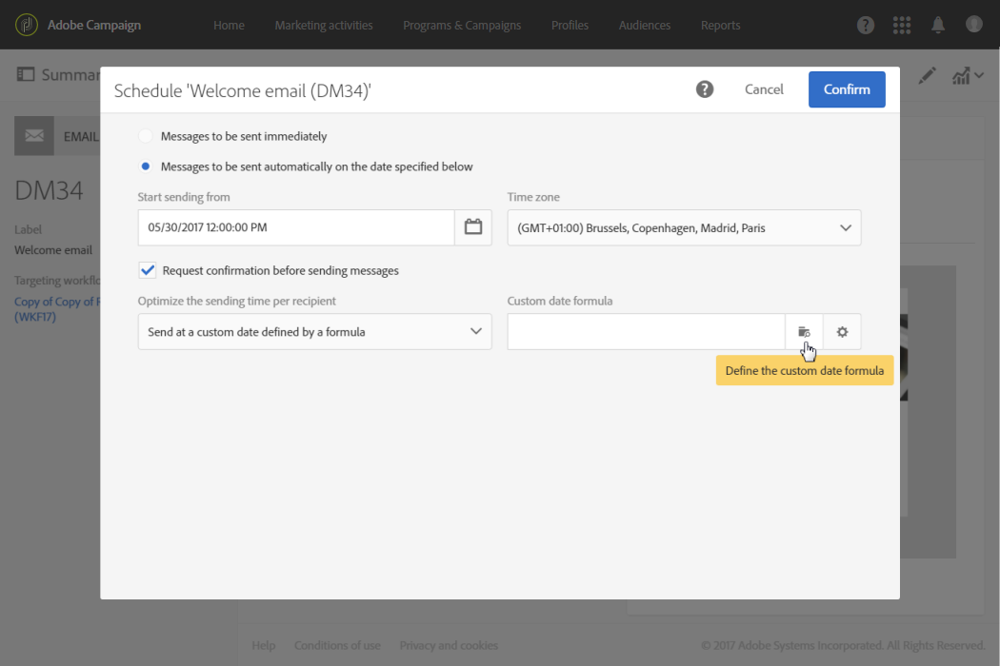

# 보내는 날짜 계산{#computing-the-sending-date}

특정 날짜 및 시간에 각 수신자에게 메시지를 전송하는 공식을 정의할 수 있습니다.

## 날짜 공식 {#customizing-date-formula} 사용자 지정

예를 들어 구현 프로세스 동안 전송 시간 최적화를 사용할 수 있습니다.

새로운 플랫폼을 사용하여 이메일을 보내면 인터넷 서비스 공급자(ISP)는 인식되지 않는 IP 주소를 의심하게 됩니다. 대량의 이메일이 갑자기 전송되면 ISP는 종종 이메일을 스팸으로 표시합니다.

스팸으로 표시되지 않도록 여러 시간에 걸쳐 대량의 이메일을 배포하여 전송된 볼륨을 점진적으로 늘릴 수 있습니다. 이렇게 하면 시작 단계가 매끄럽게 발전되고 잘못된 주소의 전체 비율을 줄일 수 있습니다.

예를 들어 대상 고객을 무작위로 세그먼트화하여 5개의 배치로 배달을 보낼 수 있습니다. 6월 1일 오전 10시에 타겟 대상자의 10%를 나타내는 첫 번째 배치를 전송하고, 24시간 후에 15%의 고객을 갖는 두 번째 일괄 처리 등을 수행합니다.

워크플로우를 사용하여 예약할 수 있습니다.


1. 마케팅 활동 목록에 액세스하고 새 워크플로우를 만듭니다. [워크플로우 만들기](../../automating/using/building-a-workflow.md#creating-a-workflow)를 참조하십시오.
1. **쿼리** 활동을 워크플로우로 드래그하여 놓고 엽니다. [쿼리](../../automating/using/query.md) 섹션을 참조하십시오.
1. 모든 Gold 고객을 비롯하여 대상자를 선택하고 **[!UICONTROL Confirm]**&#x200B;을 클릭하여 쿼리를 저장합니다.
1. **세그멘테이션** 활동을 워크플로우로 드래그하여 놓고 엽니다. [세그멘테이션](../../automating/using/segmentation.md) 섹션을 참조하십시오.
1. 5개의 세그먼트를 정의합니다. 각 세그먼트에 대해:

   * **[!UICONTROL Segment code]** 필드를 채웁니다.메시지를 보낼 날짜와 시간을 수동으로 입력합니다.

      예를 들어, 6월 1일 오전 10시 GMT+1에 첫 번째 배치를 전송하려고 합니다. 다음 형식을 사용하십시오.**YYYY-MM-DD hh:mm:ss+tz**.

      

      다음 배치를 그 다음 날 이후에 전송하려면 두 번째 세그먼트에 대해 **2017-06-02+01**&#x200B;을 입력합니다.

      나머지 세그먼트의 경우 다음 배치를 다음과 같이 정의합니다.

      * **2017-06-03 10:00:00+01**
      * **2017-06-04 10:00:00+01**
      * **2017-06-05 10:00:00+01**
   * **[!UICONTROL Limit the population of this segment]** 옵션을 선택해야 합니다.

      **[!UICONTROL Limitation]** 탭에서 **[!UICONTROL Random sampling]**&#x200B;을 선택하고 각 세그먼트에 대해 원하는 백분율을 입력합니다.첫 번째 배치의 경우 10, 두 번째 배치의 경우 15 등을 나타냅니다.

      


1. 모든 세그먼트가 정의된 후 **[!UICONTROL Generate all segments in the same transition]**&#x200B;을 선택하고 **[!UICONTROL Confirm]**&#x200B;을 클릭합니다.

   

1. **이메일 배달** 활동을 워크플로우로 드래그하여 놓고 엽니다. [이메일 배달](../../automating/using/email-delivery.md) 섹션을 참조하십시오.
1. 이메일 대시보드에서 **[!UICONTROL Schedule]** 섹션을 클릭하고 **[!UICONTROL Messages to be sent automatically on the date specified below]**&#x200B;을 선택합니다.
1. **[!UICONTROL Start sending from]** 필드에서 연락처 날짜를 정의합니다.
1. 보내기 시간 최적화 드롭다운 메뉴에서 **[!UICONTROL Send at a custom date defined by a formula]**&#x200B;을 선택합니다.
1. **[!UICONTROL Custom date formula]** 필드의 **[!UICONTROL Edit an expression]** 단추를 클릭합니다.

   

1. **[!UICONTROL ToDateTime]** 함수 및 **[!UICONTROL Segment code]** 필드를 사용하여 다음 표현식을 만듭니다. 표현식에 직접 입력할 수도 있지만 올바른 구문과 맞춤법을 사용해야 합니다.

   ```
   ToDateTime([targetData/@segmentCode])
   ```

   **[!UICONTROL ToDateTime]** 함수는 세그먼트 코드를 텍스트 문자열에서 날짜 및 시간 값으로 변환합니다.

   이전 화면으로 돌아갈 표현식을 확인합니다.

   

   **[!UICONTROL Schedule]** 창에서 사용자 지정 날짜 공식이 다음과 같이 표시됩니다.

   ```
   ToDateTime([targetData/@segmentCode])
   ```

   

1. 일정을 확인하고, 배달을 저장하고 워크플로우를 실행합니다.

배달은 5일 동안 모든 대상 받는 사람에게 점진적으로 전송됩니다.

>[!NOTE]
>
>전송을 확인할 때 모든 날짜가 미래 날짜인지 확인합니다. 그렇지 않으면 전송이 확인되는 즉시 메시지가 전송됩니다.

## 표현식 {#using-an-expression} 사용

보내기 시간 최적화는 콜 센터와 관련된 캠페인에도 유용합니다. 모든 메시지가 동시에 수신되지 않도록 할 수 있습니다. 이를 통해 조직은 용량에 따라 통화 수를 처리할 수 있습니다.

예를 들어 프로모션 기회를 얻기 위해 고객에게 콜센터에 연락하도록 초대하는 이메일을 보낼 수 있습니다. 콜센터의 폭발적인 확산을 방지하기 위해, 타겟 고객을 무작위로 세그먼트화하여 4개의 일괄로 이메일을 전송하기로 결정할 수 있습니다.

워크플로우를 사용하여 예약할 수 있습니다.


1. 마케팅 활동 목록에 액세스하고 새 워크플로우를 만듭니다. [워크플로우 만들기](../../automating/using/building-a-workflow.md#creating-a-workflow)를 참조하십시오.
1. **쿼리** 활동을 워크플로우로 드래그하여 놓고 엽니다. [쿼리](../../automating/using/query.md) 섹션을 참조하십시오.
1. 대상(예: 35개 이상의 프로필)을 선택하고 **[!UICONTROL Confirm]**&#x200B;을 클릭하여 쿼리를 저장합니다.
1. **세그멘테이션** 활동을 워크플로우로 드래그하여 놓고 엽니다. [세그멘테이션](../../automating/using/segmentation.md) 섹션을 참조하십시오.
1. 4개의 세그먼트를 정의합니다. 각 세그먼트에 대해:

   * 다음과 같이 세그먼트 코드를 정의합니다.

      * 오전 8:00 - 오전 10:00:**0**. 메시지는 오전 8시(연락처 날짜)에 목표 인구의 1/4분기로 전송됩니다.
      * 오전 10:00 - 오후 12:00:**2**. 메시지는 오전 10시(연락처 날짜 + 2시간) 목표 인구의 2분기로 전송됩니다.
      * 오후 2:00 - 오후 4:00:**6**. 12:00 PM에서 2:00 PM 사이에 폐쇄되는 콜 센터, 메시지는 2:00 PM에 목표 인구의 3/4분기(연락처 날짜 + 6시간)로 전송됩니다.
      * 오후 4:00 - 오후 6:00:**8**. 메시지는 오후 4시(연락처 날짜 + 8시간)에 대상 인구의 마지막 분기로 전송됩니다.

      >[!NOTE]
      >
      >연락처 날짜는 워크플로우의 후반에 이메일 배달 활동에 정의됩니다.

   * **[!UICONTROL Limit the population of this segment]** 옵션을 선택해야 합니다.
   * **[!UICONTROL Limitation]** 탭에서 **[!UICONTROL Random sampling]**&#x200B;을 선택하고 각 세그먼트에 대해 원하는 백분율을 입력합니다.**25**.


1. 모든 세그먼트가 정의된 후 **[!UICONTROL Generate all segments in the same transition]**&#x200B;을 선택하고 **[!UICONTROL Confirm]**&#x200B;을 클릭합니다.

   

1. **이메일 배달** 활동을 워크플로우로 드래그하여 놓고 엽니다. [이메일 배달](../../automating/using/email-delivery.md) 섹션을 참조하십시오.
1. 이메일 대시보드에서 **[!UICONTROL Schedule]** 섹션을 클릭합니다.
1. **[!UICONTROL Messages to be sent automatically on the date specified below]**&#x200B;을(를) 선택합니다.
1. **[!UICONTROL Start sending from]** 필드에서 연락처 날짜를 정의합니다.

   이 예에서 오전 8시에 5월 25일을 선택합니다.

1. 보내기 시간 최적화 드롭다운 메뉴에서 **[!UICONTROL Send at a custom date defined by a formula]**&#x200B;을 선택하고 **[!UICONTROL Edit an expression]** 단추를 클릭합니다.

   

1. **[!UICONTROL Expression editor]**&#x200B;에서 날짜 및 세그먼트 코드를 설정하여 각 고객에 대한 데이터를 계산합니다.

   함수 목록에서 **[!UICONTROL AddHours]**&#x200B;을 선택합니다.

   

   사용 가능한 필드에서 **[!UICONTROL Current delivery]** > **[!UICONTROL Delivery scheduling]** > **[!UICONTROL Contact date]**&#x200B;를 선택합니다.

   

   이렇게 하면 **[!UICONTROL Start sending from]** 필드에 지정된 날짜 및 시간을 검색할 수 있습니다.

   함수 목록에서 **[!UICONTROL ToInteger]**&#x200B;을 선택합니다. 사용 가능한 필드에서 **[!UICONTROL Additional data]** > **[!UICONTROL Segment code]**&#x200B;을 선택합니다.

   

   이렇게 하면 세그먼트 코드에 지정한 숫자를 검색할 수 있습니다.

   다음 공식을 가져와야 합니다.

   ```
   AddHours([currentDelivery/scheduling/@contactDate], ToInteger([targetData/@segmentCode]))
   ```

1. 표현식을 저장하려면 확인합니다. 일정을 확인하고, 배달을 저장하고 워크플로우를 실행합니다.

* 첫 번째 세그먼트는 연락처 날짜(5월 25일 오전 8시)에 메시지를 수신합니다.
* 두 번째 세그먼트는 2시간 후(5월 25일 오전 10시) 메시지를 받게 됩니다.
* 세 번째 세그먼트는 6시간 후(5월 25일 오후 2시) 메시지를 받게 됩니다.
* 네 번째 세그먼트는 8시간 후(5월 25일 오후 4시) 메시지를 수신하게 됩니다.

