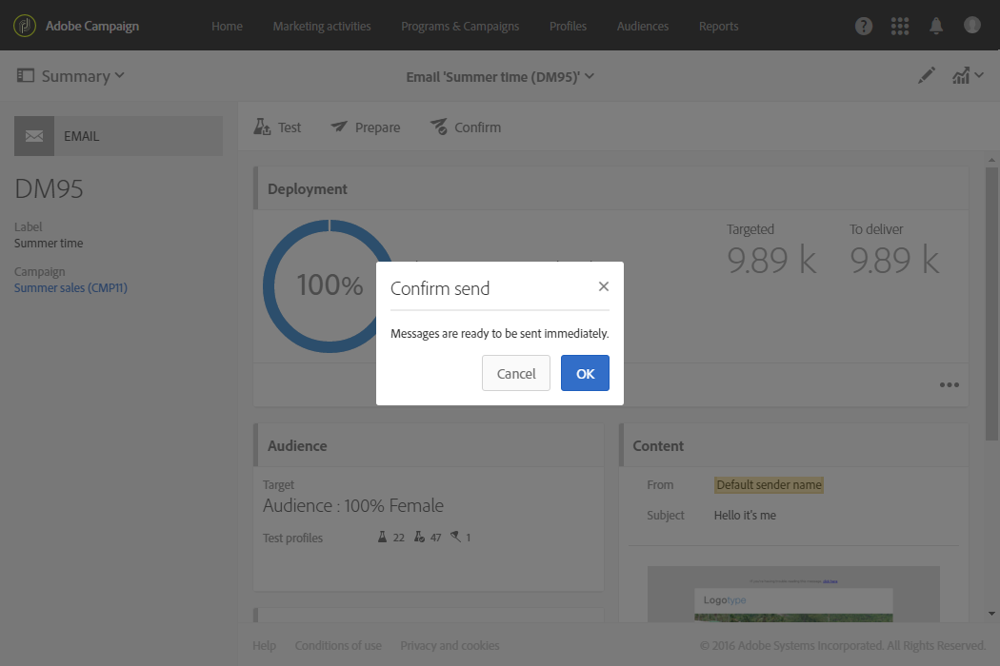
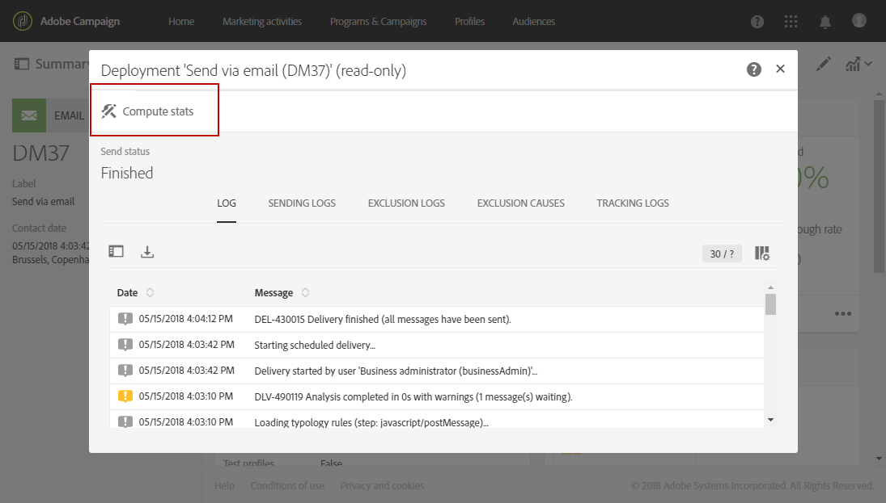

# 보내기 확인{#confirming-the-send}

메시지 준비와 승인 단계를 완료하면 메시지를 보낼 수 있습니다. 메시지 준비에 대한 자세한 내용은 [보내기 준비](../../sending/using/preparing-the-send.md)를 참조하십시오.

**[!UICONTROL Start deliveries]** 역할을 가진 사용자만 메시지 보내기를 확인할 수 있습니다. 자세한 내용은 [역할 목록](../../administration/using/list-of-roles.md) 섹션을 참조하십시오.

이 역할이 없는 사용자에게는 다음 메시지가 표시됩니다.

게재를 보내려면 메시지의 작업 표시줄에 있는 **[!UICONTROL Confirm send]** 버튼을 클릭합니다.

보내기를 확정할지 묻는 메시지에서 **[!UICONTROL OK]** 버튼을 누릅니다.

메시지가 보내집니다.

>[!NOTE]
>
>메시지를 예약하면 전송 시간이 되었을 때 보내집니다. 메시지 예약에 대한 자세한 정보는 [이 섹션](../../sending/using/about-scheduling-messages.md)을 참조하십시오.

합계 기간 없이 되풀이하는 게재를 사용할 경우, 게재를 보내기 전 확인을 요청할 수 있습니다. 이렇게 하려면 게재 대시보드의 **[!UICONTROL Schedule]** 블록을 연 다음 전용 옵션을 활성화합니다.

**[!UICONTROL Deployment]** 블록은 보내기 진행 상황을 보여줍니다.

연락처에 메시지를 보내고 나면 **[!UICONTROL Deployment]** 영역에 다음 항목을 포함하는 KPI(주요 성과 지표) 데이터가 표시됩니다.

* 게재할 메시지 수
* 보낸 메시지 수
* 게재한 메시지 비율
* 반송 및 오류 비율
* 메시지 오픈율
* 메시지 클릭률 (이메일)

   >[!NOTE]
   >
   >**[!UICONTROL Open rate]**&#x200B;와(과) **[!UICONTROL Click-through rate]**&#x200B;은(는) 한 시간마다 업데이트됩니다.

KPI를 업데이트하는 데 너무 오래 걸리거나 보내기 로그의 결과를 고려하지 않는 경우, **[!UICONTROL Deployment]** 창의 **[!UICONTROL Compute stats]** 버튼을 클릭합니다.

대상자에 포함되는 고객 프로필 중 하나의 내역에서 메시지를 볼 수 있습니다. [Integrated Customer Profile](../../audiences/using/integrated-customer-profile.md)을 참조하십시오.

메시지를 보내고 나면 수신자의 동작을 추적하고 이를 모니터하여 메시지의 영향력을 측정할 수 있습니다. 자세한 정보는 다음 섹션을 참조하십시오.

* [메시지 추적](../../sending/using/tracking-messages.md)
* [게재 모니터링](../../sending/using/monitoring-a-delivery.md)

