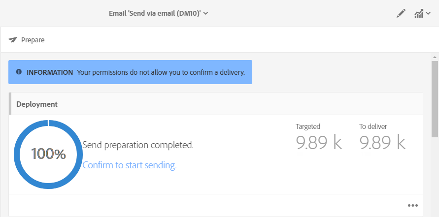

# 보내기 확인{#confirming-the-send}

메시지 준비와 승인 단계를 완료하면 메시지를 보낼 수 있습니다. 메시지 준비에 대한 자세한 내용은 [보내기 준비](../../sending/using/preparing-the-send.md)를 참조하십시오.

을 사용하는 사용자만 **[!UICONTROL Start deliveries]** 역할은 전송을 확인할 수 있습니다. 자세한 내용은 [역할 목록](../../administration/using/list-of-roles.md) 섹션을 참조하십시오.

<!--Users without this role will see the following message: 

-->

## 메시지 보내기 {#sending-message}

준비가 완료되면 아래 절차에 따라 메시지를 보내십시오.

1. 을(를) 클릭합니다. **[!UICONTROL Confirm send]** 메시지의 작업 표시줄에 있는 단추입니다.

   

1. 전송을 완료하기 위해 **[!UICONTROL OK]** 버튼을 클릭합니다.

   

1. 메시지를 보내는 동안 기다립니다. **[!UICONTROL Deployment]** 블록은 보내기 진행 상황을 보여줍니다.

>[!NOTE]
>
>메시지를 예약하면 전송 시간이 되었을 때 전송됩니다. 메시지 예약에 대한 자세한 정보는 [이 섹션](../../sending/using/about-scheduling-messages.md)을 참조하십시오.

합계 기간 없이 되풀이하는 게재를 사용할 경우, 게재를 보내기 전 확인을 요청할 수 있습니다. 메시지를 구성할 때 **[!UICONTROL Schedule]** 게재 대시보드의 블록을 제거하고 전용 옵션을 활성화합니다.

## 메시지 표시기 이해 {#message-indicators}

연락처에 메시지를 보내고 나면 **[!UICONTROL Deployment]** 영역에 다음 항목을 포함하는 KPI(주요 성과 지표) 데이터가 표시됩니다.

* 게재할 메시지 수
* 보낸 메시지 수
* 게재한 메시지 비율
* 반송 및 오류 비율
* 메시지 오픈율
* 메시지 클릭률 (이메일)

   >[!NOTE]
   >
   >**[!UICONTROL Open rate]**&#x200B;와(과) **[!UICONTROL Click-through rate]**&#x200B;은(는) 한 시간마다 업데이트됩니다.

KPI를 업데이트하는 데 너무 오래 걸리거나 보내기 로그의 결과를 반영하지 않는 경우, **[!UICONTROL Compute stats]** 단추 **[!UICONTROL Deployment]** 창을 엽니다.

타겟팅된 프로필 중 하나의 내역에서 메시지를 볼 수 있습니다. [Integrated Customer Profile](../../audiences/using/integrated-customer-profile.md)을 참조하십시오.

메시지를 보내고 나면 수신자의 동작을 추적하고 이를 모니터하여 메시지의 영향력을 측정할 수 있습니다. 자세한 정보는 다음 섹션을 참조하십시오.

* [메시지 추적](../../sending/using/tracking-messages.md)
* [게재 모니터링](../../sending/using/monitoring-a-delivery.md)

### 게재 성공 보고 {#delivered-status-report}

>[!NOTE]
>
>이 섹션은 전자 메일 채널에만 적용됩니다.

에서 **[!UICONTROL Summary]** 각 이메일 보기, **[!UICONTROL Delivered]** 백분율은 100%에서 시작하여 게재 내내 점진적으로 내려갑니다 [유효 기간](../../administration/using/configuring-email-channel.md#validity-period-parameters): 소프트 및 하드 바운스가 다시 보고되면<!--from the Enhanced MTA to Campaign-->.

실제로 모든 메시지는 **[!UICONTROL Sent]** 에서 [로그 전송](../../sending/using/monitoring-a-delivery.md#sending-logs) Campaign에서 Enhanced MTA(메시지 전송 에이전트)로 성공적으로 중계되는 즉시 이 경우, 또는 [바운스](../../sending/using/understanding-delivery-failures.md#delivery-failure-types-and-reasons) 해당 메시지는 Enhanced MTA에서 Campaign으로 다시 전달됩니다.

하드 바운스 메시지가 향상된 MTA에서 다시 보고되면 상태가 **[!UICONTROL Sent]** to **[!UICONTROL Failed]** 그리고 **[!UICONTROL Delivered]** 백분율이 그에 따라 감소합니다.

소프트 바운스 메시지가 향상된 MTA에서 다시 보고되면 여전히 으로 표시됩니다 **[!UICONTROL Sent]** 그리고 **[!UICONTROL Delivered]** 백분율이 아직 업데이트되지 않았습니다. 그러면 소프트 바운스 메시지가 표시됩니다 [다시 시도](../../sending/using/understanding-delivery-failures.md#retries-after-a-delivery-temporary-failure) 게재 유효 기간 동안:

* 유효성 기간이 종료되기 전에 다시 시도하면 메시지 상태는 다음과 같이 유지됩니다 **[!UICONTROL Sent]** 그리고 **[!UICONTROL Delivered]** 백분율은 변경되지 않은 상태로 유지됩니다.

* 그렇지 않으면 상태가 **[!UICONTROL Failed]** 그리고 **[!UICONTROL Delivered]** 백분율이 그에 따라 감소합니다.

따라서 최종 결과를 보려면 유효 기간이 끝날 때까지 기다려야 합니다 **[!UICONTROL Delivered]** 백분율과 최종 숫자 **[!UICONTROL Sent]** 및 **[!UICONTROL Failed]** 메시지.

### 이메일 피드백 서비스(베타) {#email-feedback-service}

피드백을 Enhanced MTA(메시지 전송 에이전트)에서 직접 캡처하므로 EFS(이메일 피드백 서비스) 기능을 사용하면 각 이메일의 상태가 정확하게 보고됩니다.

>[!IMPORTANT]
>
>이메일 피드백 서비스 는 현재 베타 기능으로 사용할 수 있습니다.

게재를 시작하면 에는 변경 사항이 없습니다 **[!UICONTROL Delivered]** 메시지가 Campaign에서 Enhanced MTA로 성공적으로 중계되는 경우의 백분율입니다.

게재 로그에는 **[!UICONTROL Pending]** 타겟팅된 각 주소의 상태입니다.

타겟팅된 프로필에 대한 메시지 게재가 향상된 MTA에서 실시간으로 다시 보고되면 게재 로그에 **[!UICONTROL Sent]** 메시지를 성공적으로 받은 각 주소의 상태입니다. 다음 **[!UICONTROL Delivered]** 백분율이 게재의 각 성공에따라 증가합니다.

하드 바운스 메시지가 향상된 MTA에서 다시 보고되면 로그 상태가 **[!UICONTROL Pending]** to **[!UICONTROL Failed]** 그리고 **[!UICONTROL Bounces + errors]** 백분율이 그에 따라 증가합니다.

소프트 바운스 메시지가 향상된 MTA에서 다시 보고되면 로그 상태도 **[!UICONTROL Pending]** to **[!UICONTROL Failed]** 그리고 **[!UICONTROL Bounces + errors]** 백분율이 그에 따라 증가합니다. 다음 **[!UICONTROL Delivered]** 백분율은 변경되지 않은 상태로 유지됩니다. 그런 다음 소프트 바운스 메시지가 게재 동안 다시 시도됩니다 [유효 기간](../../administration/using/configuring-email-channel.md#validity-period-parameters):

* 유효 기간이 끝나기 전에 재시도가 성공하면 메시지 상태가 **[!UICONTROL Sent]** 그리고 **[!UICONTROL Delivered]** 백분율이 그에 따라 증가합니다.

* 그렇지 않으면 상태는 **[!UICONTROL Failed]**. 다음 **[!UICONTROL Delivered]** 및 **[!UICONTROL Bounces + errors]** 백분율은 변경되지 않은 상태로 유지됩니다.

>[!NOTE]
>
>하드 및 소프트 바운스에 대한 자세한 내용은 [이 섹션](../../sending/using/understanding-delivery-failures.md#delivery-failure-types-and-reasons).
>
>일시적 게재 실패 후 다시 시도하는 방법에 대한 자세한 내용은 [이 섹션](../../sending/using/understanding-delivery-failures.md#retries-after-a-delivery-temporary-failure).

<!--Soft-bouncing messages increment an error counter. When the error counter reaches the limit threshold or when the validity period is over, the address goes into quarantine and the status remains as **[!UICONTROL Failed]**. For more on conditions for sending an address to quarantine, see [this section](../../help/sending/using/understanding-quarantine-management.md#conditions-for-sending-an-address-to-quarantine).-->

### EFS에서 도입된 변경 사항 {#changes-introduced-by-efs}

아래 표는 EFS 기능에서 도입된 KPI 및 전송 로그 상태의 변경 사항을 보여줍니다.

**이메일 피드백 서비스 사용**

| 전송 프로세스의 단계 | KPI 요약 | 전송 로그 상태 |
|--- |--- |--- |
| 메시지가 Campaign에서 Enhanced MTA로 성공적으로 전달되었습니다 | <ul><li>**[!UICONTROL Delivered]** 백분율이 0%로 시작</li><li>**[!UICONTROL Bounces + errors]** 백분율이 0%로 시작</li></ul> | 보류 중 |
| 하드 바운스 메시지가 향상된 MTA에서 다시 보고됩니다 | <ul><li>에서 변경 없음 **[!UICONTROL Delivered]** 백분율</li><li>**[!UICONTROL Bounces + errors]** 백분율이 그에 따라 증가함</li></ul> | 실패 |
| 소프트 바운스 메시지는 Enhanced MTA에서 다시 보고됩니다 | <ul><li>에서 변경 없음 **[!UICONTROL Delivered]** 백분율</li><li>**[!UICONTROL Bounces + errors]** 백분율이 그에 따라 증가함</li></ul> | 실패 |
| 소프트 바운스 메시지 다시 시도 성공 | <ul><li>**[!UICONTROL Delivered]** 백분율이 그에 따라 증가함</li><li>**[!UICONTROL Bounces + errors]** 백분율이 그에 따라 감소하다</li></ul> | 전송 |
| 소프트 바운스 메시지 다시 시도 실패 | <ul><li> 에서 변경 없음 **[!UICONTROL Delivered]** 백분율 </li><li> 에서 변경 없음 **[!UICONTROL Bounces + errors]** 백분율 </li></ul> | 실패 |

**이메일 피드백 서비스 제외**

| 전송 프로세스의 단계 | KPI 요약 | 전송 로그 상태 |
|--- |--- |--- |
| 메시지가 Campaign에서 Enhanced MTA로 성공적으로 전달되었습니다 | <ul><li>**[!UICONTROL Delivered]** 백분율이 100%에서 시작됨</li><li>**[!UICONTROL Bounces + errors]** 백분율이 0%로 시작</li></ul> | 전송 |
| 하드 바운스 메시지가 향상된 MTA에서 다시 보고됩니다 | <ul><li>**[!UICONTROL Delivered]** 백분율이 그에 따라 감소하다</li><li>**[!UICONTROL Bounces + errors]** 백분율이 그에 따라 증가함</li></ul> | 실패 |
| 소프트 바운스 메시지는 Enhanced MTA에서 다시 보고됩니다 | <ul><li>에서 변경 없음 **[!UICONTROL Delivered]** 백분율</li><li>에서 변경 없음 **[!UICONTROL Bounces + errors]** 백분율</li></ul> | 전송 |
| 소프트 바운스 메시지 다시 시도 성공 | <ul><li>에서 변경 없음 **[!UICONTROL Delivered]** 백분율</li><li>에서 변경 없음 **[!UICONTROL Bounces + errors]** 백분율</li></ul> | 전송 |
| 소프트 바운스 메시지 다시 시도 실패 | <ul><li>**[!UICONTROL Delivered]** 백분율이 그에 따라 감소하다</li><li>**[!UICONTROL Bounces + errors]** 백분율이 그에 따라 증가함</li></ul> | 실패 |
