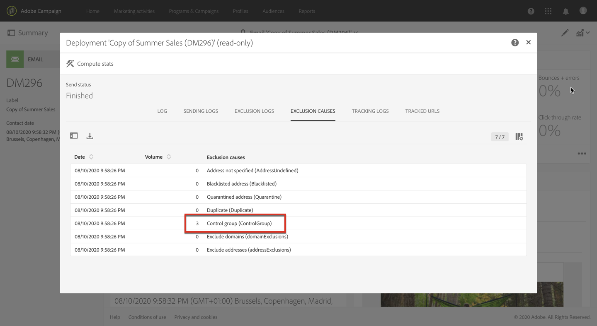
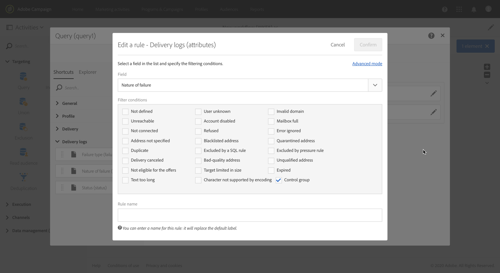

# 컨트롤 그룹 추가 {#adding-control-group}

캠페인의 영향을 측정하기 위해 컨트롤 그룹을 사용하여 대상의 일부에 메시지를 보내지 않아도 됩니다.

Adobe Campaign에서 이렇게 하려면 게재 대상을 정의할 때 <b>컨트롤 그룹</b>을 만듭니다. 프로필은 임의로, 필터링 여부에 따라, 또는 기준에 따라 컨트롤 그룹에 추가됩니다.

그러면 메시지를 받은 대상 모집단과 타겟팅되지 않은 연락처의 동작을 비교할 수 있습니다. 전송 로그를 기준으로 향후 캠페인에서 컨트롤 그룹을 타겟팅할 수도 있습니다.

<!--The control group is built when the delivery is prepared.-->

## 개요 {#overview}

컨트롤 그룹은 기본 대상에서 임의로 추출하거나 특정 모집단에서 선택할 수 있습니다. 따라서 컨트롤 그룹을 정의하는 방법에는 두 가지가 있습니다.
* 기본 타겟에서 프로필을 몇 개 **추출**&#x200B;합니다.
* 쿼리에 정의된 기준을 기반으로 일부 프로필을 **제외**&#x200B;합니다.

컨트롤 그룹을 정의할 때 두 가지 방법을 모두 사용할 수 있습니다.

게재 준비 단계에서 컨트롤 그룹에 속한 모든 프로필은 기본 대상에서 제거됩니다. 전송되면 메시지가 수신되지 않습니다.

## 대상 모집단에서 추출 {#extraction-target-population}

컨트롤 그룹을 정의하려면, 임의로 또는 대상 모집단에서 정렬, 백분율 또는 고정된 수의 프로필을 추출하도록 선택할 수 있습니다.

### 대상 추출 {#target-extraction}

먼저 대상에서 프로필을 추출하는 방법을 정의합니다. **임의로** 또는 **정렬을 기준으로 합니다**.

**[!UICONTROL Target extraction]** 섹션에서 다음 중 하나를 선택합니다.

* **[!UICONTROL Random sampling]**:게재를 준비할 때, Adobe Campaign은 백분율이나 [크기 제한](#size-limit)으로 설정할 최대 수에 해당하는 여러 개의 프로필을 임의로 추출합니다.

   예를 들어 **[!UICONTROL Limits]** 섹션에서 임계값을 10으로 설정하면 대상 모집단에서 임의로 선택된 10%로 컨트롤 그룹이 구성됩니다.<!--Change screenshot to match example)-->

   

* **[!UICONTROL Keep only the first records after sorting]**: 이 옵션을 사용하면 하나 이상의 정렬 명령을 기준으로 제한을 정의할 수 있습니다.

   예제:

   * **[!UICONTROL Age]** 필드를 정렬 기준으로 선택합니다.
   * **[!UICONTROL Limits]** 섹션에서 100을 임계값으로 정의합니다([크기 제한](#size-limit)참조).
   * **[!UICONTROL Descending sort]** 옵션을 선택된 상태로 두십시오.

   그 결과 컨트롤 그룹은 100명의 가장 오래된 수신자로 구성됩니다.<!--Change screenshot to match example)-->

   

   구매 횟수가 많은 고객과 적은 고객을 포함한 컨트롤 그룹을 정의한 후, 해당 그룹의 행동을 연락을 한 수신자의 행동과 비교해보면 좋은 정보를 얻을 수 있습니다.

>[!NOTE]
>
>**[!UICONTROL Target extraction]** 옵션을 사용하지  않으려면 **[!UICONTROL No extraction]**&#x200B;을(를) 선택합니다.

<!---->

### 크기 제한 {#size-limit}

**[!UICONTROL Random sampling]** 또는 **[!UICONTROL Keep only the first records after sorting]** 중 어느 것을 선택하였더라도 기본 대상에서 추출하는 프로필 수를 제한하는 방법을 설정해야 합니다. 다음 중 하나를 수행합니다.

* **[!UICONTROL Size (as a % of the initial population)]**&#x200B;을(를) 선택하고 해당 프레임을 채웁니다.

   예를 들어 10을 설정한 경우, 위에서 선택한 옵션에 따라 Adobe Campaign이 다음 중 하나를 수행합니다.
   * 대상 모집단의 10%를 임의로 추출합니다.
   * **[!UICONTROL Age]** 필드를 정렬 기준으로 선택한 경우 대상 모집단에서 가장 오래된 10% 프로필을 추출합니다.

   >[!NOTE]
   >
   >**[!UICONTROL Descending sort]** 옵션의 선택을 취소하면 가장 최신의 프로필 10%가 추출됩니다.

* **[!UICONTROL Maximum size]**&#x200B;을(를) 선택하고 해당 프레임을 채웁니다.

   예를 들어 100을 설정하면 Adobe Campaign이 다음 중 하나를 수행합니다.
   * 대상 모집단에서 100개의 프로필을 임의로 추출합니다.
   * **[!UICONTROL Age]** 필드를 정렬 기준으로 선택한 경우 대상 모집단에서 가장 오래된 100개의 프로필을 추출합니다.

   >[!NOTE]
   >
   >**[!UICONTROL Descending sort]** 옵션의 선택을 취소하면 가장 최신 프로필 100개가 추출됩니다. 

## 특정 모집단 제외 {#excluding-specific-population}

컨트롤 그룹을 정의하는 또 다른 방법은 쿼리를 사용하여 특정 모집단을 대상에서 제외하는 것입니다.

방법은 다음과 같습니다.

1. **[!UICONTROL Target exclusion]** 섹션에서 **[!UICONTROL Define target exclusion]**&#x200B;을(를) 클릭합니다.

   

1. [쿼리 편집기](../../automating/using/editing-queries.md)를 사용하여 제외 기준을 정의합니다. 이전에 만든 [대상](../../audiences/using/about-audiences.md)을 선택할 수도 있습니다.

   

1. **[!UICONTROL Confirm]**&#x200B;을(를) 클릭합니다.

쿼리 결과와 일치하는 프로필은 대상에서 제외됩니다.

<!--For more on using the query editor, see the [Editing queries](../../automating/using/editing-queries.md) section.-->

## 사용 사례: 컨트롤 그룹 설정 {#control-group-example}

다음은 기본 대상에서 프로필 추출과 쿼리를 사용하여 특정 모집단 제외의 두 가지 방법을 사용하여 컨트롤 그룹을 정의하는 방법을 보여주는 예입니다.

1. 워크플로우 만들기. 워크플로우를 만드는 자세한 단계는 [워크플로우 작성](../../automating/using/building-a-workflow.md) 섹션에 나와 있습니다.
1. **[!UICONTROL Activities]** > **[!UICONTROL Targeting]**&#x200B;에서 [쿼리](../../automating/using/query.md) 활동을 끌어다 놓습니다. 활동을 두 번 클릭하고 대상을 정의합니다. <!--For example, in **[!UICONTROL Shortcuts]**, drag and drop **[!UICONTROL Profile]**, select **[!UICONTROL Age]** with the operator **[!UICONTROL Greater than]** and type 25 in the **[!UICONTROL Value]** field.-->

1. **[!UICONTROL Activities]** > **[!UICONTROL Channels]**&#x200B;에서 기본 대상 세그먼트 뒤에 [이메일 게재](../../automating/using/email-delivery.md) 활동을 끌어다 놓고 편집합니다.
1. 게재 대시보드에서 **[!UICONTROL Audience]** 블록을 클릭합니다.

1. **[!UICONTROL Control group]** 탭을 선택합니다. 

   

1. **[!UICONTROL Target extraction]** 섹션에서 **[!UICONTROL Keep only the first records after sorting]**&#x200B;을(를) 선택합니다.
1. 날짜를 정렬하고 **[!UICONTROL Descending]** 정렬 옵션을 선택된 상태로 둡니다.

   

1. 최대 크기로 100을 설정합니다. 대상에서 가장 오래된 프로필 100개가 추출됩니다.

1. **[!UICONTROL Target exclusion]** 섹션에서 [쿼리 편집기](../../automating/using/editing-queries.md)를 사용하여 선택한 기준에 따라 대상에서 제외할 프로필을 정의합니다. 예를 들어 &quot;나이는 20세 미만&quot; 입니다.

   

   20세 미만인 프로필은 제외됩니다.

1. [게재 준비](../../sending/using/preparing-the-send.md)를 시작하고 [전송을 확인](../../sending/using/confirming-the-send.md)합니다.

추출된 프로필(가장 오래된 프로필 100개)과 쿼리를 기반으로 정의된 프로필(20세 미만의 프로필)은 기본 대상에서 제거됩니다. 해당 프로필은 메시지를 받지 않습니다.

## 결과 비교 {#delivery-logs}

게재를 보낸 후 컨트롤 그룹으로 무엇을 수행할 수 있을까요?

**전송 로그**&#x200B;를 추출하여 커뮤니케이션을 받지 않은 컨트롤 그룹이 효과적인 대상과 비교하여 어떻게 행동했는지 비교할 수 있습니다. 게재 로그를 사용하여 **다른 타겟팅을 빌드**&#x200B;할 수도 있습니다.

>[!IMPORTANT]
>
>Adobe Campaign에 연결하려면 [관리자 역할](../../administration/using/users-management.md#functional-administrators)과 **[!UICONTROL All]** [조직 단위](../../administration/using/organizational-units.md)에 속해 있어야 합니다. 특정 사용자 또는 사용자 그룹에 대한 액세스를 제한하려면 게재 로그에 액세스할 수 있도록 **[!UICONTROL All]** 단위를 연결하지 마십시오.

### 게재 로그 확인 {#checking-logs}

메시지가 전송된 후 대상에서 제거된 프로필을 보려면 **[!UICONTROL Delivery logs]**&#x200B;을(를) 확인하십시오. 게재 로그와 액세스 방법에 대한 자세한 내용은 [이 섹션](../../sending/using/monitoring-a-delivery.md#delivery-logs)을 참조하십시오.

* 이 **[!UICONTROL Sending logs]** 탭에서 추출된 프로필과 제외된 프로필을 볼 수 있습니다. 이 프로필의 상태는 **[!UICONTROL Ignored]**&#x200B;이며 실패 원인은 **[!UICONTROL Control group]** 입니다.

   

* 게재에 포함되지 않은 프로필 수를 확인하려면 **[!UICONTROL Exclusion causes]** 탭을 확인하십시오.

   

### 컨트롤 그룹 로그 사용 {#using-logs}

게재가 전송되면 게재 로그를 사용하여 메시지를 받지 못한 프로필을 필터링할 수 있습니다. 아래의 단계를 수행하십시오.

1. 워크플로우 만들기. 워크플로우를 만드는 자세한 단계는 [워크플로우 작성](../../automating/using/building-a-workflow.md) 섹션에 나와 있습니다.
1. **[!UICONTROL Activities]** > **[!UICONTROL Targeting]**&#x200B;에서 [쿼리](../../automating/using/query.md) 활동을 끌어다 놓습니다.
1. **[!UICONTROL Properties]** 탭에서 **[!UICONTROL Delivery logs]**&#x200B;을(를) **[!UICONTROL Resource]**(으)로 설정하고 **[!UICONTROL Profile]**&#x200B;을(를) **[!UICONTROL Targeting dimension]**(으)로 설정합니다.

   

1. **[!UICONTROL Target]** 탭에서 **[!UICONTROL Delivery logs]**&#x200B;을(를) 클릭합니다 .
1. **[!UICONTROL Status]**&#x200B;을(를) 끌어서 놓고 **[!UICONTROL Ignored]**&#x200B;을(를) 필터 조건으로 선택합니다.

   

1. **[!UICONTROL Confirm]**&#x200B;을(를) 클릭합니다.

1. **[!UICONTROL Target]** 탭에서 **[!UICONTROL Nature of failure]**&#x200B;을(를) 끌어서 놓고 **[!UICONTROL Control group]**&#x200B;을(를) 필터 조건으로 선택합니다.

   

1. **[!UICONTROL Confirm]**&#x200B;을(를) 클릭합니다.

   

그런 다음 **파일 추출** 활동 후 **파일 전송** 작업을 사용하여 로그 데이터를 내보낼 수 있습니다. 이렇게 하면 자체 보고 도구에서 컨트롤 그룹과 비교하여 효과적인 대상에 대한 캠페인 결과를 분석할 수 있습니다. 로그 내보내기에 대한 자세한 내용은 [이 섹션](../../automating/using/exporting-logs.md)을 참조하십시오.

### 컨트롤 그룹 타겟팅 {#targeting-control-group}

메시지를 받지 못한 프로필을 기반으로 타겟팅을 수행하려면 게재 로그를 사용할 수도 있습니다. 아래의 단계를 수행하십시오.

1. 워크플로우 만들기. 워크플로우를 만드는 자세한 단계는 [워크플로우 작성](../../automating/using/building-a-workflow.md) 섹션에 나와 있습니다.
1. **[!UICONTROL Activities]** > **[!UICONTROL Targeting]**&#x200B;에서 첫 번째 [쿼리](../../automating/using/query.md) 활동을 끌어서 놓습니다.
1. **[!UICONTROL Properties]** 탭에서 **[!UICONTROL Profile]** 리소스가 **[!UICONTROL Resource]** 및  **[!UICONTROL Targeting dimension]**(으)로 선택되었는지 확인합니다.

   

1. **[!UICONTROL Target]** 탭에서  **[!UICONTROL Delivery]**&#x200B;을(를) 확장하고 **[!UICONTROL Delivery logs]**&#x200B;을(를) 끌어서 놓습니다.

   

1. **[!UICONTROL Add a rule]** 창에서 **[!UICONTROL Delivery]**&#x200B;을(를) 끌어서 놓습니다.

   

1. 필터 조건으로 보낸 이메일을 선택합니다. **[!UICONTROL Confirm]**&#x200B;을(를) 클릭합니다.

   

1. 다시 **[!UICONTROL Add a rule]** 창으로 돌아와 **[!UICONTROL Status]**&#x200B;을(를) 끌어서 놓고 **[!UICONTROL Ignored]**&#x200B;을(를) 필터 조건으로 선택합니다. **[!UICONTROL Confirm]**&#x200B;을(를) 클릭합니다.

   

1. **[!UICONTROL Nature of failure]**&#x200B;을(를) 끌어서 놓고 **[!UICONTROL Control group]**&#x200B;을(를) 필터 조건으로 선택합니다. **[!UICONTROL Confirm]**&#x200B;을(를) 클릭합니다.

   

1. 조건이 모두 **AND** 부울 연산자와 정렬되었는지 확인합니다.

   

1. **[!UICONTROL Confirm]**&#x200B;을(를) 클릭합니다.

이제 컨트롤 그룹에 속해 있어 첫 번째 메시지를 받지 못한 프로필을 대상으로 하여 다른 이메일을 보낼 수 있습니다.

동일한 워크플로우에서 이메일을 받은 프로필을 대상으로 다른 쿼리를 만들어 다른 메시지를 보낼 수도 있습니다.

